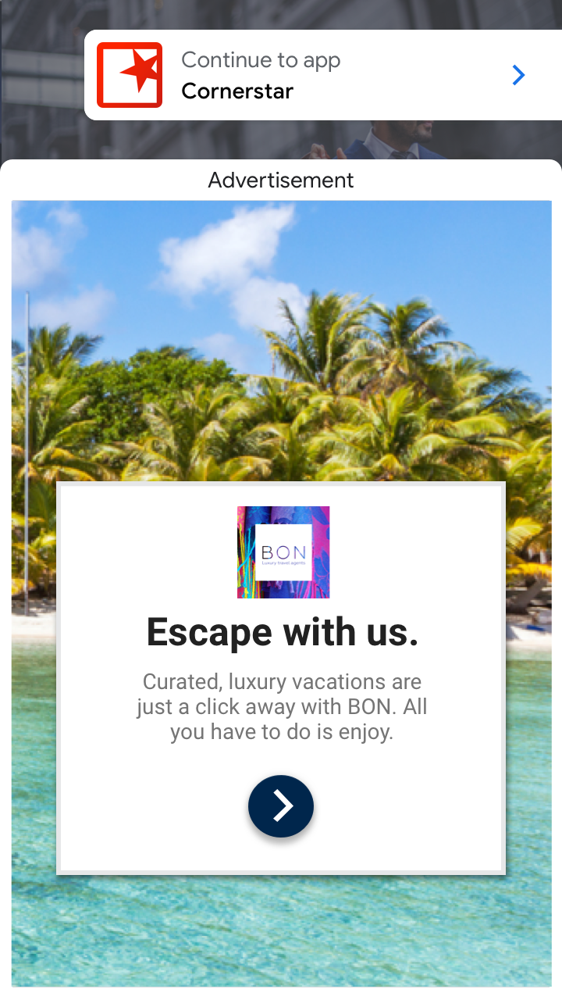

App open ads are a special ad format intended for publishers wishing to monetize their app load screens. App open ads can be closed at any time, and are designed to be shown when your users bring your app to the foreground.

App open ads automatically show a small branding area so users know they're in your app. Here is an example of what an app open ad looks like:




At a high level these are the important steps:

- Create an `AppOpenAd` instance;
- Load an ad;
- Add state listeners, we suggest using the [Application state events](https://docs.airnativeextensions.com/docs/application/application-state-events);
- Detect "Foreground" events (`ApplicationStateEvent.FOREGROUND`);
- Show the ad;


App Open Ads are represented by the `AppOpenAd` class. 

All of the App Open Ads functionality is provided through the `Adverts.service.appOpenAds` singleton.

>
> You must initialise an advert platform before calling any of the App Open Ad functionality. 
> See the [Initialise Platform](initialise-platform) section.
>


## Support

The App Open Ads have their own `isSupported` flag as App Open Ads may not be available on all platform and services.

To check if App Open Ads are supported:

```actionscript
if (Adverts.service.appOpenAds.isSupported)
{
	// App Open Ads are supported
}
```

This allows you to create a fallback scenario if App Open Ads aren't supported on the current platform and device. 


## Create

To create an App Open Ad call the `createAppOpenAd()` method:

```actionscript
var appOpenAd:AppOpenAd = Adverts.service.appOpenAds.createAppOpenAd();
```

This creates an instance of `AppOpenAd`.

You should set the ad unit id of the ad as part of your creation process, using the `setAdUnitId()` function:

```actionscript 
var appOpenAd:AppOpenAd = Adverts.service.appOpenAds.createAppOpenAd();
appOpenAd.setAdUnitId( ADUNITID );
```


## Load

App Open Ads should be preloaded in your application. This allows you to start the load at any time, and only display when your application is ready and when the advert has been loaded. You cannot display an app open ad until it is loaded and ready.

To load an advert you use the `load` function and pass it an `AdRequest` object which will specify the details of the ad request to load, and the orientation for the Ad.

The simplest example is to just use a generic request:

```actionscript
appOpenAd.load(
        new AdRequestBuilder().build(),
        AppOpenAdOrientation.PORTRAIT
);
```

See [Targeting](targeting) for more on the `AdRequestBuilder` targetting options.


You can listen for events that will inform you on when an advert is available or if there were any errors in loading the advert.

- `AppOpenAdEvent.LOADED`: dispatched when an ad has finished loading;
- `AppOpenAdEvent.ERROR`: dispatched if the ad failed to load


```actionscript
appOpenAd.addEventListener( AppOpenAdEvent.LOADED, loadedHandler );
appOpenAd.addEventListener( AppOpenAdEvent.ERROR, errorHandler );

function loadedHandler( event:AppOpenAdEvent ):void
{
	// appOpenAd loaded and ready to be displayed
}

function errorHandler( event:AppOpenAdEvent ):void
{
	// Load error occurred. The errorCode will contain more information
	trace( "Error" + event.errorCode );
}
```

If an error occurs you can use the `errorCode` on the event to determine what type of error occurred. See the [troubleshooting](troubleshooting) guide to determine what happened.


## Checking Loaded

You can check whether the advert is loaded by waiting for the `AppOpenAdEvent.LOADED` 
or checking the `isLoaded()` flag. It is useful to use the flag to confirm that the ad is loaded before attempting to display the ad:

```actionscript
if (appOpenAd.isLoaded())
{
	// Show the ad
}
```


## Display

When you are ready to display the app open ad you call `show()` as below:

```actionscript
appOpenAd.show();
```

You should check whether the ad is loaded before calling show to ensure that there is an ad available to display (as noted above). If there isn't this call will fail and return `false`.

```actionscript
if (appOpenAd.isLoaded())
{
	appOpenAd.show();
}
```


## Events

There are several presentation events dispatched by the app open ad as the user interacts with it:

- `FullScreenContentEvent.SHOW`: dispatched when an ad opens an overlay that covers the screen;
- `FullScreenContentEvent.DISMISSED`: dispatched when a user returns to the app, having closed the app open ad;
- `FullScreenContentEvent.FAILED_TO_SHOW`: dispatched if there was an error presenting the ad


```actionscript
appOpenAd.addEventListener( FullScreenContentEvent.DISMISSED, dismissedHandler );
appOpenAd.addEventListener( FullScreenContentEvent.SHOW, showHandler );
appOpenAd.addEventListener( FullScreenContentEvent.FAILED_TO_SHOW, failedToShowHandler );
				
function showHandler( event:FullScreenContentEvent ):void 
{
    // The app open ad has been shown and is now visible to the user 
}

function dismissedHandler( event:FullScreenContentEvent ):void 
{
	// Control has returned to your application
	// you should reactivate any paused / stopped parts of your application.

    // We also suggest that you start the load of another app open ad here in order
    // to ensure you have one available for the next app open.
}

function failedToShowHandler( event:FullScreenContentEvent ):void 
{
    // An error occurred, we suggest you load another ad 
}
```


## Always test with test ads

The easiest way to load test ads is to the dedicated test ad unit ID for app open ads:

- Android: `ca-app-pub-3940256099942544/3419835294`
- iOS: `ca-app-pub-3940256099942544/5662855259`

For more information about how the Mobile Ads SDK's test ads work, see [Test Ads](test-ads)


## Application State Events

You can use whatever method you choose to decide when to display your app open ads.

We suggest using the Application extension's state events though as a simple method of detecting the foreground event.
This event is better than the normal `ACTIVATE` event as the `ACTIVATE` event can get triggered when other elements are overlaid on your application, such as dialogs or the iOS control center. 

For example: 

```actionscript
Application.service.addEventListener( ApplicationStateEvent.FOREGROUND, foregroundHandler );

function foregroundHandler( event:ApplicationStateEvent ):void
{
    if (appOpenAd.isLoaded())
    {
        appOpenAd.show();
    }
}
```

For more information on the Application State Events see the documentation [here](https://docs.airnativeextensions.com/docs/application/application-state-events).


## Consider ad expiration

>
> Ad references in the app open beta will time out after four hours. Ads rendered more than four hours after request time will no longer be valid and may not earn revenue. This time limit is being carefully considered and may change in future beta versions of the app open format. 
>

To ensure you don't show an expired ad you should add a process to check how long it has been since your ad reference was loaded. Currently the ads have an expiry of 4 hours.


## Cold starts

The documentation thus far assumes that you only show app open ads when users foreground your app when it is suspended in memory. "Cold starts" occur when your app is launched but was not previously suspended in memory.

An example of a cold start is when a user opens your app for the first time. With cold starts, you won't have a previously loaded app open ad that's ready to be shown right away. The delay between when you request an ad and receive an ad back can create a situation where users are able to briefly use your app before being surprised by an out of context ad. This should be avoided because it is a bad user experience.

The preferred way to use app open ads on cold starts is to use a loading screen to load your game or app assets, and to only show the ad from the loading screen. If your app has completed loading and has sent the user to the main content of your app, do not show the ad.


## Best Practices

Google built app open ads to help you monetize your app's loading screen, but it's important to keep best practices in mind so that your users enjoy using your app. Make sure to:

- Wait to show your first app open ad until after your users have used your app a few times.
- Show app open ads during times when your users would otherwise be waiting for your app to load.
- If you have a loading screen under the app open ad, and your loading screen completes loading before the ad is dismissed, you may want to dismiss your loading screen in the `FullScreenContentEvent.DISMISSED` handler.

