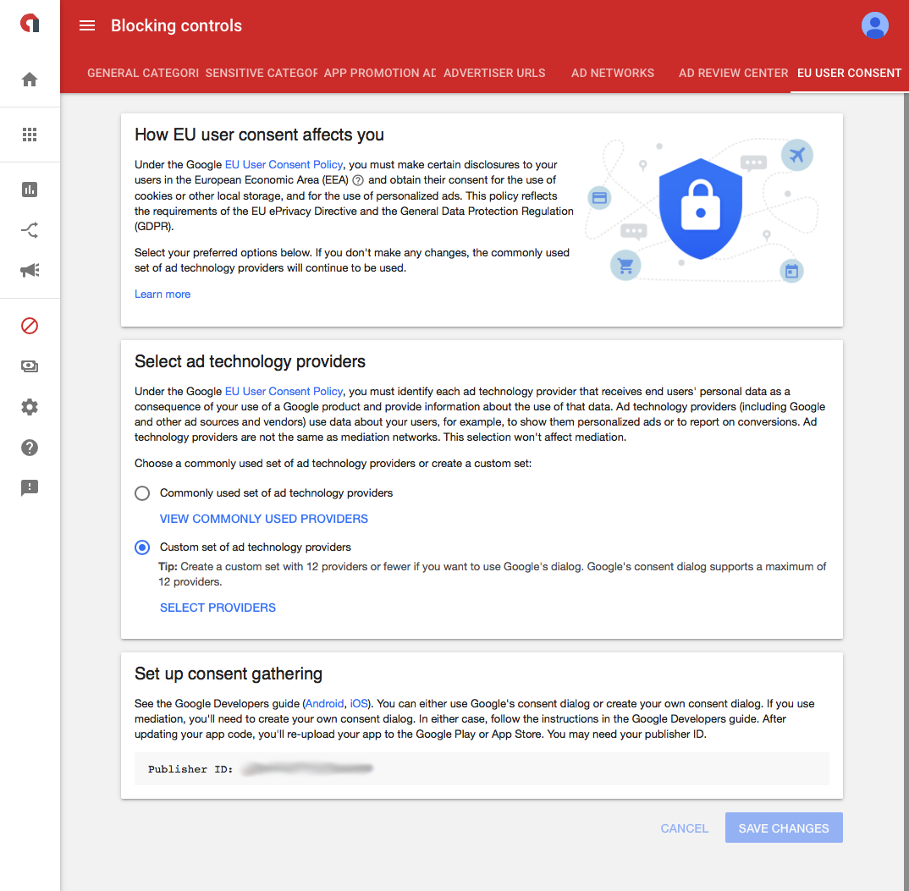
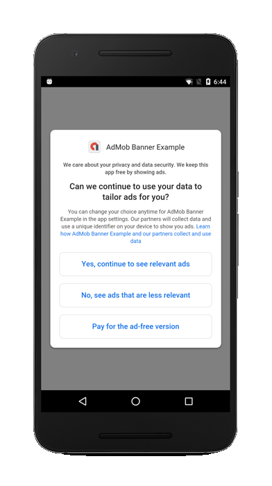

>
> **The Consent SDK has been deprecated. You should migrate to the new [User Messaging Platform](user-messaging-platform) to ensure you have access to the latest consent gathering tools**
>


>
> **Important** There are additional resources required to be packaged with your application in order to use this part of the SDK. 
> This is described in the [Consent Form Resources](consent#consent-form-resources) section below.
>


## The Consent SDK

>
> Under the Google EU User Consent Policy, you must make certain disclosures to your users in the European Economic Area (EEA) and obtain their consent to use cookies or other local storage, where legally required, and to use personal data (such as AdID) to serve ads. This policy reflects the requirements of the EU ePrivacy Directive and the General Data Protection Regulation (GDPR).
>
> To support publishers in meeting their duties under this policy, Google offers a Consent SDK. The Consent SDK is an open-source library that provides utility functions for collecting consent from your users.
>
> Ads served by Google can be categorized as personalized or non-personalized, both requiring consent from users in the EEA. By default, ad requests to Google serve personalized ads, with ad selection based on the user's previously collected data. Google also supports configuring ad requests to serve non-personalized ads. Learn more about personalized and non-personalized ads.
>
> This guide describes how to use the Consent SDK to obtain consent from users. It also describes how to forward consent to the Google Mobile Ads SDK once you have obtained consent.
>


## AdMob Settings

Firstly lets check you have setup your AdMob account to allow usage of the Consent SDK.

- Sign in to your AdMob account and [select ad technology providers](https://support.google.com/admob/answer/7666519#providers).

If you plan to use the consent form then you will need to make sure you select the **Custom set of ad technology providers** when you **Select ad technology providers**. 
This is located in the  *Blocking Controls / EU User Consent* section.





## Consent Status

Prior to using any other methods in the Consent SDK, you should update consent status to make sure the Consent SDK has the latest information regarding the ad technology providers you've selected in the AdMob UI. If the list of ad technology providers has changed since the user last provided consent, the consent state is set back to an unknown state.

To retrieve and update the consent status call the `getConsentStatus` function:

```actionscript
Adverts.service.consent.getConsentStatus( "publisher_id" );
```

The publisher id is taken from your AdMob account as shown in the [AdMob Settings](consent#admob-settings) section.

This is an asynchronous process and will dispatch one of two possible events:

- `ConsentEvent.STATUS_UPDATED`: Dispatched when the consent status has been updated
- `ConsentEvent.STATUS_ERROR`: Dispatched when there was an error retrieving the consent status


```actionscript
Adverts.service.consent.addEventListener( ConsentEvent.STATUS_UPDATED, statusUpdatedHandler );
Adverts.service.consent.addEventListener( ConsentEvent.STATUS_ERROR, statusErrorHandler );

Adverts.service.consent.getConsentStatus( "publisher_id" );


function statusUpdatedHandler( event:ConsentEvent ):void
{
    trace( "statusUpdatedHandler(): " + event.status
            + " inEea:" + event.inEeaOrUnknown );
}

private function statusErrorHandler( event:ConsentEvent ):void
{
    trace( "statusErrorHandler(): " + event.error );
}
```


## Consent Form

Asking for consent will involve presentation of the consent form. 

>
> The Google-rendered consent form is a full-screen configurable form that displays over your app content. You can configure the form to present the user with combinations of the following options:
> 
> - Consent to view personalized ads
> - Consent to view non-personalized ads
> - Use a paid version of the app instead of viewing ads
>
> You should review the consent text carefully: what appears by default is a message that might be appropriate if you use Google to monetize your app; but we cannot provide legal advice on the consent text that is appropriate for you. 
> To update consent text of the Google-rendered consent form, modify the `consentform.html` file included in the Consent SDK as required.
>




The Google-rendered consent form is configured using the `ConsentOptions` class and displayed using the `askForConsent(options)` function.
The following code demonstrates how to display a form with all three consent options:

```actionscript
var options:ConsentOptions = new ConsentOptions( "https://www.your.com/privacyurl" )
					.withPersonalizedAdsOption()
					.withNonPersonalizedAdsOption()
					.withAdFreeOption();

Adverts.service.consent.askForConsent( options );;
```

Once you have called `askForConsent` you will receive one of two events:

- `ConsentEvent.FORM_CLOSED`: Dispatched when the user has selected their consent status and the form has been closed
  - `event.status`:  Is a string containing one of the values defined in the ConsentStatus class.
- `ConsentEvent.FORM_ERROR`: Dispatched when there was an error loading or displaying the form
  - `event.error`: Will be a description of the error that occurred.

See [`ConsentEvent`](https://docs.airnativeextensions.com/asdocs/adverts/com/distriqt/extension/adverts/events/ConsentEvent.html) for more information on the fields.

```actionscript
var options:ConsentOptions = new ConsentOptions( "https://www.your.com/privacyurl" )
        .withPersonalizedAdsOption()
        .withNonPersonalizedAdsOption();

Adverts.service.consent.addEventListener( ConsentEvent.FORM_CLOSED, formClosedHandler );
Adverts.service.consent.addEventListener( ConsentEvent.FORM_ERROR, formErrorHandler );

Adverts.service.consent.askForConsent( options );


function formClosedHandler( event:ConsentEvent ):void
{
    trace( "formClosedHandler(): " + event.status
            + " inEea:" + event.inEeaOrUnknown
            + " adFree:" + event.userPrefersAdFree );
}

function formErrorHandler( event:ConsentEvent ):void
{
    trace( "formErrorHandler(): " + event.error );
}
```

>
> The Google-rendered consent form is not supported if any of your publisher IDs use the commonly used set of ad technology providers. Attempting to load the Google-rendered consent form will always fail in this case.
>


**Remember to provide users with the option to change or revoke consent.**


### Consent Form Resources

You need to package some additional assets with your application for the consent form. This is the html content for the consent form. 
It is packaged in a slightly different form for Android and iOS so we will address each separately.

#### Consent Form Resources - Android

On Android you will need to place the `consentform.html` file in the root of your application package and ensure it is packaged with your application.

If you wish to customise the form, such as changing the textural content, you should update this html file.


#### Consent Form Resources - iOS

On iOS you will need to place the `PersonalizedAdConsent.bundle` in the root of your application package and ensure it is packaged with your application.

If you wish to customise the form, such as changing the textural content, you should update the `consentform.html` file contained within the bundle.


## Testing

The Consent SDK has different behaviors depending on the location of the user. For example, the consent form fails to load if the user is not located in the EEA.

To enable easier testing of your app both inside and outside the EEA, the Consent SDK supports debug options that you can set prior to calling any other methods in the Consent SDK.

1. Update the consent status by calling `getConsentStatus()` as described above. 

  - On Android check the [logcat output](https://airnativeextensions.github.io/tutorials/device-logs) for the following log:

> ```
> I/ConsentInformation: Use ConsentInformation.getInstance(context).addTestDevice("33BE2250B43518CCDA7DE426D04EE231") to get test ads on this device.
> ```

  - On iOS get the value of the [Advertising identifier](advertising-identifier). 

2. Whitelist your device to be a debug device using the advertising ID:

```
Adverts.service.consent.addTestDevice( "33BE2250B43518CCDA7DE426D04EE231" );
```

3. Finally, call setDebugGeography to set your preferred geography for testing purposes.

```
Adverts.service.consent.setDebugGeography( DebugGeography.DEBUG_GEOGRAPHY_EEA );
```

After completing these steps, calls to update consent status will take into account your debug geography.


## Forward consent to the Google Mobile Ads SDK

Once you have gathered consent you must set the appropriate information on an ad request. See the [Targeting section](targeting) for more information.

