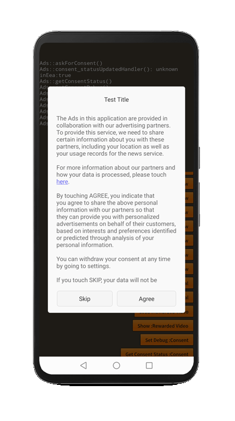

:::caution
**AdMob users must migrate to the [User Messaging Platform](user-messaging-platform) to ensure you have access to the latest consent gathering tools. The consent sdk has been removed due to app rejections when it was included.**

Huawei still utilises this consent SDK.
:::

## The Consent SDK

> Under the EU User Consent Policy, you must make certain disclosures to your users in the European Economic Area (EEA) and obtain their consent to use cookies or other local storage, where legally required, and to use personal data (such as AdID) to serve ads. This policy reflects the requirements of the EU ePrivacy Directive and the General Data Protection Regulation (GDPR).
>
> This consent SDK is to support publishers in meeting their duties under this policy. The Consent SDK is an open-source library that provides utility functions for collecting consent from your users.
>
> This guide describes how to use the Consent SDK to obtain consent from users. It also describes how to forward consent to the ads SDK once you have obtained consent.

## Availability

The consent sdk is only available for certain platforms. Once you have setup your platform you can check if the consent sdk is available by calling `isSupported`

```actionscript
if (Adverts.service.consent.isSupported)
{
  // Consent sdk is available
}
```

## Consent Status

Prior to using any other methods in the Consent SDK, you should update consent status to make sure the Consent SDK has the latest information regarding the ad technology providers you've selected in the AdMob UI. If the list of ad technology providers has changed since the user last provided consent, the consent state is set back to an unknown state.

To retrieve and update the consent status call the `getConsentStatus` function:

```actionscript
Adverts.service.consent.getConsentStatus( "publisher_id" );
```

The publisher id is taken from your AdMob account as shown in the [AdMob Settings](consent#admob-settings) section.

This is an asynchronous process and will dispatch one of two possible events:

- `ConsentEvent.STATUS_UPDATED`: Dispatched when the consent status has been updated
- `ConsentEvent.STATUS_ERROR`: Dispatched when there was an error retrieving the consent status

```actionscript
Adverts.service.consent.addEventListener( ConsentEvent.STATUS_UPDATED, statusUpdatedHandler );
Adverts.service.consent.addEventListener( ConsentEvent.STATUS_ERROR, statusErrorHandler );

Adverts.service.consent.getConsentStatus( "publisher_id" );


function statusUpdatedHandler( event:ConsentEvent ):void
{
    trace( "statusUpdatedHandler(): " + event.status
            + " inEea:" + event.inEeaOrUnknown );
}

private function statusErrorHandler( event:ConsentEvent ):void
{
    trace( "statusErrorHandler(): " + event.error );
}
```

## Consent

### Huawei Ads Kit

Huawei's consent sdk will present a series of dialogs to request consent for your user.



You can control the content using the `ConsentOptions.setDialogContent()` functionality and passing an `ConsentDialogContent` instance:

```actionscript
var options:ConsentOptions = new ConsentOptions( "https://airnativeextensions.com/privacy" )
          .setDialogContent(
            new ConsentDialogContent()
                .setContentText( "The Ads in this application are provided in collaboration with our advertising partners. To provide this service, we need to share certain information about you with these partners, including your location as well as your usage records for the news service.\n\n" +
                            "For more information about our partners and how your data is processed, please touch %MORE_INFO%.\n\n" +
                            "By touching AGREE, you indicate that you agree to share the above personal information with our partners so that they can provide you with personalized advertisements on behalf of their customers, based on interests and preferences identified or predicted through analysis of your personal information.\n\n" +
                            "You can withdraw your consent at any time by going to settings.\n\n" +
                            "If you touch SKIP, your data will not be shared with our partners and you will not receive personalized ads.")
                .setTitle( "Test Title" )
                .setMoreInfoText( "The Ads in HUAWEI X is provided in collaboration with our partners. You can find a full list of our partners for each country/region %MORE_INFO%.\n\n" +
                              "    In order to provide you with personalized advertisements, we need to share the following information with our partners:\n\n" +
                              "    •\tUser information, including advertising ID, city of residence, country, and language.\n\n" +
                              "    •\tDevice information, including device name and model, operating system version, screen size, and network type.\n\n" +
                              "    •\tService usage information, including news ID and records of views, clicks, dislikes, shares, and comments for news content and advertisements.\n\n" +
                              "    With your consent, the above information will be shared with our partners so that they can provide you with personalized advertisements on behalf of their customers, based on interests and preferences identified or predicted through analysis of your personal information.\n\n" +
                              "    You can withdraw your consent at any time by going to app settings.\n\n" +
                              "    Without your consent, no data will be shared with our partners and you will not receive personalized ads." )
                .setMediationPartnersText("You can find a full list of our partners for each country/region \n\n" )
        );

Adverts.service.consent.askForConsent( options );
```

### Consent Form Events

Once you have called `askForConsent` you will receive one of two events:

- `ConsentEvent.FORM_CLOSED`: Dispatched when the user has selected their consent status and the form has been closed
  - `event.status`: Is a string containing one of the values defined in the ConsentStatus class.
- `ConsentEvent.FORM_ERROR`: Dispatched when there was an error loading or displaying the form
  - `event.error`: Will be a description of the error that occurred.

See [`ConsentEvent`](https://docs.airnativeextensions.com/asdocs/adverts/com/distriqt/extension/adverts/events/ConsentEvent.html) for more information on the fields.

```actionscript
var options:ConsentOptions = new ConsentOptions( "https://www.your.com/privacyurl" )
        .withPersonalizedAdsOption()
        .withNonPersonalizedAdsOption();

Adverts.service.consent.addEventListener( ConsentEvent.FORM_CLOSED, formClosedHandler );
Adverts.service.consent.addEventListener( ConsentEvent.FORM_ERROR, formErrorHandler );

Adverts.service.consent.askForConsent( options );


function formClosedHandler( event:ConsentEvent ):void
{
    trace( "formClosedHandler(): " + event.status
            + " inEea:" + event.inEeaOrUnknown
            + " adFree:" + event.userPrefersAdFree );
}

function formErrorHandler( event:ConsentEvent ):void
{
    trace( "formErrorHandler(): " + event.error );
}
```

> Huawei Ads Kit return values are slightly different, `userPrefersAdFree` will always be `false` and `inEeaOrUnknown` will be `true` if the user needs to consent and `false` otherwise. The consent status will have equivalent values though.

**Remember to provide users with the option to change or revoke consent.**

## Testing

The Consent SDK has different behaviors depending on the location of the user. For example, the consent form fails to load if the user is not located in the EEA.

To enable easier testing of your app both inside and outside the EEA, the Consent SDK supports debug options that you can set prior to calling any other methods in the Consent SDK.

1. Update the consent status by calling `getConsentStatus()` as described above.

- On Android check the [logcat output](/docs/tutorials/device-logs) for the following log:

> ```
> I/ConsentInformation: Use ConsentInformation.getInstance(context).addTestDevice("33BE2250B43518CCDA7DE426D04EE231") to get test ads on this device.
> ```

- On iOS get the value of the [Advertising identifier](advertising-identifier).

2. Whitelist your device to be a debug device using the advertising ID:

```
Adverts.service.consent.addTestDevice( "33BE2250B43518CCDA7DE426D04EE231" );
```

3. Finally, call setDebugGeography to set your preferred geography for testing purposes.

```
Adverts.service.consent.setDebugGeography( DebugGeography.DEBUG_GEOGRAPHY_EEA );
```

After completing these steps, calls to update consent status will take into account your debug geography.

## Forward consent to the SDK

Once you have gathered consent you must set the appropriate information on an ad request. See the [Targeting section](targeting) for more information.
