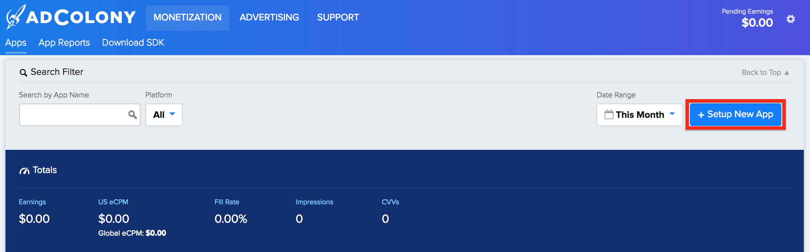
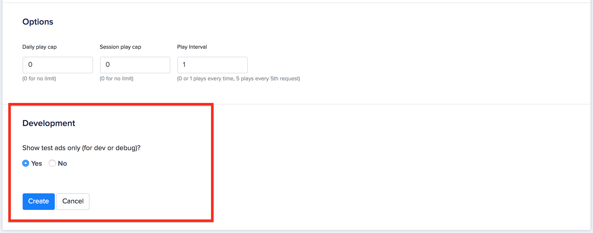

import Tabs from '@theme/Tabs'
import TabItem from '@theme/TabItem'

import InstallAPM from './_includes/add-apm.mdx'
import InstallManual from './_includes/add-manual.mdx'

import AppDescriptorAPM from './_includes/add-apm-appdescriptor.mdx'
import AppDescriptorManual from './_includes/add-manual-appdescriptor.mdx'


:::danger Deprecated
AdColony is now deprecated.

With AdColony being deprecated, we recommend removing AdColony from your project.

```
apm uninstall com.distriqt.admob.AdColony
```

This documentation only applies to legacy versions of the extension.
:::


This guide is intended for publishers who want to use the Google Mobile Ads SDK to load and display ads from AdColony through Open Bidding or waterfall mediation. It covers how to add AdColony ads to an ad unit's mediation configuration, and how to integrate the AdColony SDK and adapter into an AIR app.


## Step 1: Set up AdColony

[Sign up](https://clients.adcolony.com/signup) or [log in](https://clients.adcolony.com/login) to your AdColony account.  Add your app to the [AdColony publisher dashboard](https://clients.adcolony.com/apps) by clicking the **Setup New App** button.



Continue following the guide on the AdMob site:
- [Android](https://developers.google.com/admob/android/mediation/adcolony#step_1_set_up_adcolony)
- [iOS](https://developers.google.com/admob/ios/mediation/adcolony#step_1_set_up_adcolony)


## Step 2: Configure mediation settings for your AdMob ad unit

- [Android](https://developers.google.com/admob/android/mediation/adcolony#step_2_configure_mediation_settings_for_your_ad_unit)
- [iOS](https://developers.google.com/admob/ios/mediation/adcolony#step_2_configure_mediation_settings_for_your_ad_unit)


## Step 3: Import the AdColony SDK and adapter ANE

The simplest way to install and manage your AIR native extensions and libraries is to use the AIR Package Manager (`apm`). We highly recommend using `apm`, as it will handle downloading all required dependencies and manage your application descriptor (Android manifest additions, iOS info additions etc).

However you can choose to install it manually, as you would have done in the past. 

### Add the Extension

<Tabs
  groupId="packagemanager"
  defaultValue="apm"
  values={[
    {label: 'APM', value: 'apm'},
    {label: 'Manual', value: 'manual'},
  ]}>

  <TabItem value="apm" >
	<InstallAPM/>
  </TabItem>
  <TabItem value="manual" >
	<InstallManual/>
  </TabItem>
  
</Tabs>


### Application Descriptor

<Tabs
  groupId="packagemanager"
  defaultValue="apm"
  values={[
    {label: 'APM', value: 'apm'},
    {label: 'Manual', value: 'manual'},
  ]}>

  <TabItem value="apm" >
	<AppDescriptorAPM/>
  </TabItem>
  <TabItem value="manual" >
	<AppDescriptorManual/>
  </TabItem>
  
</Tabs>


## Step 4: Additional code required

No additional code required


## Step 5: Test your implementation

To enable test ads on AdColony, go to your AdColony dashboard and navigate to Monetization > Apps. Select your Zone for which you would like to enable test ads under the Ad Zones section of your app. Test ads can be enabled by checking Yes to Show test ads only? under the Development section.




## Optional steps

### EU Consent and GDPR


Under the Google EU User Consent Policy, you must ensure that certain disclosures are given to, and consents obtained from, users in the European Economic Area (EEA) regarding the use of device identifiers and personal data. This policy reflects the requirements of the EU ePrivacy Directive and the General Data Protection Regulation (GDPR). When seeking consent, you must identify each ad network in your mediation chain that may collect, receive, or use personal data and provide information about each network's use. Google currently is unable to pass the user's consent choice to such networks automatically.

The section below shows you how to enable or disable personalized ads for AdColony.


The AdColony adapter provides the `AdColony.instance.getAppOptions()` method to customize parameters to be sent to AdColony's SDK. Two methods relevant to GDPR on these options are `setPrivacyFrameworkRequired()` and `setPrivacyConsentString()`, added in AdColony SDK 4.2.0. The following sample code demonstrates how to pass these parameters to the AdColony adapter, which are then used in AdColony’s initialization method. These options must be set before you initialize mobile ads to ensure they get forwarded properly to AdColony's SDK:


```actionscript
AdColony.instance.getAppOptions()
        .setPrivacyFrameworkRequired( AdColonyAppOptions.GDPR, true )
        .setPrivacyConsentString( AdColonyAppOptions.GDPR, "1" );
```

See [AdColony’s GDPR implementation details](https://github.com/AdColony/AdColony-Android-SDK/wiki/Privacy-Laws#gdpr) for more information about what values may be provided in these methods.


### Permissions

For optimal performance, AdColony recommends adding the following optional permissions to your app's manifest additions:

```xml
<uses-permission android:name="android.permission.WRITE_EXTERNAL_STORAGE" />
<uses-permission android:name="android.permission.VIBRATE" />
```

## Further information

See the Google AdColony Mediation guide:

https://developers.google.com/admob/android/mediation/adcolony


