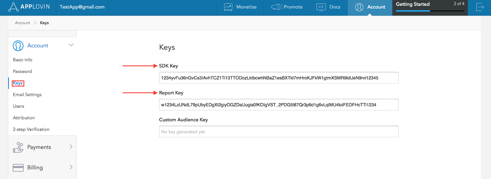
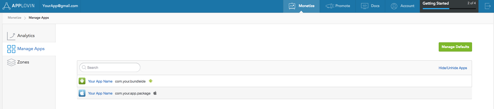
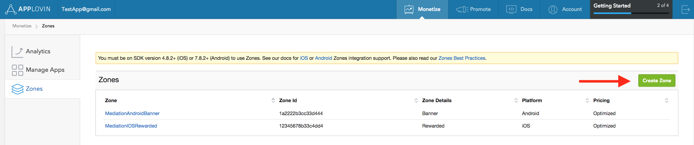
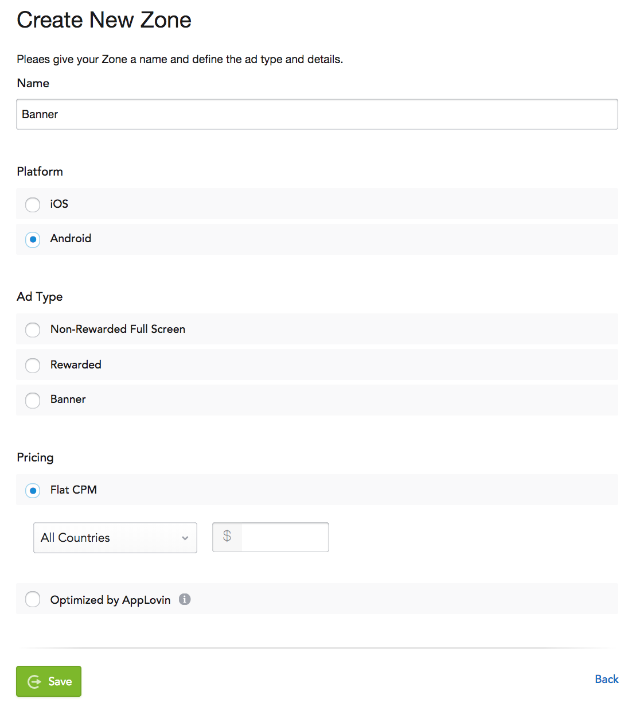
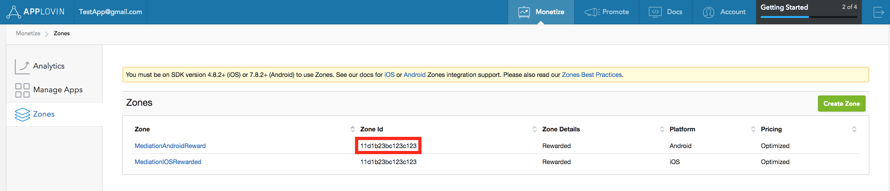
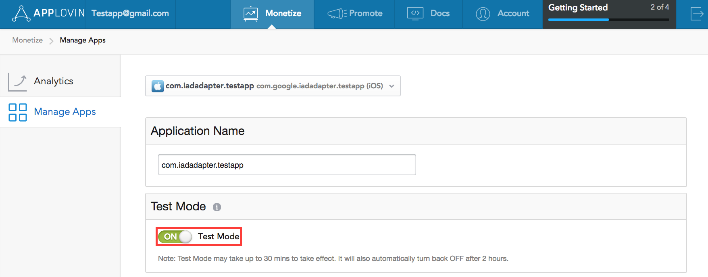
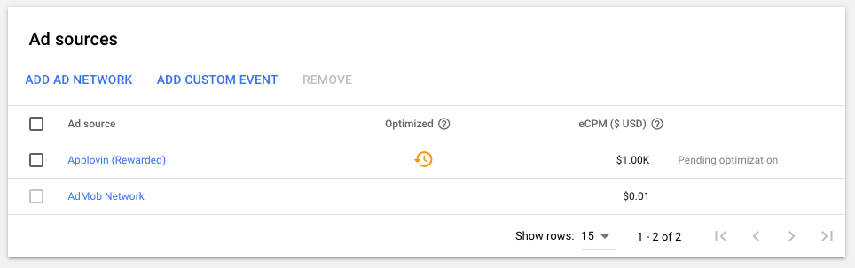

import Tabs from '@theme/Tabs'
import TabItem from '@theme/TabItem'

import InstallAPM from './_includes/add-apm.md'
import InstallManual from './_includes/add-manual.md'

import AppDescriptorAPM from './_includes/add-apm-appdescriptor.md'
import AppDescriptorManual from './_includes/add-manual-appdescriptor.md'

This guide is intended for publishers who want to use the Google Mobile Ads SDK to load and display ads from AppLovin Ads via mediation. It covers how to add AppLovin to an ad unit's mediation configuration , how to set up Ad Network Optimization (ANO), and how to integrate the AppLovin SDK and adapter into an Android app.

## Step 1: Set up AppLovin

[Sign up](https://www.applovin.com/signup) or [log in](https://www.applovin.com/login) to your AppLovin account.

To set up your AdMob ad unit, you'll need your AppLovin **SDK Key** and **Report Key**. To find them, go to the [AppLovin Dashboard](https://www.applovin.com/analytics#date_range=today&app_id=45001570&type=thirdparty_impressions&compare=false&show_unique=true) and click on the **Account** tab. In the dropdown list under **Account**, select **Keys** to see both values.Sign up or log in to your AppLovin account.

To set up your AdMob ad unit, you'll need your AppLovin SDK Key and Report Key. To find them, go to the AppLovin Dashboard and click on the Account tab. In the dropdown list under Account, select Keys to see both values.



### Select app for mediation

On the AppLovin dashboard, select **Manage Apps** under the **Monetize** section to get to your registered apps. Select the app you'd like to use with mediation from the list of available apps. If you do not see your app in the list, it is not registered. See the note below to get it registered



:::info Register AppLovin Application
Before you can complete the AdMob mediation setup, your app needs to be registered by AppLovin. Once your app initializes the AppLovin SDK, AppLovin automatically detects and registers it. To complete this process:

  1. Follow the steps in the [Import the AppLovin SDK and adapter section](#step-3-import-the-applovin-sdk-and-adapter-ane) below. Once that's done, you will have the AppLovin SDK integrated in your app.

  2. Add the Initialize the AppLovin SDK by calling `AdMobAppLovin.service.initializeSdk();` in your application.

Build and run your app, then wait thirty minutes or so. Afterwards, check the AppLovin dashboard under Monetize > Manage Apps to find your app.

Once the registration process is complete, you can remove the `initializeSdk` call.
:::

### Create Zone

On the AppLovin dashboard, select Zones under the Monetize section to get to your registered Zone IDs. If you have already created the required Zones for your app, skip ahead to Step2. To create a new Zone ID, click on Create Zone.



Enter the name of Zone ID, select Android as the Platform, and choose the desired Ad Type.

Configure Pricing for the Zone by selecting either Flat CPM or Optimized by AppLovin. CPMs can be configured on a per country basis for the Flat CPM option. Then, click Save.



Once the Zone is created, the Zone ID can be found under the Zone ID column.



> Note: We highly recommend that you create an AppLovin Zone corresponding to each AdMob ad unit so that AdMob can more effectively [Optimize ad sources in mediation](https://support.google.com/admob/answer/7374110). See AppLovin's [best practices](https://support-developer.applovin.com/hc/en-us/articles/360000476612-What-is-the-recommended-implementation-of-Zones) to assist you in configuring Zones optimally. In the meantime, you can continue without creating a Zone.

## Step 2: Configure mediation settings for your AdMob ad unit

https://developers.google.com/admob/android/mediation/applovin#step_2_configure_mediation_settings_for_your_ad_unit

## Step 3: Import the AppLovin SDK and adapter ANE


The simplest way to install and manage your AIR native extensions and libraries is to use the AIR Package Manager (`apm`). We highly recommend using `apm`, as it will handle downloading all required dependencies and manage your application descriptor (Android manifest additions, iOS info additions etc).

However you can choose to install it manually, as you would have done in the past. 

### Add the Extension

<Tabs
  groupId="packagemanager"
  defaultValue="apm"
  values={[
    {label: 'APM', value: 'apm'},
    {label: 'Manual', value: 'manual'},
  ]}>

  <TabItem value="apm" >
	<InstallAPM/>
  </TabItem>
  <TabItem value="manual" >
	<InstallManual/>
  </TabItem>
  
</Tabs>


### Application Descriptor

<Tabs
  groupId="packagemanager"
  defaultValue="apm"
  values={[
    {label: 'APM', value: 'apm'},
    {label: 'Manual', value: 'manual'},
  ]}>

  <TabItem value="apm" >
	<AppDescriptorAPM/>
  </TabItem>
  <TabItem value="manual" >
	<AppDescriptorManual/>
  </TabItem>
  
</Tabs>


## Step 4: Additional code required

No additional code required.


## Step 5: Test your implementation

AppLovin recommends that [test ads](https://support-developer.applovin.com/hc/en-us/articles/115000509267-How-can-I-get-test-ads-) should be used during development if you cannot get live ads.

To enable test ads, go to the Manage Apps page by clicking on your app's name in the AppLovin dashboard and navigate to the Test Mode section. Toggle the Test Mode switch to ON.



Test Mode may take up to 30 mins to take effect. It will also automatically reset to OFF after two hours.

### Forcing Mediation Network

The easiest way we have found to force a mediation network during testing is to disable automatic optimisations and set the eCPM manually.

Doing this you can give the mediation network you are wanting to test a high eCPM value ( eg $1000) and all others (including AdMob) a very low eCPM (eg $0.01).



## Optional steps

### EU consent and GDPR

Under the Google EU User Consent Policy, you must ensure that certain disclosures are given to, and consents obtained from, users in the European Economic Area (EEA) regarding the use of device identifiers and personal data. This policy reflects the requirements of the EU ePrivacy Directive and the General Data Protection Regulation (GDPR). When seeking consent, you must identify each ad network in your mediation chain that may collect, receive, or use personal data and provide information about each network's use. Google currently is unable to pass the user's consent choice to such networks automatically.

The section below shows you how to enable or disable personalized ads for AppLovin.

In SDK version 8.0.1, AppLovin added the `setHasUserContent` and `setIsAgeRestrictedUser` methods. The following sample code shows how to pass consent information to the AppLovin SDK. It is recommended that you call these methods prior to requesting ads via the Google Mobile Ads SDK.

```actionscript
AdMobAppLovin.service.setHasUserConsent( true );
```

Additionally, if the user is known to be in an age-restricted category, you can also set the below flag to true.

```actionscript
AdMobAppLovin.service.setIsAgeRestrictedUser( true );
```

## Further information

See the Google AppLovin Mediation guide:

https://developers.google.com/admob/android/mediation/applovin
