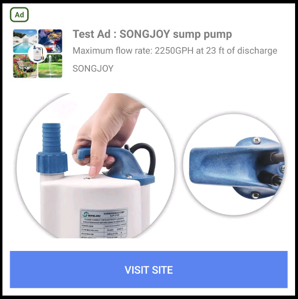

Native ads allow you to customize the look and feel of the ads that appear in your app. You design the ads from the ground up: how they look, where they’re placed, and how they work within your existing app design.

Using native ads you can customize your ads resulting in a better user experience. Better user experiences can increase engagement and improve your overall yield.

>
> Currently only Native Ad Templates are implemented. If you need a custom view implementation please contact our custom development team at airnativeextensions@distriqt.com
>

## Load an Ad

Native ads are loaded via the `NativeAd` class.


Firstly create an instance of the `NativeAd` by calling `Adverts.service.nativeAds.createNativeAd()` passing your unit id:

```actionscript
var nativeAd:NativeAd = Adverts.service.nativeAds.createNativeAd( "ca-app-pub-3940256099942544/2247696110" );
```

To load an ad call the `loadAd()` function of the `NativeAd` instance and pass an `AdRequest` object which will specify the details of the ad request to load. You create an `AdRequest` by using the `AdRequestBuilder`. The builder is used to correctly create the request object and easily set the availble properties on the request.

The simplest example is to just use a generic request:

```actionscript
nativeAd.load( new AdRequestBuilder().build() );
```

You can set properties, such as adding a gender to the request, using the other methods on the builder:

```actionscript
var request:AdRequest = new AdRequestBuilder()
							.setGender( AdRequest.GENDER_MALE )
							.build();

nativeAd.load( request );
```

See [Targeting](targeting) for more on the `AdRequestBuilder` targetting options.


The load process will dispatch one of two events:

- `NativeAdEvent.LOADED`: On successful load of a native ad;
- `NativeAdEvent.ERROR`: If there was an error, (eg invalid account, unit id etc)


```actionscript
var nativeAd:NativeAd = Adverts.service.nativeAds.createNativeAd( "ca-app-pub-3940256099942544/2247696110" );

nativeAd.addEventListener( NativeAdEvent.LOADED, loadedHandler );
nativeAd.addEventListener( NativeAdEvent.ERROR, errorHandler );
nativeAd.load( new AdRequestBuilder().build() ); 

function loadedHandler( event:NativeAdEvent ):void
{
    trace( "native ad loaded" );
}

function errorHandler( event:NativeAdEvent ):void
{
    trace( "errorHandler: " + event.errorCode + "::"+event.errorMessage );
}
```


> **As opposed to some other formats, you cannot show a native ad until the load is complete.**


## Testing and Development

It is very important that while you are developing your application that you do not serve live ads. **This is a requirement of the usage of AdMob and not following this correctly can have your application id blocked from using AdMob.**

While in development you should either use the test ad unit ids available or specify your test device id in your ad requests. More information on this is located in the section on [Test Ads](test-ads)


## Display


We have provided access to the native templates to get started with native ads.

>
> If you require more specific customisation on how your ads are displayed, you can contact our custom development team at airnativeextensions@distriqt.com
>

There are two templates: small and medium.


### Small Template

The small template is ideal for lists or any time you need a long rectangular ad view (similar to a banner).


### Medium Template

The medium template is meant to be a one-half to three-quarter page view but can also be used in feeds. It is good for landing pages or splash pages.




### Show

To use a template call the `showWithTemplate()` function. This function takes two parameters, the type of template and view parameters to position and size the ad.


For the small sized template:

```actionscript
nativeAd.showWithTemplate( NativeAdTemplate.SMALL, params );
```

For the medium sized template:

```actionscript
nativeAd.showWithTemplate( NativeAdTemplate.MEDIUM, params );
```


You must specify the size and position for the advert in order for it to be correctly created. Here `params` is an instance of `AdViewParams`. You must at least provide the width and height for the ad:

```actionscript
var params:AdViewParams = new AdViewParams();
params.width = 800;
params.height = 800;

nativeAd.showWithTemplate( NativeAdTemplate.MEDIUM, params );
```


### Size and Position

To control the size and position of the advert, use the `setViewParams()` function. This function uses the `AdViewParams` class to communicate position and size of the native ad.

To set the position:

```actionscript
var params:AdViewParams = new AdViewParams();
params.x = 50;
params.y = 50;
params.width = 800;
params.height = 400;

nativeAd.setViewParams( params );
```

**You must specify a width or height for a native ad!** Unlike other ad formats the content is created and sized from a template according to your needs so it is very important that you provide size information.


To retrieve the displayed position and size of the advert use the `getViewParams()` function.

```actionscript
var params:AdViewParams = nativeAd.getViewParams();

trace( "AD WIDTH:  " + params.width );
trace( "AD HEIGHT: " + params.height );
```


### Styling

You can style the templates by providing a custom `NativeAdTemplateStyle` instance to the `showWithTemplate()` function.

The `NativeAdTemplateStyle` has a range of functions to control various styles, such as text sizes and background colours. 

```actionscript
var style:NativeAdTemplateStyle = new NativeAdTemplateStyle()
    .setMainBackgroundColor( 0xFFFF00FF )
    .setCallToActionBackgroundColor( 0xFFFF0000 )
    .setPrimaryTextBackgroundColor( 0xFF00FF00 )
    .setSecondaryTextBackgroundColor( 0xFF0000FF )
    .setTertiaryTextBackgroundColor( 0xFF000000 );
```

This instance is passed as the second parameter to the `showWithTemplate()` function:

```actionscript
nativeAd.showWithTemplate( NativeAdTemplate.MEDIUM, params, style );
```


### Example


```actionscript
var nativeAd:NativeAd = Adverts.service.nativeAds.createNativeAd( "ca-app-pub-3940256099942544/2247696110" );

nativeAd.addEventListener( NativeAdEvent.LOADED, loadedHandler );
nativeAd.addEventListener( NativeAdEvent.ERROR, errorHandler );

nativeAd.load( new AdRequestBuilder().build() );


function loadedHandler( event:NativeAdEvent ):void
{
    var params:AdViewParams = new AdViewParams();
        params.width = 800;
        params.height = 400;

    var style:NativeAdTemplateStyle = new NativeAdTemplateStyle()
        .setMainBackgroundColor( 0xFFFF00FF )
		.setCallToActionBackgroundColor( 0xFFFF0000 )
		.setPrimaryTextBackgroundColor( 0xFF00FF00 )
		.setSecondaryTextBackgroundColor( 0xFF0000FF )
		.setTertiaryTextBackgroundColor( 0xFF000000 );

    nativeAd.showWithTemplate(
		NativeAdTemplate.SMALL,
        params,
		style
    );
}

function errorHandler( event:NativeAdEvent ):void
{
    trace( "errorHandler: " + event.errorCode + "::"+event.errorMessage );
}
```

