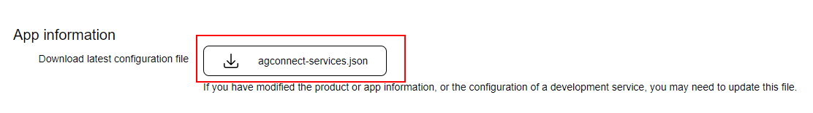

This section describes how to setup your AIR application to use Huawei Ads Kit with this extension. Huawei devices use a variant of Android. 

You should make sure you have been through the process of creating an Huawei developer account and setup your Ads application in the console :

- https://developer.huawei.com/consumer/en/doc/development/HMS-Guides/ads-sdk-introduction
- Console: https://developer.huawei.com/consumer/en/service/ads/publisher/html/index.html

You will need to gather a few resources from the console, 

- `agconnect-services.json` configuration file;
- Ad Unit ids for the advertisements you plan to display;


## AppGallery Connect Configuration File

- Sign in to [AppGallery Connect](https://developer.huawei.com/consumer/en/service/josp/agc/index.html) and select My apps.
- Find your app from the list and click the app name.


- Go to Development > Overview > App information.
- Click `agconnect-services.json` to download the configuration file.



 - Add `agconnect-services.json` to the root of your application and ensure it is packaged.  


## Assets

Along with the `agconnect-services.json` there are a series of assets that need to be packaged with your application. 
These assets are required by the Huawei SDK . 

Copy all the files in the `assets` folder (alongside the extension):

- `grs_sdk_global_route_config_opensdkService.json`
- `grs_sdk_server_config.json`
- `grs_sp.bks`
- `hianalytics_njjn`
- `updatesdkcas.bks`

These need to be added at the root level of your application and packaged with your application. 


## Dependencies

Many of our extensions use some common libraries, for example, the Android Support libraries.

We have to separate these libraries into separate extensions in order to avoid multiple versions of the libraries being included in your application and causing packaging conflicts. This means that you need to include some additional extensions in your application along with the main extension file.

You will add these extensions as you do with any other extension, and you need to ensure it is packaged with your application.


### Core 

The Core ANE is required by this ANE. You must include and package this extension in your application.

The Core ANE doesn't provide any functionality in itself but provides support libraries and frameworks used by our extensions.
It also includes some centralised code for some common actions that can cause issues if they are implemented in each individual extension.

You can access this extension here: [https://github.com/distriqt/ANE-Core](https://github.com/distriqt/ANE-Core).


### Android Support

The Android Support libraries encompass the Android Support, Android X and common Google libraries. 

These libraries are specific to Android. There are no issues including these on all platforms, they are just **required** for Android.

This extension requires the following extensions:

- [androidx.appcompat.ane](https://github.com/distriqt/ANE-AndroidSupport/raw/master/lib/androidx.appcompat.ane)
- [androidx.core.ane](https://github.com/distriqt/ANE-AndroidSupport/raw/master/lib/androidx.core.ane)
- [androidx.constraintlayout.ane](https://github.com/distriqt/ANE-AndroidSupport/raw/master/lib/androidx.constraintlayout.ane)

You can access these extensions here: [https://github.com/distriqt/ANE-AndroidSupport](https://github.com/distriqt/ANE-AndroidSupport).


>
> **Note**: if you have been using the older `com.distriqt.androidsupport.*` (Android Support) extensions you should remove these extensions and replace it with the `androidx` extensions listed above. This is the new version of the android support libraries and moving forward all our extensions will require AndroidX.
>


### Huawei Mobile Services

This extension requires usage of certain aspects of the Huawei Mobile Services (HMS) SDK. 

The HMS SDK is available as a series of extensions that you add into your applications packaging options.  Each separate extension provides a component(s) from the HMS SDK and are used by different extensions. These client libraries aren't packaged with this extension as they are used by multiple extensions and separating them will avoid conflicts, allowing you to use multiple extensions in the one application.

This extension requires the following HMS extensions:

- [com.huawei.hms.base](https://github.com/distriqt/ANE-HuaweiMobileServices/raw/master/lib/com.huawei.hms.base.ane)
- [com.huawei.hms.adsidentifier](https://github.com/distriqt/ANE-HuaweiMobileServices/raw/master/lib/com.huawei.hms.adsidentifier.ane)
- [com.huawei.hms.adslite](https://github.com/distriqt/ANE-HuaweiMobileServices/raw/master/lib/com.huawei.hms.adslite.ane)


You must include the above native extensions in your application along with this extension, and you need to ensure they are packaged with your application.

You can access the Huawei Mobile Services SDK extensions here: [https://github.com/distriqt/ANE-HuaweiMobileServices](https://github.com/distriqt/ANE-HuaweiMobileServices).


## Extension IDs

The following should be added to your `extensions` node in your application descriptor to identify all the required ANEs in your application:

```xml
<extensions>
        <extensionID>com.distriqt.Adverts</extensionID>
        <extensionID>com.distriqt.Core</extensionID>

        <extensionID>com.huawei.hms.base</extensionID>
        <extensionID>com.huawei.hms.adsidentifier</extensionID>
        <extensionID>com.huawei.hms.adslite</extensionID>

        <extensionID>androidx.appcompat</extensionID>
        <extensionID>androidx.core</extensionID>
        <extensionID>androidx.constraintlayout</extensionID>
</extensions>
```


## Android 

### Manifest Additions

The Adverts ANE requires a few additions to the manifest to be able to start certain activities. You should add the listing below to your manifest, replacing `APPLICATION_PACKAGE` with your AIR application package name on Android (eg `air.com.distriqt.test`) Note that it may be prefixed by `air.`.

Also we suggest you enable hardware acceleration so videos are displayed correctly (i.e. the `android:hardwareAccelerated="true"` attribute on your android `application` tag).


```xml
<manifest android:installLocation="auto">

    <uses-permission android:name="android.permission.INTERNET"/>
    <uses-permission android:name="android.permission.ACCESS_NETWORK_STATE"/>
    <uses-permission android:name="android.permission.ACCESS_WIFI_STATE" />
    <uses-permission android:name="android.permission.WAKE_LOCK" />
    <uses-permission android:name="android.permission.WRITE_EXTERNAL_STORAGE"/>

	<application 
		android:hardwareAccelerated="true"
		android:appComponentFactory="androidx.core.app.CoreComponentFactory">

        <activity android:name="com.huawei.openalliance.ad.activity.PPSLauncherActivity"
            android:theme="@android:style/Theme.Translucent.NoTitleBar"
            android:exported="true">
            <intent-filter>
                <action android:name="android.intent.action.VIEW"/>
                <category android:name="android.intent.category.DEFAULT"/>
                <category android:name="android.intent.category.BROWSABLE"/>
                <data android:scheme="hwpps" android:host="APPLICATION_PACKAGE"/>
            </intent-filter>
            <meta-data android:name="hwc-theme" android:value="androidhwext:style/Theme.Emui.Translucent.NoTitleBar" />
        </activity>
        <activity
            android:name="com.huawei.openalliance.ad.activity.PPSBridgeActivity"
            android:exported="false"
            android:theme="@android:style/Theme.Translucent.NoTitleBar" >
            <meta-data
                android:name="hwc-theme"
                android:value="androidhwext:style/Theme.Emui.Translucent.NoTitleBar" />
        </activity>
        <activity
            android:name="com.huawei.openalliance.ad.activity.PPSNotificationActivity"
            android:exported="false"
            android:theme="@android:style/Theme.Translucent.NoTitleBar" >
            <meta-data
                android:name="hwc-theme"
                android:value="androidhwext:style/Theme.Emui.Translucent.NoTitleBar" />
        </activity>
        <activity
            android:name="com.huawei.openalliance.ad.activity.AgProtocolActivity"
            android:configChanges="orientation|screenSize"
            android:exported="false"
            android:theme="@android:style/Theme.Translucent.NoTitleBar" >
            <meta-data
                android:name="hwc-theme"
                android:value="androidhwext:style/Theme.Emui.Translucent.NoTitleBar" />
        </activity>


        <meta-data android:name="com.huawei.hms.client.service.name:base" android:value="base:4.0.2.300" />
        <meta-data android:name="com.huawei.hms.min_api_level:base:hmscore" android:value="1" />

        <!-- HMS Ads Kit -->
        <meta-data android:name="com.huawei.hms.client.service.name:ads-lite" android:value="ads-lite:13.4.30.301" />
        <meta-data android:name="com.huawei.hms.client.service.name:ads-banner" android:value="ads-banner:13.4.30.301" />
        <meta-data android:name="com.huawei.hms.client.service.name:ads-template" android:value="ads-template:13.4.30.301" />
        <meta-data android:name="com.huawei.hms.client.service.name:ads-native" android:value="ads-native:13.4.30.301" />
        <meta-data android:name="com.huawei.hms.client.service.name:ads-interstitial" android:value="ads-interstitial:13.4.30.301" />
        <meta-data android:name="com.huawei.hms.client.service.name:ads-reward" android:value="ads-reward:13.4.30.301" />
        <meta-data android:name="com.huawei.hms.client.service.name:ads-splash" android:value="ads-splash:13.4.30.301" />
        <meta-data android:name="com.huawei.hms.client.service.name:ads-base" android:value="ads-base:13.4.30.301" />
        <meta-data android:name="com.huawei.hms.client.service.name:ads-lang" android:value="ads-lang:13.4.30.301" />

        <!-- HMS Ads Consent -->
        <meta-data android:name="com.huawei.hms.client.service.name:ads-consent" android:value="ads-consent:3.4.34.301" />

        <!-- HMS Ads Identifier -->
        <meta-data android:name="com.huawei.hms.client.service.name:ads-identifier" android:value="ads-identifier:3.4.34.301" />

			
	</application>

</manifest>
```

We also suggest that you add the `containsVideo` tag to your `android` configuration:


```xml
<android>
	<manifestAdditions><![CDATA[
		<!-- MANIFEST -->
	]]></manifestAdditions>
	
	<containsVideo>true</containsVideo>

</android>
```


## iOS 

iOS is not supported by Huawei Ads, you should consider using AdMob on iOS as a replacement.

