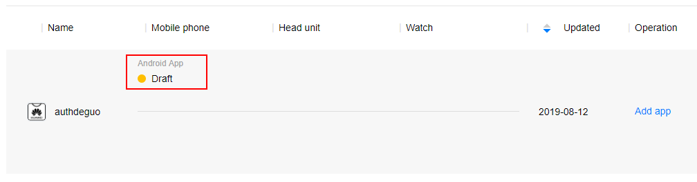

import Tabs from '@theme/Tabs'
import TabItem from '@theme/TabItem'

import InstallAPM from './_includes/add-apm.mdx'
import InstallManual from './_includes/add-manual.mdx'

import AppDescriptorAPM from './_includes/add-apm-appdescriptor.mdx'
import AppDescriptorManual from './_includes/add-manual-appdescriptor.mdx'


This section describes how to setup your AIR application to use Huawei Ads Kit with this extension. Huawei devices use a variant of Android. 

You should make sure you have been through the process of creating an Huawei developer account and setup your Ads application in the console :

- https://developer.huawei.com/consumer/en/doc/development/HMS-Guides/ads-sdk-introduction
- Console: https://developer.huawei.com/consumer/en/service/ads/publisher/html/index.html

You will need to gather a few resources from the console, 

- `agconnect-services.json` configuration file;
- Ad Unit ids for the advertisements you plan to display;


## AppGallery Connect Configuration File

- Sign in to [AppGallery Connect](https://developer.huawei.com/consumer/en/service/josp/agc/index.html) and select My apps.
- Find your app from the list and click the app name.



- Go to Development > Overview > App information.
- Click `agconnect-services.json` to download the configuration file.


 - Add `agconnect-services.json` to the root of your application and ensure it is packaged.  


## Install

The simplest way to install and manage your AIR native extensions and libraries is to use the AIR Package Manager (`apm`). We highly recommend using `apm`, as it will handle downloading all required dependencies and manage your application descriptor (Android manifest additions, iOS info additions etc).

However you can choose to install it manually, as you would have done in the past. 


<Tabs
  groupId="packagemanager"
  defaultValue="apm"
  values={[
    {label: 'APM', value: 'apm'},
    {label: 'Manual', value: 'manual'},
  ]}>

  <TabItem value="apm" >
	<InstallAPM/>
  </TabItem>
  <TabItem value="manual" >
	<InstallManual/>
  </TabItem>
  
</Tabs>


## Application Descriptor

<Tabs
  groupId="packagemanager"
  defaultValue="apm"
  values={[
    {label: 'APM', value: 'apm'},
    {label: 'Manual', value: 'manual'},
  ]}>

  <TabItem value="apm" >
	<AppDescriptorAPM/>
  </TabItem>
  <TabItem value="manual" >
	<AppDescriptorManual/>
  </TabItem>
  
</Tabs>


## Checking for Support

You can use the `isSupported` flag to determine if this extension is supported on the current platform and device.

This allows you to react to whether the functionality is available on the device and provide an alternative solution if not.


```actionscript
if (Adverts.isSupported)
{
	// Functionality here
}
```


