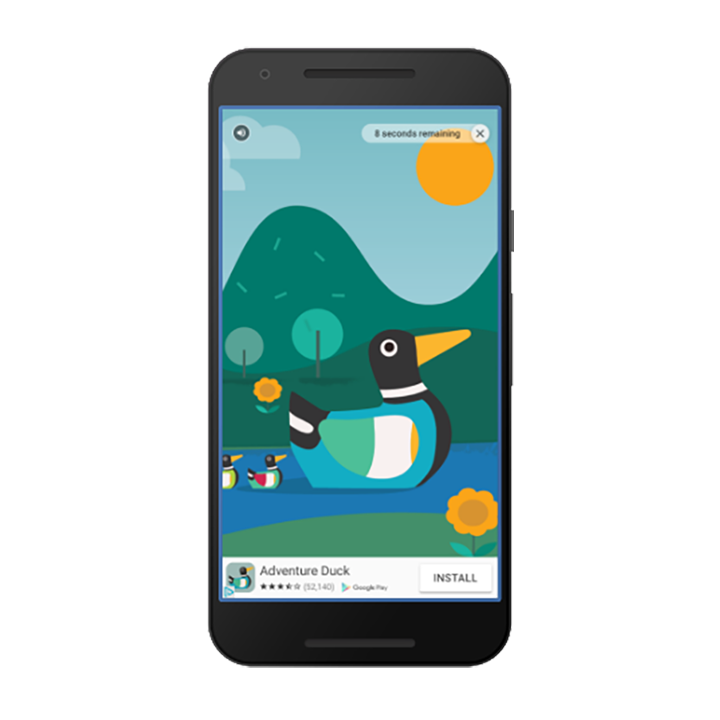
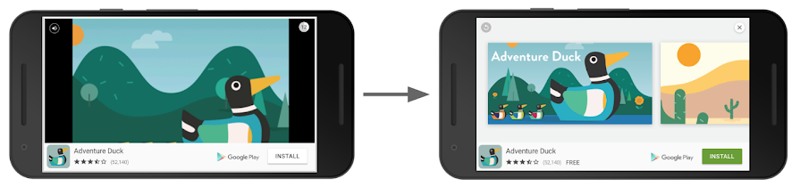

Rewarded video ads are full-screen video ads that users have the option of watching in full in exchange for in-app rewards.



Rewarded ads are click-to-download video ads with an end card that appears when the video ends.



Clicking on the X button will generate a prompt asking if the user wishes to close the ad.
The user is warned that they will lose the reward if the ad is closed.


Rewarded Video Ads are represented by the `RewardedVideoAd` class.

> **Starting with version 8.0 there can be multiple instances of the `RewardedVideoAd` class, meaning you can preload another ad while presenting one.**

All of the rewarded video ads functionality is provided through the `Adverts.service.rewardedVideoAds` singleton.

:::info
You must initialise an advert platform before calling any of the rewarded video ad functionality.
See the [Initialise Platform](initialise-platform) section.
:::

## Support

The rewarded video ads have their own `isSupported` flag as rewarded video ads may not be available on all platform and services.

To check if rewarded video ads are supported:

```actionscript
if (Adverts.service.rewardedVideoAds.isSupported)
{
	// rewarded video ads are supported
}
```

This allows you to create a fallback scenario if rewarded video ads aren't supported on the current platform and device.

## `RewardedVideoAd`

To create a `RewardedVideoAd` instance use the `createRewardedVideoAd()` function:

```actionscript
var rewardedVideoAd : RewardedVideoAd = Adverts.service.rewardedVideoAds.createRewardedVideoAd();
```

This will instanciate an instance of the `RewardedVideoAd` class. You are required to destroy this instance when you are finished with it.

You are required to set the ad unit id by calling the `setAdUnitId` function before any loading is performed.

```actionscript
rewardedVideoAd.setAdUnitId( "REWARDED_AD_UNIT_ID" );
```

## Loading

Rewarded Video Ads should be preloaded in your application. This allows you to start the load at any time, and only display when your application is ready and when the advert has been loaded. You cannot display a rewarded video ad until it is loaded and ready.

To load an advert you use the `load` function and pass it an `AdRequest` object which will specify the details of the ad request to load.

The simplest example is to just use a generic request:

```actionscript
rewardedVideoAd.load( new AdRequestBuilder().build() );
```

See [Targeting](targeting) for more on the `AdRequestBuilder` targetting options.

You can listen for events that will inform you on when an advert is available or if there were any errors in loading the advert.

- `RewardedVideoAdEvent.LOADED`: dispatched when an ad has finished loading;
- `RewardedVideoAdEvent.ERROR`: dispatched if the ad failed to load

```actionscript
rewardedVideoAd.addEventListener( RewardedVideoAdEvent.LOADED, loadedHandler );
rewardedVideoAd.addEventListener( RewardedVideoAdEvent.ERROR, errorHandler );

function loadedHandler( event:RewardedVideoAdEvent ):void
{
	// rewarded video ad loaded and ready to be displayed
}

function errorHandler( event:RewardedVideoAdEvent ):void
{
	// Load error occurred. The errorCode will contain more information
	trace( "Error" + event.errorCode );
}
```

If an error occurs you can use the `errorCode` on the event to determine what type of error occurred. See the [troubleshooting](troubleshooting) guide to determine what happened.

## Testing and Development

It is very important that while you are developing your application that you do not serve live ads. **This is a requirement of the usage of AdMob and not following this correctly can have your application id blocked from using AdMob.**

While in development you should either use the test ad unit ids available or specify your test device id in your ad requests. More information on this is located in the section on [Test Ads](test-ads)

The following Ad Unit IDs can be used to test rewarded video ads in your application:

- Android: `ca-app-pub-3940256099942544/5224354917`
- iOS: `ca-app-pub-3940256099942544/1712485313`

## Checking Loaded

You can check whether the advert is loaded by waiting for the `RewardedVideoAdEvent.LOADED`
or checking the `isLoaded()` flag. It is useful to use the flag to confirm that the ad is loaded before attempting to display the ad:

```actionscript
if (rewardedVideoAd.isLoaded())
{
	// Show the ad
}
```

## Display

When you are ready to display the rewarded video you call `show()` as below:

```actionscript
rewardedVideoAd.show();
```

You should check whether the ad is loaded before calling show to ensure that there is an ad available to display (as noted above). If there isn't this call will fail and return `false`.

```actionscript
if (rewardedVideoAd.isLoaded())
{
	rewardedVideoAd.show();
}
```

## Events

There are several events dispatched by the rewarded video ad as the user interacts with it (in addition to the loaded and error events already mentioned):

- `FullScreenContentEvent.SHOW`: dispatched when an ad shows an overlay that covers the screen;
- `FullScreenContentEvent.DISMISSED`: dispatched when a user returns to the app, having closed the rewarded video ad;
- `FullScreenContentEvent.FAILED_TO_SHOW`: dispatched if there was an error presenting the ad
- `RewardedVideoAdEvent.REWARD`: See the [reward section](rewarded-video-ads#rewards)

```actionscript
rewardedVideoAd.addEventListener( FullScreenContentEvent.SHOW, showHandler );
rewardedVideoAd.addEventListener( FullScreenContentEvent.DISMISSED, dismissedHandler );

function showHandler( event:FullScreenContentEvent ):void
{
    // The rewarded video ad has been shown and is now visible to the user
}

function dismissedHandler( event:FullScreenContentEvent ):void
{
	// Control has returned to your application
	// you should reactivate any paused / stopped parts of your application.
}
```

## Rewards

Rewarding your user should take place after the `RewardedVideoAdEvent.REWARD` event is dispatched.
This is the important event that is dispatched after the user has finished watching the video ad and is when you should give the reward associated with this event to your user.

```actionscript
rewardedVideoAd.addEventListener( RewardedVideoAdEvent.REWARD, rewardHandler );

function rewardHandler( event:RewardedVideoAdEvent ):void
{
    // Here you should reward your user

    //     event.rewardAmount contains the amount that should be awarded to your user
    //     event.rewardType contains the type of this reward
}
```

## Refresh

Once you have displayed a rewarded video ad a new ad needs to be loaded in order to display the rewarded video ad again. This is a simple matter of starting a new ad request load:

```actionscript
rewardedVideoAd.load( new AdRequestBuilder().build() );
```

The `FullScreenContentEvent.DISMISSED` event is generally a good place to trigger this load so that you ensure you always have a loaded ad available to display in your application, however you can handle this process as you see fit.
