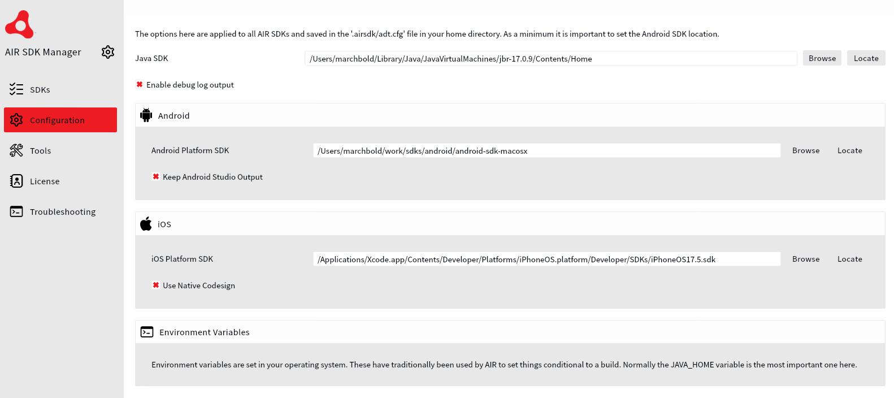

## Common Issues


### Account Setup 

It is important that you have completed the account setup through the AdMob console. An incomplete account setup will generally mean all ad requests will fail. 

Accounts require a linked application before they can be reviewed and approved by AdMob. Without this you will not receive live ads and may not receive test ads. (This requirement is being rolled out through 2021).

>
> Note that new apps must be listed and linked to a supported store in order to be approved and remove the ad serving limit. New apps not listed to any supported stores won't be able to be reviewed. To have an app reviewed and eligible for approval, list and link the app to a supported store. 
>

Reference: https://support.google.com/admob/answer/10417515


### Resolve common onboarding issues

Carefully review the details you receive from the Google Mobile Ads SDK to determine the issue you're having. Click on the error message you received to view more details about how to fix the issue. 

https://support.google.com/admob/answer/9905175


### iOS Crash

#### Invalid GAD Identifier 

If you encounter a crash on launch, ensure you have added the [info additions](add-the-extension#info-additions) correctly. The AdMob SDK will terminate your application if you haven't provided your Google AdMob application identifier in the info additions.


#### iOS SDK issue

If you are still having issues then ensure you are packaging against a recent version of the iOS SDK. We have found that some versions of AIR seem to fail if you don't supply a version of the iOS SDK. You can do this via the adt `platformsdk` command line option:

`adt ... -platformsdk /Applications/Xcode.app/Contents/Developer/Platforms/iPhoneOS.platform/Developer/SDKs/iPhoneOS17.5.sdk`

Or via the AIR SDK Manager, under *Configuration* / *iOS*:



> The default install location is `/Applications/Xcode.app/Contents/Developer/Platforms/iPhoneOS.platform/Developer/SDKs/iPhoneOSXX.X.sdk`, you'll need to confirm the version `XX.X` available on your system. 


### Waiting

It can take an hour or two for a new ad unit to become available. Make sure you have waited a decent amount of time before testing your ad unit ids.


## AdMob Error Codes

### Error Code 0

Error code 0 (`ERROR_CODE_INTERNAL_ERROR`) can occur for many reasons. It is an Internal Error that may indicate that something unexpected has happened, such as an error from the SDK, or an invalid response from the server.

Firstly check that your identifier's are all correct. If you are on iOS also check that you have provided the correct account id to the `initialisePlatform` call.

The most common cause that we have encountered of this issue is an application id (package name) that has been denied or blocked by AdMob. This can occur if you have been using live ad unit ids while developing your application rather than using the test id's or specifying the test device id. 

To confirm this you can try changing your application id and serving the same ad unit id from this new application id. If it works from this new application id then you can assume your application id has been blocked.  

>
> If you suspect that your app's Package Name has been blocked from serving ads, then it's not something specific to the Mobile Ads SDK and this ANE. We recommend that you reach out to the [Product Support Team](https://support.google.com/admob/contact/account_setup) to get this issue sorted out, or you can use this [Troubleshooter](https://support.google.com/admob/troubleshooter/6401922). 
> 
> Make sure to provide them the necessary information, such as any affected Ad Unit IDs and Package Names for them to assist you quicker.
>


### Error Code 1

Error code 1 (`ERROR_CODE_INVALID_REQUEST `) can occur in certain situations. 

The most common situation is that your AdUnit ID is incorrect. Check that it was correctly transferred from the console and no irregular characters or spaces have been included.

This error can also occur if the user of this device has enabled ad limiting. This can affect the requests to AdMob and result in this error.

This error can also be caused by an incomplete [account setup](#account-setup). 


## Ad Inspector

Ad inspector is an in-app overlay that enables authorized devices to perform real-time analysis of test ad requests directly within a mobile app. It is included with the Adverts extension version v13 and higher, and can be enabled with no coding required. 


Using ad inspector you can:

- Inspect your ad units
- Inspect your third-party adapters
- Check whether your ads are filling as expected
- Identify errors and view details about how to resolve them
- View the mediation details for each ad network per request
- Test individual third-party mediation ad sources
- Verify that you've correctly configured each ad unit for waterfall mediation
- Test custom events integrations

- View the bidding details for each ad network per request
- View the bidding and waterfall mediation details together for each ad network per request
- Test individual third-party bidding or waterfall mediation ad sources

- Verify that you've correctly configured each ad unit for bidding and waterfall mediation

:::warning
In order to use ad inspector, you need to have added your device as a test device. Ad Inspector only launches on test devices
:::


For details on using the Ad Inspector to view and troubleshoot ad units see the [AdMob documentation](https://developers.google.com/admob/android/ad-inspector) 


### Launch programmatically

To launch the Ap inspector programmatically call the `openAdInspector()` method:

```actionscript
Adverts.service.openAdInspector();
```

This will dispatch an event when closed (or if the inspector failed to launch) indicating control has returned back to your application:

```actionscript
Adverts.service.addEventListener( AdInspectorEvent.CLOSED, adInspector_closedHandler );

function adInspector_closedHandler( event:AdInspectorEvent ):void
{
    trace( event.errorCode + ", " + event.errorMessage );
}
```

:::note
You will need to have at least called `setup()` on the extension before using the Ad Inspector. Additionally Google recommend initialising the platform (i.e. calling `initialise()`) before using the Ad Inspector.