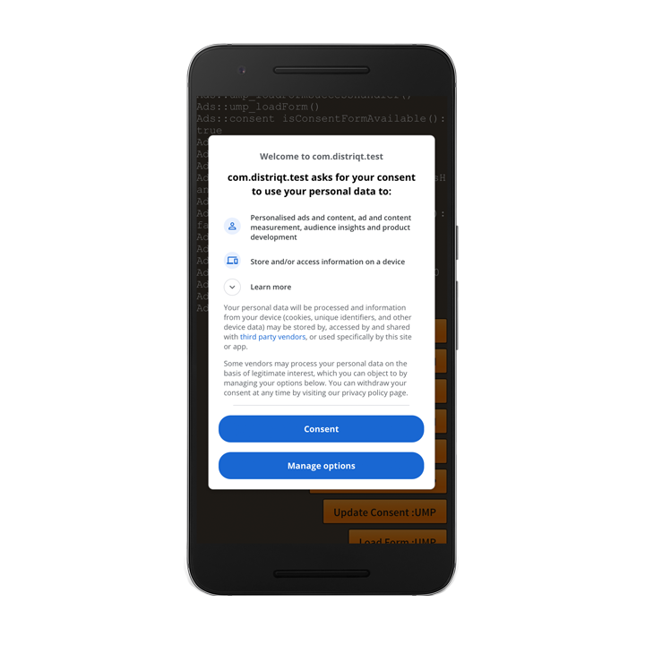

## Obtaining Consent with the User Messaging Platform

Before attempting to integrate the SDK you should ensure you have created at least one form in the "Privacy & messaging" tab for your AdMob account.


## Introduction

>
> Under the Google EU User Consent Policy, you must make certain disclosures to your users in the European Economic Area (EEA) along with the UK and obtain their consent to use cookies or other local storage, where legally required, and to use personal data (such as AdID) to serve ads. This policy reflects the requirements of the EU ePrivacy Directive and the General Data Protection Regulation (GDPR).
> 
> To support publishers in meeting their duties under this policy, Google offers the User Messaging Platform (UMP) SDK, which replaces the previous open source Consent SDK. The UMP SDK has been updated to support the latest IAB standards. We've also simplified the process of setting up consent forms and listing ad providers. All of these configurations can now conveniently be handled in the Funding Choices UI.
>
> It is a best practice to load a form every time the user launches your app, even if you determine consent is not required, so that the form is ready to display in case the user wishes to change their consent setting.
>

The following guide only shows usage of the UMP SDK, it does not show you how to setup these forms and what forms you should present to your users.

For detailed instructions and guidance on these topics we suggest you read the guides created by Google [about privacy & messaging](https://support.google.com/admob/answer/10107561).


## Dependencies

:::caution Ad Identifier
UMP requires additional dependencies that aren't installed by default with the Adverts extension.
If you don't add the advertising identifier library the UMP calls will fail.
:::

UMP uses the advertising identifier which isn't installed by default with the Adverts extension now as it defaults to the new AppSet identifier.

In order to use UMP you will need to add the advertising identifier dependencies. We suggest you install the [IDFA](/docs/idfa/) extension to achieve this. 


## Usage

### Request Consent Information

You retrieve the consent information through the `ConsentInformation` instance accessible via:

```actionscript
var consentInformation:ConsentInformation = Adverts.service.ump.getConsentInformation();
```

This object has the consent information including:

- `consentInformation.getPrivacyOptionsRequirementStatus()`: Gets the status indicating whether a privacy options button is required;
- `consentInformation.getConsentStatus()`: The current user consent status (see `ConsentStatus` constants);
- `consentInformation.isConsentFormAvailable()`: Whether a form is available to be loaded and displayed to the user;
- `consentInformation.canRequestAds()`: Indicates whether the app has completed the necessary steps for gathering updated user consent;


**It is recommended that you request an update of the consent information at every app launch. This will determine whether or not your user needs to provide consent.**


To update consent information call the  `requestConsentInfoUpdate()` function on the consent information object.

```actionscript
var params:ConsentRequestParameters = new ConsentRequestParameters();

consentInformation.requestConsentInfoUpdate( params );
```

This will dispatch one of two possible events:

- `ConsentInformationEvent.CONSENT_INFO_UPDATE_SUCCESS`: When the consent information was updated successfully;
- `ConsentInformationEvent.CONSENT_INFO_UPDATE_FAILURE`: When there was an error updating the consent information;

```actionscript
var consentInformation:ConsentInformation = Adverts.service.ump.getConsentInformation();
consentInformation.addEventListener( ConsentInformationEvent.CONSENT_INFO_UPDATE_SUCCESS, updateSuccessHandler );
consentInformation.addEventListener( ConsentInformationEvent.CONSENT_INFO_UPDATE_FAILURE, updateFailureHandler );


var params:ConsentRequestParameters = new ConsentRequestParameters();

consentInformation.requestConsentInfoUpdate( params );

function updateSuccessHandler( event:ConsentInformationEvent ):void
{
    // consent information has been updated
}

function updateFailureHandler( event:ConsentInformationEvent ):void
{
    trace( "ERROR: [" + event.error.errorID + "] " + event.error.message );
}
```


### Load a form if available

Once you've determined that you will ask a user for consent, the next step is to determine if a form is available.

There are a variety of reasons why a form may not be available, such as:
- The user has limited ad tracking enabled.
- You tagged the user as under the age of consent.

To check if a form is available, use the `isConsentFormAvailable()` method on the `ConsentInformation` instance. 

```actionscript
if (consentInformation.isConsentFormAvailable())
{
    // A form is available to load
    Adverts.service.ump.addEventListener( UserMessagingPlatformEvent.CONSENT_FORM_LOAD_SUCCESS, loadFormSuccessHandler );
	Adverts.service.ump.addEventListener( UserMessagingPlatformEvent.CONSENT_FORM_LOAD_FAILURE, loadFormFailureHandler );
    Adverts.service.ump.loadConsentForm();
}
```


To load the form call the `loadConsentForm()` of the `UserMessagingPlatform` instance. 
This will dispatch one of two possible events:

- `UserMessagingPlatformEvent.CONSENT_FORM_LOAD_SUCCESS`: When the form has been loaded and is ready to be shown;
- `UserMessagingPlatformEvent.CONSENT_FORM_LOAD_FAILURE`: When an error occurred, try again later to load the form successfully before attempting to show;


```actionscript
if (consentInformation.isConsentFormAvailable())
{
    Adverts.service.ump.addEventListener( UserMessagingPlatformEvent.CONSENT_FORM_LOAD_SUCCESS, loadFormSuccessHandler );
	Adverts.service.ump.addEventListener( UserMessagingPlatformEvent.CONSENT_FORM_LOAD_FAILURE, loadFormFailureHandler );
    Adverts.service.ump.loadConsentForm();
}

function loadFormSuccessHandler( event:UserMessagingPlatformEvent ):void
{
    // Form loaded and ready to be shown
}

function loadFormFailureHandler( event:UserMessagingPlatformEvent ):void
{
    // An error occurred
}
```


### Present the form if required

To present the form use the `showConsentForm()` on the `UserMessagingPlatform` instance.

```actionscript
Adverts.service.ump.showConsentForm();
```

You should determine if the user requires consent prior to presenting the form. To check if consent is required, check the `getConsentStatus()` method on the `ConsentInformation` object, which returns an value from the `ConsentStatus` class. There are four possible values:

- `ConsentStatus.UNKNOWN`: Unknown consent status.
- `ConsentStatus.REQUIRED`: User consent required but not yet obtained.
- `ConsentStatus.NOT_REQUIRED`: User consent not required. For example, the user is not in the EEA or the UK.
- `ConsentStatus.OBTAINED`: User consent obtained. Personalization not defined.


For example:


```actionscript
function loadFormSuccessHandler( event:UserMessagingPlatformEvent ):void
{
    // Form loaded and ready to be shown
    if (Adverts.service.ump.getConsentInformation().getConsentStatus() == ConsentStatus.REQUIRED)
    {
        Adverts.service.ump.showConsentForm();
    }
}
```




You can also use the form to give your user the option to change their consent status. You may wish to do this in a settings screen, and call the `showConsentForm()` to present the form so the user can change their consent as required.


The `showConsentForm()` process will dispatch the `ConsentInformationEvent.CONSENT_FORM_DISMISSED` event when the consent form was dismissed.

```actionscript
Adverts.service.ump.addEventListener( UserMessagingPlatformEvent.CONSENT_FORM_DISMISSED, formDismissedHandler );
Adverts.service.ump.showConsentForm();

function formDismissedHandler( event:UserMessagingPlatformEvent ):void 
{
    // Handle form dismissal
}
```


## Testing

### Force a geography

The UMP SDK provides a simple way to test your app's behavior as though the device was located in the EEA or UK using the `debugGeography`.

You will need to provide your test device's hashed ID in your app's debug settings to use the debug functionality. If you call `requestConsentUpdate()` without setting this value, your app will log the required ID hash when run to the [native device log](/docs/tutorials/device-logs).

```actionscript
var params:ConsentRequestParameters = new ConsentRequestParameters()
        .setTagForUnderAgeOfConsent( false )
        .setConsentDebugSettings(
                new ConsentDebugSettings()
                        .addTestDeviceHashedId( "TEST-DEVICE-HASHED-ID" )
                        .setDebugGeography( com.distriqt.extension.adverts.ump.DebugGeography.DEBUG_GEOGRAPHY_EEA )
        )
;

Adverts.service.ump.getConsentInformation()
    .requestConsentInfoUpdate( params );
```

To force the SDK to treat the device as though it is not in the EEA or UK, use `DEBUG_GEOGRAPHY_NOT_EEA`. 
Note that debug settings only work on test devices. Emulators do not need to be added to the device id list as they have testing enabled by default.


### Reset

In testing your app with the UMP SDK, you may find it helpful to reset the state of the consent SDK so that you can simulate a user's first install experience. The SDK provides the `reset()` method of the `ConsentInformation` interface to do this.

```actionscript
Adverts.service.ump.getConsentInformation().reset();
```

You should also call reset if you decide to remove the UMP SDK completely from your project.


## Delay app measurement (optional)


By default, the Google Mobile Ads SDK initializes app measurement and begins sending user-level event data to Google immediately when the app starts. This initialization behavior ensures you can enable AdMob user metrics without making additional code changes.

However, if your app requires user consent before these events can be sent, you can delay app measurement until you explicitly initialize the Mobile Ads SDK or load an ad.


#### Android 

To delay app measurement, add the following `<meta-data>` tag in your manifest additions, inside the `<application>` node:

```xml
<!-- Delay app measurement until MobileAds.initialize() is called. -->
<meta-data
    android:name="com.google.android.gms.ads.DELAY_APP_MEASUREMENT_INIT"
    android:value="true"/>
```


#### iOS 

To delay app measurement, add the `GADDelayAppMeasurementInit` key with a boolean value of `true` to your app’s InfoAdditions:

```xml
<key>GADDelayAppMeasurementInit</key>
<true/>
```


