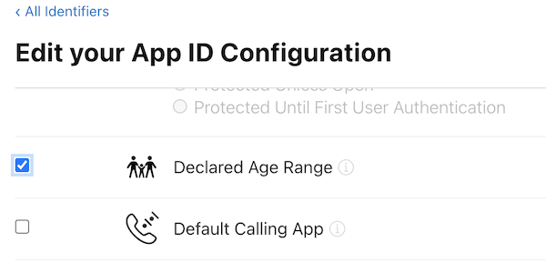

There are a few things you need to do in your application configuration in order to enable the Age Range functionality. 

:::warning 
The Declared Age Range (Apple) and Age Signals (Google) API's are still in beta and may produce unexpected results.
::: 


## iOS

In order to enable Apple's Declared Age Range functionality in your application you need to enable it in your application identifier through the Apple developer portal.

- Log into the [Apple developer portal](https://developer.apple.com/account/)
- Under **Certificates, IDs & Profiles** open your application [Identifiers](https://developer.apple.com/account/resources/identifiers/list)
- Locate your application identifier and enable the **Declared Age Range** capability
  - 
- Save your application identifier

Whenever you chage your application identifier configuration in Apple you need to regenerate the provisioning profiles you use (most commonly a development and production profile):

- Under [Profiles](https://developer.apple.com/account/resources/profiles/list) locate the relevant profiles for your environment
- They will likely be marked as *Invalid*
- Edit and Save these profiles
- Download the profile and use when packaging your application


### iOS SDK

The Declared Age Range framework was introduced in iOS 26, so you will need to use version 26 (or higher) of the iOS SDK in order to package your application. 

If you use an older version then you will encounter an error similar to the below, with the linker complaining that it can't find the symbols for the Declared Age Range framework:

```
Undefined symbols for architecture arm64:
  "_$s16DeclaredAgeRange0bC7ServiceV07requestbC08ageGates__2inAC8ResponseOSi_SiSgAISo16UIViewControllerCtYaKF", referenced from:
      _$s8AgeRange0aB10ControllerC05checkA010identifier8ageGates__ySS_S2iSgAGtYaFTY0_ in libcom.distriqt.AgeRange.a[5](AgeRangeController.o)
  "_$s16DeclaredAgeRange0bC7ServiceV07requestbC08ageGates__2inAC8ResponseOSi_SiSgAISo16UIViewControllerCtYaKFTu", referenced from:
      _$s8AgeRange0aB10ControllerC05checkA010identifier8ageGates__ySS_S2iSgAGtYaFTY0_ in libcom.distriqt.AgeRange.a[5](AgeRangeController.o)
  "_$s16DeclaredAgeRange0bC7ServiceV0bC0V03ageC11DeclarationAC0bcF0OSgvg", referenced from:
  
...

ld: symbol(s) not found for architecture arm64
```


## Android

Nothing additional to do here.
