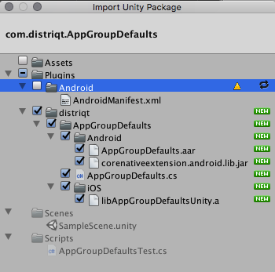

# AIR

First step is always to add the extension to your development environment. 
To do this use the tutorial located [here](http://airnativeextensions.com/knowledgebase/tutorial/1).


## Required ANEs

### Core ANE

The Core ANE is required by this ANE. You must include and package this extension in your application.

The Core ANE doesn't provide any functionality in itself but provides support libraries and frameworks used by our extensions.
It also includes some centralised code for some common actions that can cause issues if they are implemented in each individual extension.

You can access this extension here: https://github.com/distriqt/ANE-Core.


## Extension IDs

The following should be added to your `extensions` node in your application descriptor to identify all the required ANEs in your application:

```xml
<extensions>
	<extensionID>com.distriqt.AppGroupDefaults</extensionID>
	<extensionID>com.distriqt.Core</extensionID>
</extensions>
```


# Unity 

In unity you import the package by selecting `Assets / Import Package / Custom Package ...` and then browsing to the unity plugin package file: `com.distriqt.AppGroupDefaults.unitypackage`.


This will present the import dialog and place all the files for the plugin, make sure all the files are selected.



The plugin will be added to your project and you can now use the plugins functionality in your application.
