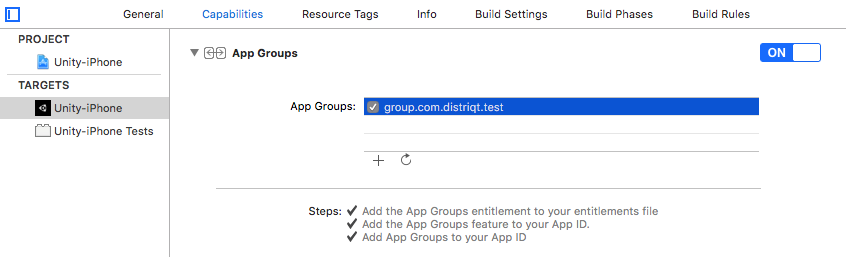

First step is always to add the plugin to your development environment. 


## Asset Store

Open the Asset Store in your browser and add the plugin to your assets.

Open the Package Manager (Window > Package Manager) in the Unity Editor and select the "My Assets" section. Select the plugin, and click Import in the bottom right.


## Manual Installation

In unity you import the package by selecting `Assets / Import Package / Custom Package ...` and then browsing to the unity plugin package file: `com.distriqt.AppGroupDefaults.unitypackage`.


You can manually download the extension from our repository:

- https://github.com/distriqt/ANE-Share


## Import the Plugin


This will present the import dialog and display all the files for the plugin, make sure all the files are selected.

The plugin will be added to your project and you can now use the plugins functionality in your application.


### iOS

In unity you can add the application groups either through scripts or through the Xcode project generated from the build.

To do it through Xcode simply select **Capabilities** in your project settings and enable the App Group capability. Then select your application groups you plan to use in this application. 



However we suggest use the automatic configuration method by setting your values in the `/Assets/distriqt/AppGroupDefaultsUnity/AppGroupDefaults/Editor/AppGroupDefaultsConfig.cs` script.

This script will be run when your application's Xcode project is built and automatically enable the app group capability and insert the app groups specified. Using this script means you won't have to update each time you build the Xcode project. See the [configuration](#configuration) information later as to how to set the group identifier in these scripts.


### Android

:::note Proguard
If you are using a custom proguard configuration you may need to add the following line to ensure the interface class for the plugin is accessible to unity at runtime.

```
-keep class com.distriqt.extension.appgroupdefaults.AppGroupDefaultsUnityPlugin {*;}
```
:::


#### Manifest Additions 

:::note 
For standard unity builds these additions will be automatically added to your build. 

However if you manually control your manifest then you should follow the documentation below to place these additions in your custom application `AndroidManifest.xml` file. 
::: 

You should place the following in your manifests `application` tag:

```xml
<!-- For the content provider and broadcast receiver method -->
<application>
				
	<meta-data android:name="app_group" android:value="[APPGROUP]" />
	<meta-data android:name="app_authority" android:value="group.[APPID].provider" />
	<meta-data android:name="app_authority_matcher" android:value="group\\.(?:[a-z,1-9]{1,}\\.)*provider" />

	<provider
		android:name="com.distriqt.extension.appgroupdefaults.provider.SharedProvider"
		android:authorities="group.[APPID].provider"
		android:exported="true" >
	</provider>
		
	<receiver
		android:name="com.distriqt.extension.appgroupdefaults.provider.SharedContentChangedReceiver"
		android:enabled="true"
		android:exported="true" >
		<intent-filter>
			<action android:name="[APPGROUP]"/>
		</intent-filter>
	</receiver>

</application>
```


You should replace `[APPGROUP]` with your application group.
This must be done in the meta-data tag and in the receiver. 
For example: `group.com.distriqt.test`

```xml
	<meta-data android:name="app_group" android:value="group.com.distriqt.test" />
```


You also need to define an **application authority**, this must be different for
each of your applications but must be matchable using the matcher. We suggest using 
the example above replacing `[APPID]` with your application id, for example an app_authority 
may be, `group.com.distriqt.test.app1.provider` as below:

```xml
	<meta-data android:name="app_authority" android:value="group.com.distriqt.test.app1.provider" />
```

You must place the application authority both in the meta-data tag and in the provider.


## Checking for Support

You can use the `isSupported` flag to determine if this extension is supported on the current platform and device.

This allows you to react to whether the functionality is available on the device and provide an alternative solution if not.


```csharp
if (AppGroupDefaults.isSupported)
{
	// Functionality here
}
```


## Configuration

To configure your application open the `AppGroupDefaultsConfig.cs` file and change the configuration values for your application. (This file is located at `/Assets/distriqt/AppGroupDefaultsUnity/AppGroupDefaults/Editor/AppGroupDefaultsConfig.cs`).

This file has 2 important configuration values:

- `groupIdentifier`
- `applicationAuthority`

>
> These values are used to configure the iOS Xcode project and the Android manifest. There are some additional configuration values supplied at runtime.
>

### iOS  

For iOS the `groupIdentifier` is the identifier for the group you created in the developer console, eg `group.com.distriqt.test`. 

The `applicationAuthority` value is not used on iOS.

To confirm this was done successfully (or to do it manually) you can open the Xcode project after your build and simply select **Capabilities** in your project settings and ensure the App Group capability is enabled. Then select your application groups you plan to use in this application. 


### Android

The `groupIdentifier` can be anything you require, generally for simplicity we suggest leaving it as the same identifier as for the iOS group. This value should be the same for every application you use inside this group.

The `applicationAuthority` uniquely identifies this application content provider, while being in a specific pattern that the plugin uses to identify other providers that it can potentially synchronise with. To this end we suggest using `group.COMMON.UNIQUE.provider` as this value, replacing `COMMON` with some common value used across all your applications and `UNIQUE` with something unique for this application, for example:

- `group.com.distriqt.authority.unity1.provider`
- `group.com.distriqt.authority.unity2.provider`
- `group.com.distriqt.authority.unity3.provider`

:::info
If you are manually managing the manifest for your Android application make sure you set these values directly in the manifest as described above
:::