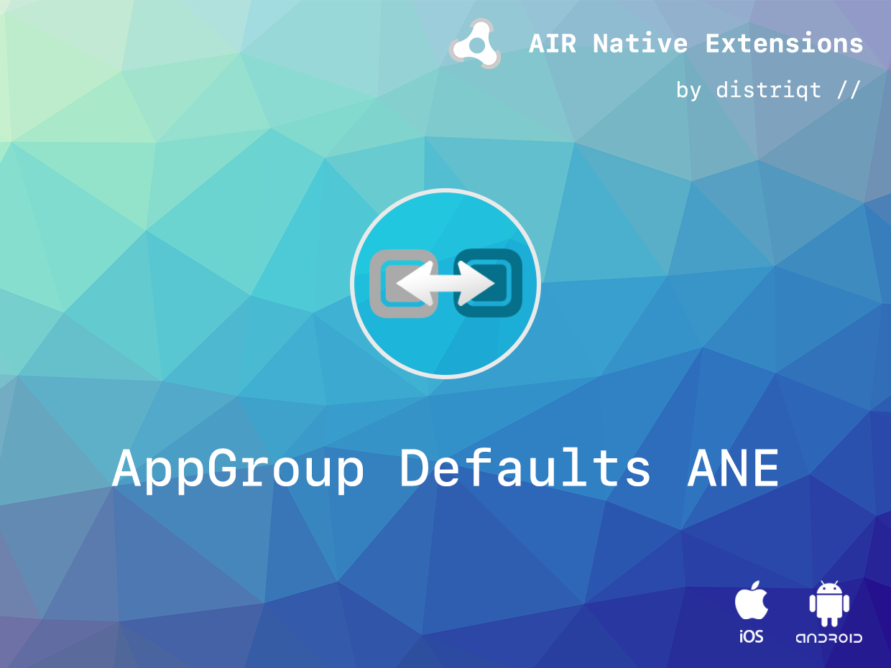
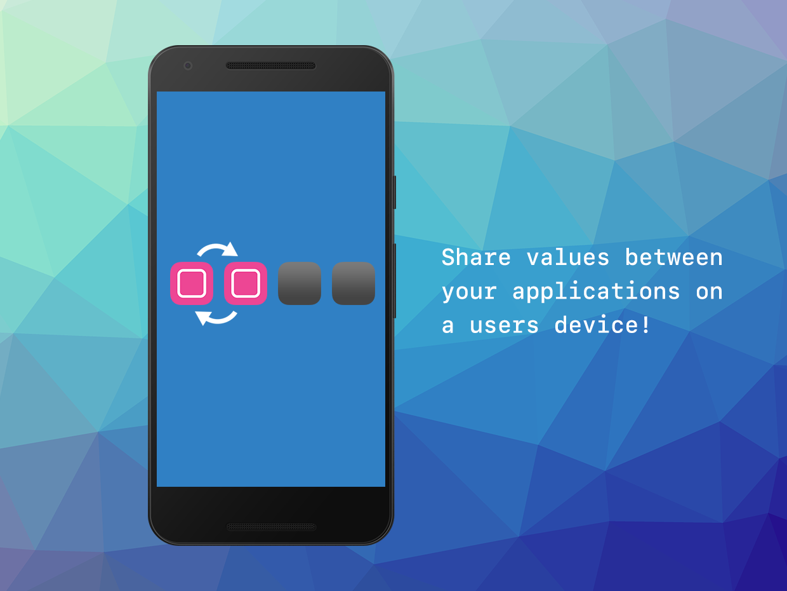

# App Group Defaults 

The [AppGroup Defaults](https://airnativeextensions.com/extension/com.distriqt.AppGroupDefaults) extension provides the ability to be able to share settings in a key-value store between your different applications installed on a users device.

It supports both Unity and Adobe AIR frameworks on iOS and Android, allowing you to share data between frameworks.

### Features:

- Ability to share key-value settings between applications;
  - App Group Defaults on iOS;
  - File or Content Provider based on Android;
- Your code works across iOS and Android with minimal modifications;
- Sample project code and ASDocs reference;

## Documentation

The [Wiki](https://github.com/distriqt/ANE-AppGroupDefaults/wiki) forms the best source of detailed documentation for the extension 
along with the [asdocs](https://docs.airnativeextensions.com/asdocs/appgroupdefaults). 

More information here:

[com.distriqt.AppGroupDefaults](https://airnativeextensions.com/extension/com.distriqt.AppGroupDefaults)

## License

You can purchase a license for using this extension:

[airnativeextensions.com](https://airnativeextensions.com/)

distriqt retains all copyright.

