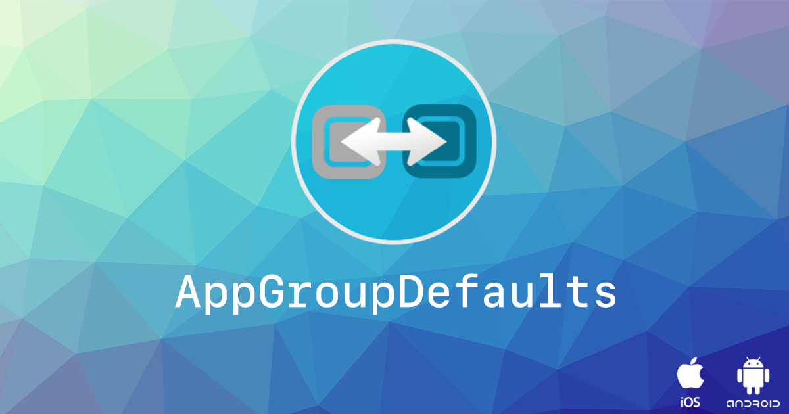
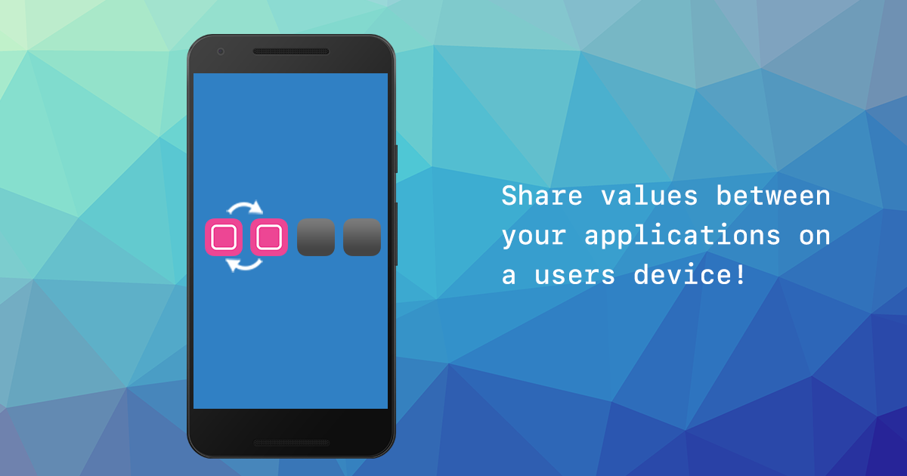
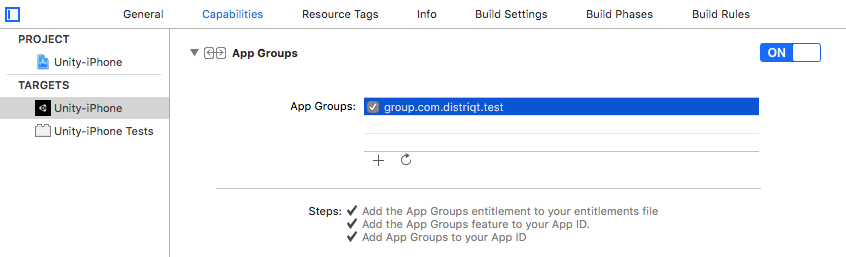

<!--newpage-->

## Contents

- [Overview](#overview)
- [Features](#features)
- [Add the Plugin](#add-the-plugin)
    - [Asset Store](#asset-store)
    - [Manual Installation](#manual-installation)
    - [Import the Plugin](#import-the-plugin)
	- [iOS Setup](#ios-setup)
- [Usage](#usage)
    - [Checking for Support](#checking-for-support)   
	- [Configuration](#configuration)
		- [iOS](#ios)
		- [Android](#android)
	- [Setup](#setup)
	- [Get Values](#get-values)   
	- [Set Values](#set-values)   
	- [Listing Keys](#listing-keys)
	- [Removing Values](#removing-values)
	- [Removing All Values](#removing-all-values)
	- [Example](#example)
- [Support](#support)


<!--newpage-->

## Overview

The [AppGroup Defaults](https://airnativeextensions.com/extension/com.distriqt.AppGroupDefaults) extension provides the ability to be able to share settings in a key-value store between your different applications installed on a users device.

The simple API allows you to quickly integrate saving data. The key-value storage allows you to store discrete values for preferences, configuration, or state variables that need to be shared between applications. Key-value storage is similar to the local user defaults database; but values that you place in key-value storage are available to every application in your group. If one instance of your app changes a value, the other instances see that change and can use it to update their configuration.

We provide complete guides to get you up and running with app group defaults quickly and easily.

It supports both Unity and Adobe AIR frameworks on **iOS** and **Android**, allowing you to use the same functionality on all frameworks and platforms.




<!--newpage-->

## Features

Save key/value pairs to App Cloud Defaults on: 

- Ability to share key-value settings between applications;
  - App Group Defaults on iOS;
  - Content Provider based on Android;
- Your code works across iOS and Android with minimal modifications;
- Your code works across Unity and Adobe AIR allowing communication between frameworks;
- Sample project code and ASDocs reference;

As with all our extensions you get access to a year of support and updates as we are continually improving and updating the extensions for OS updates and feature requests.


## Add the Plugin

First step is always to add the plugin to your development environment. 


### Asset Store

Open the Asset Store in your browser and add the AppGroupDefaults plugin to your assets.

Open the Package Manager (Window > Package Manager) in the Unity Editor and select the "My Assets" section. Select the AppGroupDefaults plugin, and click Import in the bottom right.


### Manual Installation

In unity you import the package by selecting `Assets / Import Package / Custom Package ...` and then browsing to the unity plugin package file: `com.distriqt.AppGroupDefaults.unitypackage`.


You can manually download the extension from our repository:

- https://github.com/distriqt/ANE-AppGroupDefaults


### Import the Plugin

This will present the import dialog and display all the files for the plugin, make sure all the files are selected.

The plugin will be added to your project and you can now use the plugins functionality in your application.


### iOS Setup

iOS requires set up of an "App Group" for your application(s).

Log into the developer member center and go to your application identifiers.

Firstly you will need to create an App Group.

- Go to [App Groups](https://developer.apple.com/account/ios/identifier/applicationGroup)
- Click the "+" in the top right to register a new group
- Enter a description and an identifier.
  - The identifier is recommended to be a reverse domain style and starting with `group.`
  - eg: `group.com.distriqt.test`


Once you have created a group you need to enable it for the applications that are going to be placed in this group.

- Go to [App IDs](https://developer.apple.com/account/ios/identifier/bundle)
- Select the application of interest and click edit
- Enable "App Groups" in the "iOS App ID Settings"
- Click "Edit" in the "App Groups" row
  - Select the App Group you created previously
  - Click "Continue" and then "Assign"

You will need to regenerate your provisioning profiles and download them again so make sure you do this now.

Next you will need to add this group identifier to the plugin configuration for your application.


### Android

:::note Proguard
If you are using a custom proguard configuration you may need to add the following line to ensure the interface class for the plugin is accessible to unity at runtime.

```
-keep class com.distriqt.extension.appgroupdefaults.AppGroupDefaultsUnityPlugin {*;}
```
:::


#### Manifest Additions 

:::note 
For standard unity builds these additions will be automatically added to your build. 

However if you manually control your manifest then you should follow the documentation below to place these additions in your custom application `AndroidManifest.xml` file. 
::: 

You should place the following in your manifests `application` tag:

```xml
<!-- For the content provider and broadcast receiver method -->
<application>
				
	<meta-data android:name="app_group" android:value="[APPGROUP]" />
	<meta-data android:name="app_authority" android:value="group.[APPID].provider" />
	<meta-data android:name="app_authority_matcher" android:value="group\\.(?:[a-z,1-9]{1,}\\.)*provider" />

	<provider
		android:name="com.distriqt.extension.appgroupdefaults.provider.SharedProvider"
		android:authorities="group.[APPID].provider"
		android:exported="true" >
	</provider>
		
	<receiver
		android:name="com.distriqt.extension.appgroupdefaults.provider.SharedContentChangedReceiver"
		android:enabled="true"
		android:exported="true" >
		<intent-filter>
			<action android:name="[APPGROUP]"/>
		</intent-filter>
	</receiver>

</application>
```


You should replace `[APPGROUP]` with your application group.
This must be done in the meta-data tag and in the receiver. 
For example: `group.com.distriqt.test`

```xml
	<meta-data android:name="app_group" android:value="group.com.distriqt.test" />
```


You also need to define an **application authority**, this must be different for
each of your applications but must be matchable using the matcher. We suggest using 
the example above replacing `[APPID]` with your application id, for example an app_authority 
may be, `group.com.distriqt.test.app1.provider` as below:

```xml
	<meta-data android:name="app_authority" android:value="group.com.distriqt.test.app1.provider" />
```

You must place the application authority both in the meta-data tag and in the provider.


##### Queries

Since Android API v30, Google has limited the ability to discover other applications via use of the `<queries>` tag in your manifest. You must specify the applications you wish to access in this area otherwise the application won't be able to discover other applications.

Add the following to your manifest:

```xml
<queries>
	<intent>
		<action android:name="[APPGROUP]" />
	</intent>
</queries>
```

You should replace `[APPGROUP]` with your application group.


Alternatively you can add the `QUERY_ALL_PACKAGES` permission, however this is discouraged.

```xml
<uses-permission android:name="android.permission.QUERY_ALL_PACKAGES"/>
```


<!--newpage-->


## Usage


### Checking for Support

You can use the `isSupported` flag to determine if this extension is supported on the current platform and device.

This allows you to react to whether the functionality is available on the device and provide an alternative solution if not.


```csharp
if (AppGroupDefaults.isSupported)
{
	// Functionality here
}
```


### Configuration

To configure your application open the `AppGroupDefaultsConfig.cs` file and change the configuration values for your application. (This file is located at `/Assets/distriqt/AppGroupDefaultsUnity/AppGroupDefaults/Editor/AppGroupDefaultsConfig.cs`).

This file has 2 important configuration values:

- `groupIdentifier`
- `applicationAuthority`

>
> These values are used to configure the iOS Xcode project and the Android manifest. There are some additional configuration values supplied at runtime.
>

#### iOS  

For iOS the `groupIdentifier` is the identifier for the group you created in the developer console, eg `group.com.distriqt.test`. 

The `applicationAuthority` value is not used on iOS.

To confirm this was done successfully (or to do it manually) you can open the Xcode project after your build and simply select **Capabilities** in your project settings and ensure the App Group capability is enabled. Then select your application groups you plan to use in this application. 




#### Android

The `groupIdentifier` can be anything you require, generally for simplicity we suggest leaving it as the same identifier as for the iOS group. This value should be the same for every application you use inside this group.

The `applicationAuthority` uniquely identifies this application content provider, while being in a specific pattern that the plugin uses to identify other providers that it can potentially synchronise with. To this end we suggest using `group.COMMON.UNIQUE.provider` as this value, replacing `COMMON` with some common value used across all your applications and `UNIQUE` with something unique for this application, for example:

- `group.com.distriqt.authority.unity1.provider`
- `group.com.distriqt.authority.unity2.provider`
- `group.com.distriqt.authority.unity3.provider`


### Setup

To correctly setup the extension you will need to inform it about your group and a salt value to use for encryption.

- The salt value is only applicable to Android however the group is used on both. 
- The salt can be any string you require and is used to setup the file encryption algorithm. 

For the group, you should use the same value you used for the `groupIdentifier` above. This is used to identify the correct group to use on iOS and similarly on Android it's used as the identifier for the group content.

```csharp
AppGroupDefaults.Instance.Setup( 
	"12345678", 
	"group.com.distriqt.test", 
	AppGroupDefaults.TYPE_CONTENTPROVIDER 
);
```


The setup call can take a short amount of time to initialise the encryption algorithms so you should
wait for the initialised event before attempting to read or write values.

With Unity add a listener to the `OnInitialised` event.

```csharp
AppGroupDefaults.Instance.OnInitialised += Instance_OnInitialised;
AppGroupDefaults.Instance.Setup(
	"12345678", // salt
	"group.com.distriqt.test", // app group identifier
	AppGroupDefaults.TYPE_CONTENTPROVIDER // Android type
);

void Instance_OnInitialised(distriqt.plugins.appgroupdefaults.events.AppGroupDefaultsEvent e)
{
	// Access data here
}
```


### Get Values

Retrieving a value is as simple as calling `GetValue()` with the key of interest.

```csharp
string someValue = AppGroupDefaults.Instance.GetValue( "some_key" ));
```


This will return `null` if the key hasn't been set before or if you haven't called `Setup` beforehand.


### Set Values

Setting a value is likewise as simple, calling the `SetValue` function.

```csharp
bool success = AppGroupDefaults.Instance.SetValue("some_key", "some_value");
```


This will return `true` if the value was set correctly and `false` if there was an issue, most likely 
that the `Setup` function hasn't been called, or if the `isSupported` flag is `false`.


### Listing Keys

You can use the `GetKeys` function to retrieve an Array of all the current keys
set in the defaults. 

This allows you to list all settings currently stored in the defaults.


```csharp
string[] keys = AppGroupDefaults.Instance.GetKeys();
foreach (string key in keys)
{
	string value = AppGroupDefaults.Instance.GetValue(key);
	Debug.Log(key + " = " + value);
}
```


### Removing Values

If you wish to clear a value and remove it from the defaults, simply call the `Remove` function with the key of interest.

```csharp
AppGroupDefaults.Instance.Remove("some_key");
```


### Removing All Values

If you wish to remove all values from the defaults, simply call the `RemoveAll` function:

```csharp
AppGroupDefaults.Instance.RemoveAll();
```

>
> Take care with this one as it will affect data across all your applications
>


<!--newpage-->


### Example

The following example shows the core concepts, i.e. the setup process, listening to the `OnInitialised` event, 
and getting and setting values.


```csharp
if (AppGroupDefaults.isSupported)
{
	AppGroupDefaults.Instance.OnInitialised += Instance_OnInitialised;

	AppGroupDefaults.Instance.Setup(
		"12345678", // salt
		"group.com.distriqt.test", // app group identifier
		AppGroupDefaults.TYPE_CONTENTPROVIDER // Android type
	);
}


private void Instance_OnInitialised(AppGroupDefaultsEvent e)
{
	Debug.Log("OnInitialised");

	string someValue = AppGroupDefaults.Instance.GetValue("someKey");

    AppGroupDefaults.Instance.SetValue("anotherKey", "Sample text from Unity!");

}
```


<!--newpage-->


## Support

If you need further support integrating or using this extension please feel free to contact us.

- Email: unityplugins@distriqt.com

We have been supporting developers for over 10 years and always happy to help.


<br/>
<br/>
<br/>
<br/>


- [https://distriqt.com](https://distriqt.com)
- [more native extensions](https://airnativeextensions.com)
