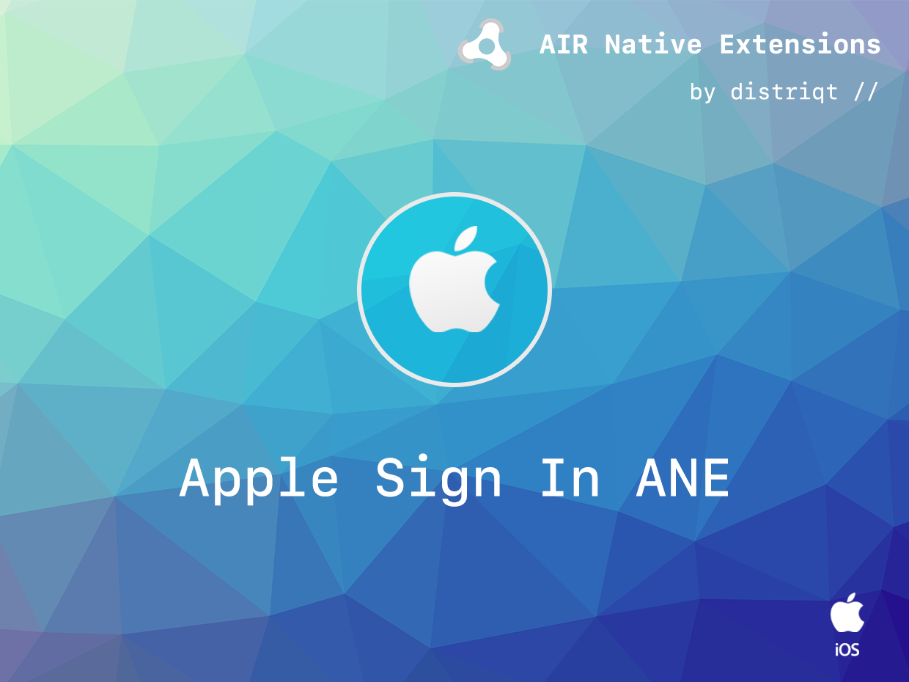

# AppleSignIn

The [AppleSignIn](https://airnativeextensions.com/extension/com.distriqt.AppleSignIn) extension gives you the ability to sign in your users using the "Sign in with Apple" functionality on iOS / tvOS and Android. 

>
> Sign in with Apple makes it easy for users to sign in to your apps and websites using their Apple ID. Instead of filling out forms, verifying email addresses, and choosing new passwords, they can use Sign in with Apple to set up an account and start using your app right away. All accounts are protected with two-factor authentication for superior security, and Apple will not track users’ activity in your app or website.
>

More information in the [Apple documentation](https://developer.apple.com/sign-in-with-apple/)


### Features

- Sign in using the user's Apple ID;
- Single API interface - your code works across supported platforms with no modifications;
- Sample project code and ASDocs reference


## Documentation

The [documenation site](https://docs.airnativeextensions.com/docs/applesignin/) forms the best source of detailed documentation for the extension along with the [asdocs](https://docs.airnativeextensions.com/asdocs/applesignin). 


Quick Example: 

```actionscript
AppleSignIn.instance.addEventListener( AppleSignInErrorEvent.ERROR, errorHandler );
AppleSignIn.instance.addEventListener( AppleSignInEvent.SUCCESS, successHandler );
				
AppleSignIn.instance.loginWithAppleId();

function successHandler( event:AppleSignInEvent ):void 
{
    // User signed in
}

function errorHandler( event:AppleSignInErrorEvent ):void 
{
    // Sign in failed
}
```

More information here: 

[com.distriqt.AppleSignIn](https://airnativeextensions.com/extension/com.distriqt.AppleSignIn)


## License

You can purchase a license for using this extension:

[airnativeextensions.com](https://airnativeextensions.com/)

distriqt retains all copyright.


