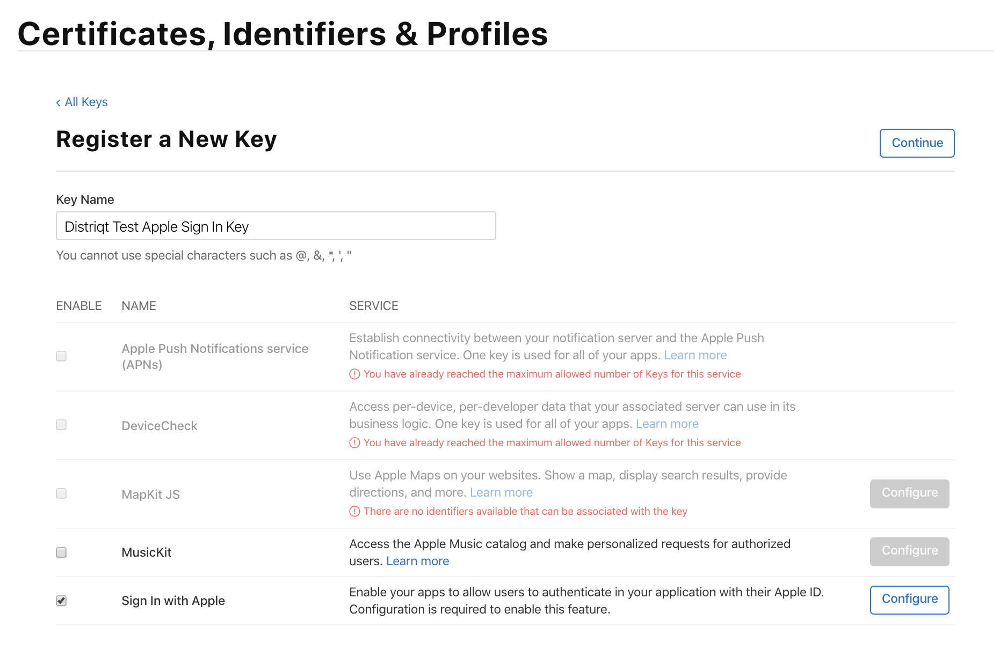
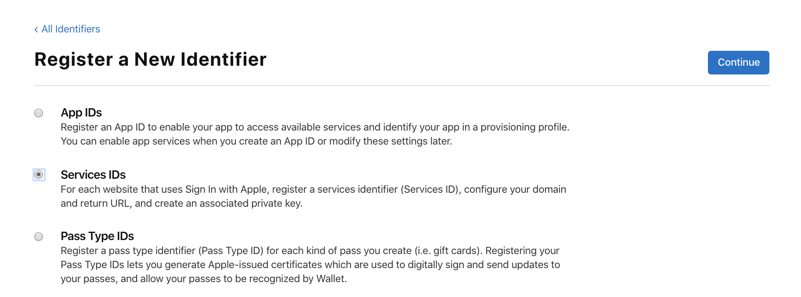
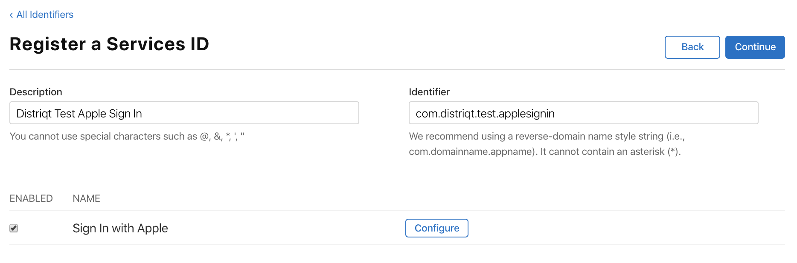
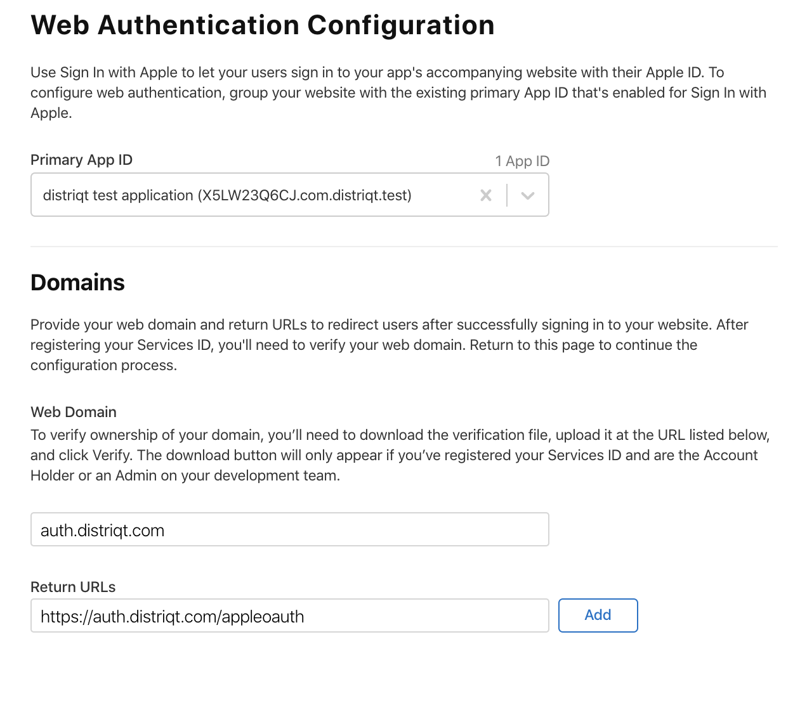
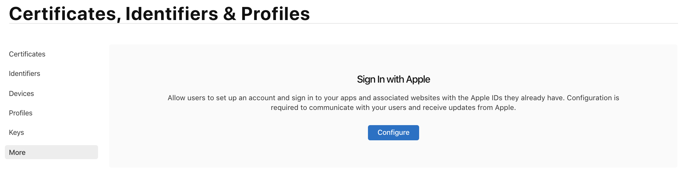
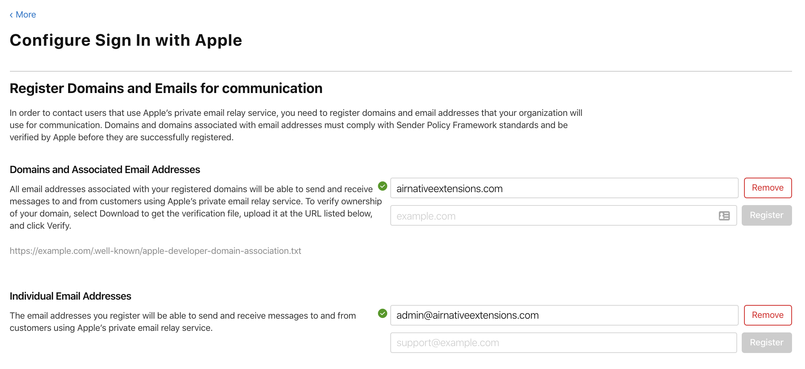

This is an overview of the steps to enable Sign in with Apple in the developer console. 

More details can be found in the official Apple documentation here: 

- [https://developer.apple.com/sign-in-with-apple/get-started/](https://developer.apple.com/sign-in-with-apple/get-started/)

The process is divided into 4 key steps:

- [Enable App ID](setup-application#enable-app-id)
- [Create Key](setup-application#create-key)
- [Create Service ID for Web Authentication](setup-application#create-service-id-for-web-authentication)
- [Register Email Sources for Communication](setup-application#register-email-sources-for-communication)

## Enable App ID

Log into the developer console and edit your application identifier:

https://developer.apple.com/account/resources/identifiers/list

Find the "Sign in with Apple" setting, enable it and set the configuration as required for your application.  

You will need to update your provisioning profile and ensure you download the updated version.

## Create Key

In order to communicate with Apple from your server you will need to setup a key. You will use this to exchange tokens for user data etc especially for the Android / Web implementation.

In the console, select **Keys** and register a new key by pressing the plus icon. Give your key a name and enable the **Sign In with Apple** option.

Select **Configure** and select the application identifier that you enabled Apple Sign-In for above. Save and register the new key.

At this point you will download the key as a `p8` file. This is the key that you will upload to your server to use to communicate with the Apple servers.

**Save this file in a safe location as you will not be able to download it again.**

At this point, select the key again from the list of keys.

Take note of the **Key ID** 

## Create Service ID for Web Authentication 

>
> This is only required if you are looking to implement sign in for Android or Web using Oauth or if you need to access user details from your server. 
> If you are only implementing this on Apple (iOS/tvOS) you can ignore this section.
>

To create a service identifier, go to the **Identifiers** secton and press the plus button. Select **Services IDs** as the type of the new identifier 

Press continue, then enter a description and the identifier, and enable **Sign In with Apple**

>
> **Take note of this identifier you will need it to configure your web application. This is referred to as the "Service ID" or "Client ID".**
>
> eg: `com.distriqt.test.applesignin`
>

Click **Configure** for the Sign in with Apple option. Select your application identifier (created above) and enter the domain and return url that you will be using for authentication requests. 

If you haven't already, you will need to verify your ownership of this domain by uploading a file to the `.well-known` directory on your server. Be patient with this process, it can take a while for Apple to pick up a file being uploaded.

Click **Continue** and then **Save** to complete the service identifier setup.

>
> Note: To view these service ids you need to change the drop down in the top left of the Identifiers page from **App IDs** to **Service IDs**
>

## Register Email Sources for Communication 

'Sign in with Apple' gives the users the option to hide their email address when they login. If you wish to contact these users you will need to setup a domain and contact email in your developer account.

Under the "More" section you can setup domains and users for Apple Sign in:

You can register domains and individual email addresses that can contact users using Apple’s private email relay service:

Follow the directions to verify your domain.

