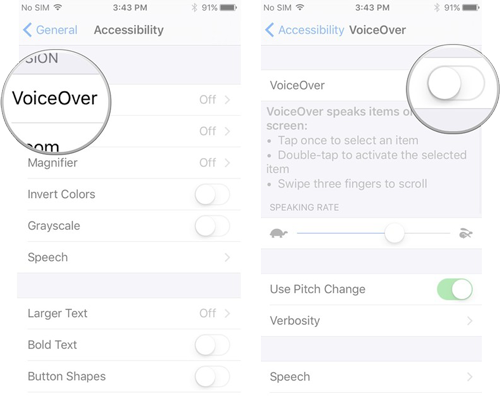
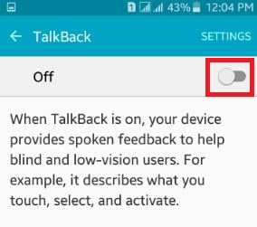

The accessibility features allow you to check the current state of accessibility 
features on the current device.


## Voice Over 

VoiceOver or TalkBack is an Accessibility feature that makes the device "easier" to operate 
for the blind and sight impaired. It uses combination of interactions to speak what is 
currently on the screen.

While this is helpful for purely native applications this generally results in a 
poor user experience for Adobe AIR applications. 

To check if voice over is enabled:

```actionscript
var voiceOverEnabled:Boolean = Application.service.accessibility.voiceOverEnabled;
```

This indicates that the following services are enabled:

- **iOS**: VoiceOver 
- **Android**: TalkBack

You can use this to change your UI accordingly or even limit the operation of your application.


### iOS: VoiceOver

To enable VoiceOver on iOS:

 


### Android: TalkBack

To enable TalkBack on Android:

- Settings > Accessibility > TalkBack

 

