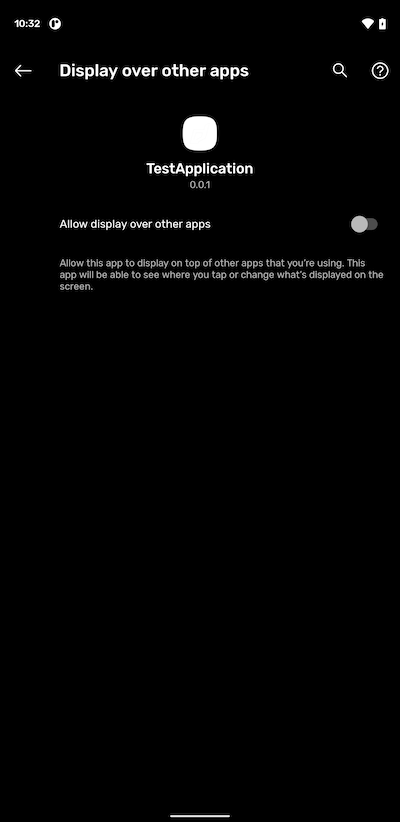

**This is an Android only feature.**

## Auto Start

This process allows your application to automatically start when the device is booted or turned on.

You must run your application at least once before automatic starting can be initialised. You enable
it by calling the `setAutoStart` function as below:

```actionscript
Application.service.setAutoStart( true );
```

If you wish to disable auto start at a later point you can pass `false` to this same function:

```actionscript
Application.service.setAutoStart( false );
```

### State

You can check if auto start is enabled by checking the `isAutoStartEnabled()` flag.

```actionscript
if (Application.service.isAutoStartEnabled())
{
	//
}
```

### Was Auto Started

You can check if your application was launched using the auto start mechanism using the `wasAutoStarted()` flag.

```actionscript
if (Application.service.wasAutoStarted())
{
	// This launch was from an auto start
}
```

### Manifest Additions

You must make sure you have added the following receiver and permission to your application descriptors
manifest additions.

```actionscript
<uses-permission android:name="android.permission.RECEIVE_BOOT_COMPLETED" />
<!-- Required for Android 30 -->
<uses-permission android:name="android.permission.SYSTEM_ALERT_WINDOW"/>

<application>
	<receiver android:enabled="true" android:name="com.distriqt.extension.application.receivers.ApplicationStartupReceiver" android:permission="android.permission.RECEIVE_BOOT_COMPLETED">
		<intent-filter>
			<action android:name="android.intent.action.BOOT_COMPLETED" />
			<action android:name="android.intent.action.QUICKBOOT_POWERON" />
			<action android:name="com.htc.intent.action.QUICKBOOT_POWERON" />
			<category android:name="android.intent.category.DEFAULT" />
		</intent-filter>
	</receiver>
</application>
```

### Android 30

With Android 30, the approach that was used in previous versions of Android to auto-launch your application has been removed meaning that we can no longer directly launch your application on boot.

The new approach requires a system permission from the user to "Display over other apps". With this permission we can still launch your application on launch using an updated approach.



To check if the user has granted this permission you can call the `hasAutoStartPermission()` method:

```actionscript
var hasPermission:Boolean = Application.service.hasAutoStartPermission();
```

If the user hasn't granted it you can open the system settings via the `requestAutoStartPermission()` method:

```actionscript
if (!Application.service.hasAutoStartPermission())
{
	Application.service.requestAutoStartPermission();
}
```

Unfortunately there is no feedback from this process but you should be able to use the application state events to handle an activation of your application after calling this.

Once you have this permission, then auto start will work as above.

:::note
Some Android TV devices don't support this permission request. We have added an additional function to check if the auto start permission request is available:

```actionscript
if (Application.service.canRequestAutoStartPermission())
{
	Application.service.requestAutoStartPermission();
}
```

Also the `requestAutoStartPermission()` method will return false if the permission request isn't supported or not required
::: 