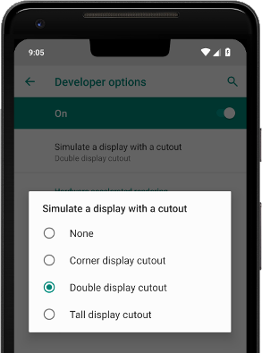

A display cutout (or notch) is an area on some devices that extends into the display surface to allow for an edge-to-edge experience while providing space for important sensors on the front of the device.

When dealing with display cutouts the display mode and layout mode affect greatly how the cutouts affect your application. So it's important that you have set the display mode before attempting to deal with cutouts. **The information returned here will change based on the display mode.**


## Support

Android officially supports display cutouts on devices running Android 9 (API level 28) and higher.

iOS supports notches from iOS 11.


## Affected

The first check you will want to perform is to determine whether the device's display cutout will affect your view.

This will enable you to determine whether you will need to adjust your applications UI to account for the cutout.

```actionscript
if (Application.service.display.willCutoutAffectView)
{
    // The current view is affected by a display cutout 
}
```


## Display Cutout

You can then retrieve information about the cutout by calling `getDisplayCutout()`:


```actionscript
var cutout:DisplayCutout = Application.service.display.getDisplayCutout();
```

The `DisplayCutout` class represents the cutouts of the device. It represents the area of the application view that is not functional for displaying content.

This contains the safe distance from each edge of the device that can be used to display content relative to the current orientation. 

For example in portrait, `cutout.safeInsetTop` will represent the height of any cutout at the top of the device. **This will account not only for notches but also some devices with curved corners and the iOS controls bar.** 

The image below represents the safe area for an iPhone X landscape device, note the area on the right is to keep the controls out of the curved corners and symmetric on the device:


Apple has some good [guidelines](https://developer.apple.com/design/human-interface-guidelines/ios/visual-design/adaptivity-and-layout/) on usage of the safe insets:

> **Inset essential content to prevent clipping.** In general, content should be centered and symmetrically inset so it looks great in any orientation, isn’t clipped by rounded corners, isn’t hidden by a sensor housing, and isn’t obscured by the indicator for accessing the Home screen. 

We recommend you should present any UI controls inside the safe insets. You can (and should) draw outside these regions though.


## Bounding Rectangles

On Android we can provide detailed information about the cutouts in the form of "bounding rectangles" of the content area affected by the cutout. 

The `DisplayCutout` class has a property `boundingRects` which is a list of `Rectangle` objects each of which is the bounding rectangle for a non-functional area on the display. There will be at most one non-functional area per edge of the device.

```actionscript
var displayCutout:DisplayCutout = Application.service.display.getDisplayCutout();
for each (var rect:Rectangle in displayCutout.boundingRects)
{
    // rect represents an area of the screen affected by a cutout
}
```


## Testing 

Be sure to test all of your app's screens and experiences. Test on devices with different types of cutouts, if possible. 


### Android 

If you don't have a device with a cutout, you can simulate some common cutout configurations on any device or emulator running Android 9 by doing the following:

1. Enable developer options.
2. In the Developer options screen, scroll down to the Drawing section, and select Simulate a display with a cutout.
3. Select the cutout type.





