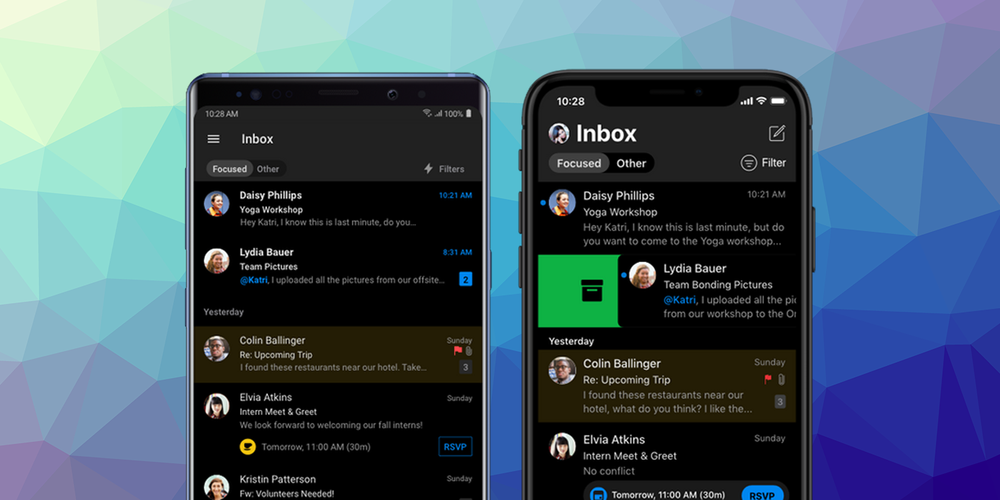

## User Interface Style - Dark Mode 





iOS 13 and Android 10 introduced the concept of a "dark mode" for applications. This allowed a user to set a flag to request a "dark mode" be used wherever possible in applications. In this mode applications replace a normal light background and dark text with a dark background and light text.

To check if the user's requested display mode you can check the value of the `userInterfaceStyle` property:

```actionscript
var style:String = Application.service.display.userInterfaceStyle;
```

This will be one of the values defined in the `UserInterfaceStyle` class:

- `UserInterfaceStyle.DARK` : Dark mode is enabled and the application should render with a dark background and light text;
- `UserInterfaceStyle.LIGHT` : Dark mode is disabled and the application should render with the default light background and dark text;


You should switch your UI colours accordingly.


### iOS

In order for your application to support dark mode on iOS it must be linked against version 13 or higher of the iOS SDK. If you don't the application will default to "light" mode and ignore the user settings.


#### Opt Out of Dark Mode Entirely

The system automatically opts in any app linked against the iOS 13.0 or later SDK to both light and dark appearances. If you need extra time to work on your app's Dark Mode support, you can temporarily opt out by including the `UIUserInterfaceStyle` key (with a value of `Light`) in your app’s info additions node in your application descriptor. Setting this key to Light causes the system to ignore the user's preference and always apply a light appearance to your app.

```xml
<key>UIUserInterfaceStyle</key>
<string>Light</string>
```

>
> Important
>
> Supporting Dark Mode is strongly encouraged. Use the `UIUserInterfaceStyle` key to opt out only temporarily while you work on improvements to your app's Dark Mode support.
>


### Android

Dark mode should be supported on any device running Android API v29 or higher.

