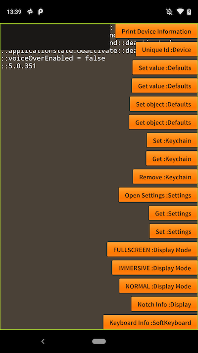
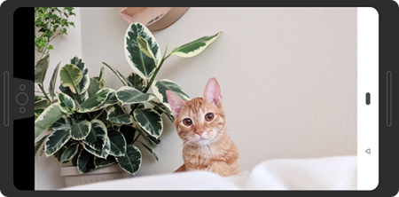
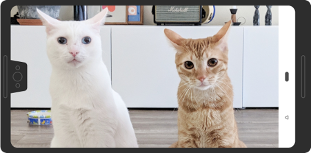
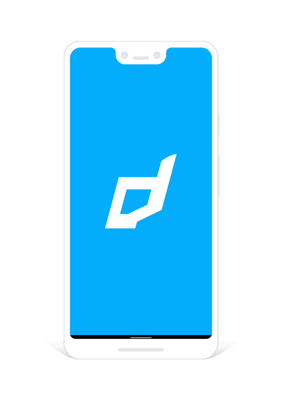
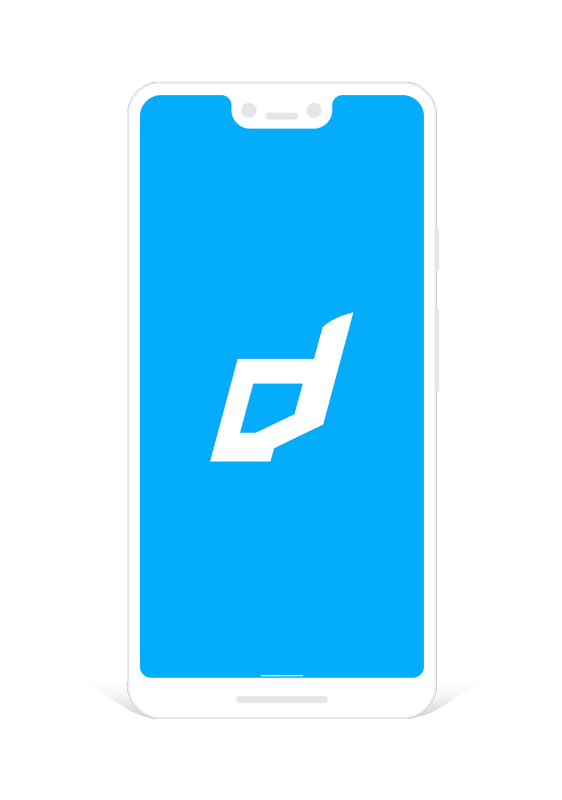
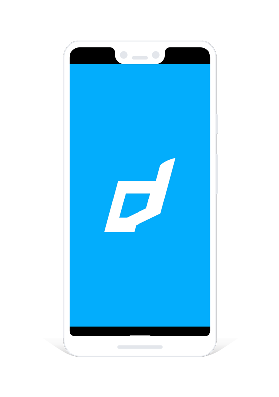
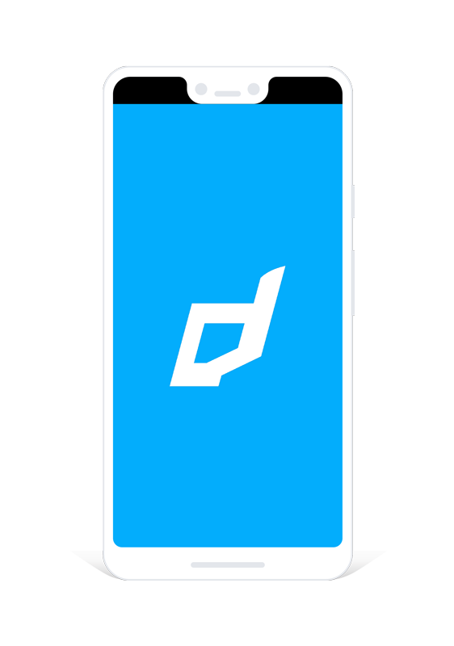

>
> This is only applicable to Android currently as these modes don't have an equivalent on iOS.
>


## Display Modes

Display modes allows you to control how your application displays the user interface decorations such as the status bar and navigation bar. 

There are several main display modes defined in the `DisplayMode` class:

- `DisplayMode.NORMAL`: Shows both the status bar and navigation bar;
- `DisplayMode.FULLSCREEN`: Shows the navigation bar and hides the status bar;
- `DisplayMode.IMMERSIVE`: Hides both the status bar and navigation bar, the user can reveal them with a swipe.


In order to set the display mode, you use the `Display` class and call the `setDisplayMode` function:

```actionscript
Application.service.display.setDisplayMode( DisplayMode.FULLSCREEN );
```

>
> **IMPORTANT**: You must set the `fullscreen` flag in your application descriptor to `false` in order to disable the AIR fullscreen mode and allow the native code to work correctly. Without this AIR will affect the display mode and keyboard information. 
>
> ```xml 
> <initialWindow>
>     ...
>     <fullScreen>false</fullScreen>
>     ...
> ```
>
> If you set this to true then we cannot guarantee the display modes will work correctly.
>


> 
> **RECOMMENDED**: We suggest you pass a reference to the stage through to the ANE to be able to control certain aspects of the stage automatically for you and to change the `displayState` automatically on unsupported platforms. 
> 
> ```actionscript
> Application.service.setStage( yourStageInstance );
> ```
>
> This is also useful to allow the ANE to control the stage display state on 
>


### Layout Modes

Modern devices are moving towards smaller bezels and larger aspect ratios. On these devices, *display cutouts* or *"notches"* are a popular way to achieve an edge-to-edge experience while providing space for important sensors on the front of the device.

We have two main options when displaying our content around cutouts, and how it will appear will depend on the display mode you are using. 

- `LayoutMode.CUTOUT_SHORT_EDGES`: The window is allowed to extend into the cutout areas;
- `LayoutMode.CUTOUT_NEVER`: The window is never allowed to overlap with the cutout area;

To set the layout mode, pass the required mode as the second parameter to the `setDisplayMode()` function:

```actionscript
Application.service.display.setDisplayMode( DisplayMode.FULLSCREEN, LayoutMode.CUTOUT_SHORT_EDGES );
```

These modes mainly have an effect in fullscreen or immersive modes where the view has the potential of displaying around the cutout.


Eg The following screenshots so the differences when using the various modes:


```actionscript
Application.service.display.setDisplayMode( 
    DisplayMode.NORMAL 
);
```




```actionscript
Application.service.display.setDisplayMode( 
    DisplayMode.FULLSCREEN, 
    LayoutMode.CUTOUT_NEVER 
);
```




```actionscript
Application.service.display.setDisplayMode( 
    DisplayMode.FULLSCREEN, 
    LayoutMode.CUTOUT_SHORT_EDGES
);
```




In order to render your content around the cutout see the documentation on getting information about the [Cutouts](cutouts).


Examples: 


```actionscript
Application.service.display.setDisplayMode( 
    DisplayMode.FULLSCREEN, 
    LayoutMode.CUTOUT_SHORT_EDGES
);
```




```actionscript
Application.service.display.setDisplayMode( 
    DisplayMode.IMMERSIVE, 
    LayoutMode.CUTOUT_SHORT_EDGES
);
```




### Aspect Ratios

As devices change in size we have seen a change in aspect ratios. You may encounter black letterboxing on some Android devices with your AIR application. For example, the following image is from a Google Pixel 3 XL with fullscreen flag:




In order to resolve this, simply add the following tag inside the `application` in your manifest additions of your application descriptor:

```xml
<meta-data android:name="android.max_aspect" android:value="2.5" />
```




This image still has a black area at the top due to the cutout.

To resolve this you will need to use the the methods above eg:


```actionscript
Application.service.display.setDisplayMode( 
    DisplayMode.IMMERSIVE, 
    LayoutMode.CUTOUT_SHORT_EDGES
);
```


Ensure you place this within the `application` tag eg:

```xml
<android>
    <manifestAdditions><![CDATA[
        <manifest android:installLocation="auto">

            <uses-sdk android:minSdkVersion="14" android:targetSdkVersion="28"/>

            <uses-permission android:name="android.permission.INTERNET"/>
            <uses-permission android:name="android.permission.WAKE_LOCK" />

            <application>
            </application>
        
        </manifest>
    ]]></manifestAdditions>
</android>
```


>
> If you encounter this on iOS then most likely you are missing a "Default.png" matching the resolution of the device.
>


---

### Migration from v4

Previously you called `setDisplayMode` on the main application with a value from the `ApplicationDisplayModes` class. This functionality has been deprecated as it was too cumbersome and we could not use it to cleanly handle cutouts.

To migrate to the new code is fairly simple, previously you would have set fullscreen through the following:

```actionscript
Application.service.setDisplayMode( ApplicationDisplayModes.FULLSCREEN );
```

This now becomes:

```actionscript
Application.service.display.setDisplayMode( DisplayMode.FULLSCREEN );
```


