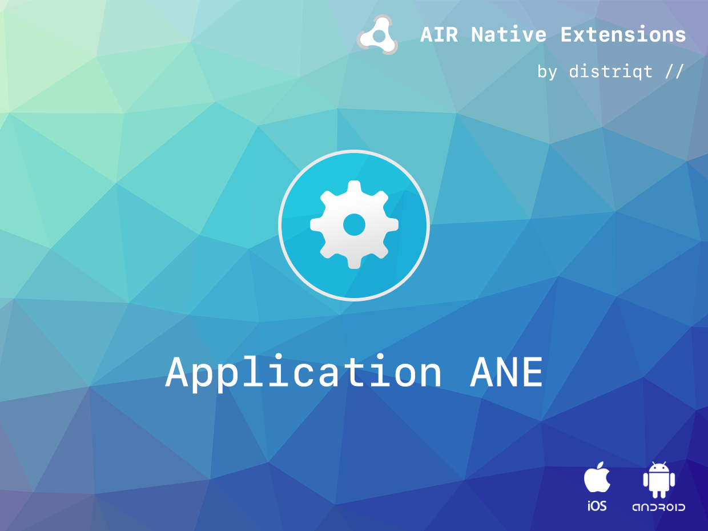
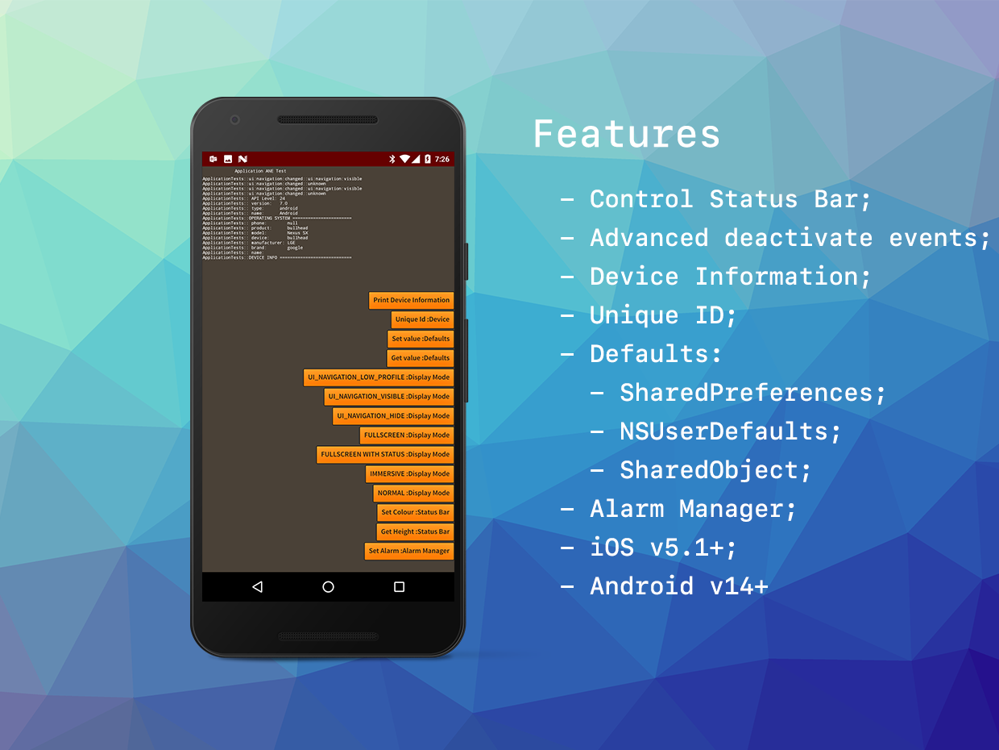

# Application

The [Application](https://airnativeextensions.com/extension/com.distriqt.Application) extension gives 
you access to some additional application options that aren't availble in the default AIR SDK.

The simple API allows you to quickly customise top level UI elements, such as status bars, 
in just a few lines of code. You can use the device information to identify a user, change 
UI based on operating system, determine device manufacturer and other device specific 
information. The user defaults can be used to save user settings in the native user databases, 
having all the advantages of using the native system for user settings.

### Features:

- Set the status bar colour on Android;
- Set advanced display modes;
- Customise your application based on the device information;
- Auto start your application on Android boot;
- Save defaults (simple data values) using:
  - SharedPreferences on Android;
  - NSUserDefaults on iOS/tvOS;
  - and SharedObject on unsupported platforms

This Wiki forms the best source of detailed documentation for the extension along with 
the [asdocs](https://docs.airnativeextensions.com/asdocs/application). 

