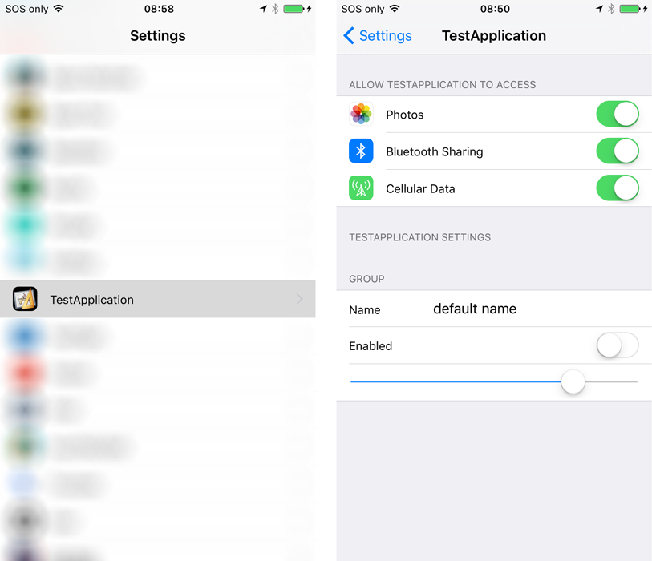
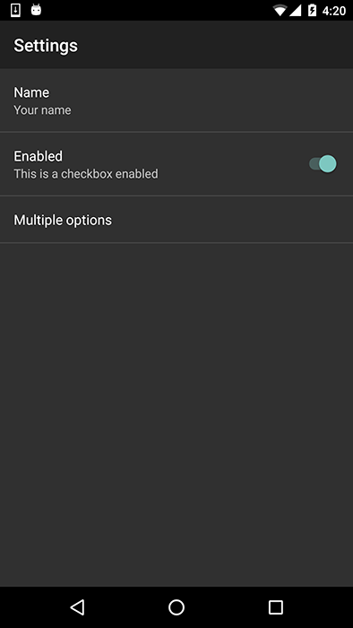

## Settings and Preferences

In this section we will cover the native integration of settings or preferences in your application.
This involves integrating with the OS method of displaying settings to your users.

On iOS your settings can be added to the "Settings" app and displayed in the section for your application:



On Android you can use the "PreferencesActivity" functionality in Android to display an activity like the following:




## Availability 

This functionality is available on iOS and Android as long as you have configured your application 
correctly. You can check if this functionality is available using the `isSupported` flag:

```actionscript
if (Application.service.settings.isSupported)
{
    // Settings functionality is available
}
```


## Displaying the Settings Screen

To display the settings screen simply call the `openSettingsScreen()` method:

```actionscript
Application.service.settings.openSettingsScreen();
```

This will display the screens shown above, based on the way you have configured them for your application (see later).


## Reading and Writing Values

The settings functionality gives you the ability to read and write certain values 
to the settings screen.

This is very similar to the `Defaults` functionality and in fact uses the exact same underlying 
native functionality (i.e. NSUserDefaults on iOS and SharedPreferences on Android), with some 
minor differences.


### Get Values 

You can use the following functions to retrieve values:

- `getBoolean( key )`
- `getString( key )`
- `getNumber( key )`
- `getInt( key )`

The key will be the key for the preference item defined in your configuration (see later).

For example:

```actionscript
trace( "name_preference =    " + Application.service.settings.getString( "name_preference" ) );
trace( "enabled_preference = " + Application.service.settings.getBoolean( "enabled_preference" ) );
trace( "numeric_preference = " + Application.service.settings.getNumber( "numeric_preference" ) );
```


### Set Values

Similarly you can set the values for the settings using:

- `setBoolean( key, value )`
- `setString( key, value )`
- `setNumber( key, value )`
- `setInt( key, value )`

For example:

```actionscript
Application.service.settings.setBoolean( "enabled_preference", false );
Application.service.settings.setString( "multi_preference", "1" );
Application.service.settings.setNumber( "numeric_preference", 10 );
```


## Listen for Change Events

You can listen for the `SettingsEvent.CHANGED` event which will be dispatched when a value in the 
settings has been changed.

```actionscript
Application.service.settings.addEventListener( SettingsEvent.CHANGED, settings_changedHandler );

function settings_changedHandler( event:SettingsEvent ):void
{
    message( "settings changed: " + event.key );
}
```

The event will contain the key that was changed on Android only.


---

## iOS 

On iOS you will be creating a **Settings Bundle** which specifies the items to display in the settings screen.

A Settings bundle has the name `Settings.bundle` and resides in the top-level directory of your applications package. 
This bundle contains one or more Settings page files that describe the individual pages of preferences. 
It may also include other support files needed to display your preferences, such as images or localized strings. 


### Creating a Settings Bundle

The `Settings.bundle` is just a directory with a `Root.plist` and some language strings as needed by your application.

The `Root.plist` file is just an xml file that defines the items that will appear in the settings page.

For example the following defines a toggle switch:

```xml
<?xml version="1.0" encoding="UTF-8"?>
<!DOCTYPE plist PUBLIC "-//Apple//DTD PLIST 1.0//EN" "http://www.apple.com/DTDs/PropertyList-1.0.dtd">
<plist version="1.0">
<dict>
	<key>StringsTable</key>
	<string>Root</string>
	<key>PreferenceSpecifiers</key>
	<array>
		<dict>
			<key>Type</key>
			<string>PSToggleSwitchSpecifier</string>
			<key>Title</key>
			<string>Enabled</string>
			<key>Key</key>
			<string>enabled_preference</string>
			<key>DefaultValue</key>
			<true/>
		</dict>
	</array>
</dict>
</plist>
```

You can either edit this file directly or use Xcode to create your Settings bundle and then copy it into your AIR project.

[Apple Documentation](https://developer.apple.com/library/content/documentation/Cocoa/Conceptual/UserDefaults/Preferences/Preferences.html)

In order to package this correctly, simply make sure it is packaged at the root level of your application.
It must be named `Settings.bundle` and contain the `Root.plist` file plus the localisation strings.


---

## Android 

On Android you will be adding a small addition to the manifest and adding a custom resource which specifies 
the items to display in the settings screen.


### Manifest Additions

In order to display the settings activity you need to add the `SettingsActivity` to your manifest:

```xml
<activity android:name="com.distriqt.extension.application.settings.SettingsActivity" android:label="Settings" />
```

You can change the `label` as you need for your application, it will be displayed at the top of the preferences panel. 


### Creating the Settings (Preferences) XML resource

To add resources to your application you will need to create a custom resources ANE.
You can use the script and instructions [here](https://github.com/distriqt/ANE-CustomResources/) 
to create this ANE. 

In the following we will go through the resources you will need to add to this ANE.

- `CheckBoxPreference`
- `SwitchPreference`
- `EditTextPreference`
- `ListPreference`
- `MultiSelectListPreference`


The following resource (`res/xml/settings.xml`) defines several settings : 

```xml
<?xml version="1.0" encoding="utf-8"?>
<PreferenceScreen xmlns:android="http://schemas.android.com/apk/res/android">

    <EditTextPreference
        android:key="name_preference"
        android:title="Name"
        android:summary="Your name"
        android:defaultValue="default"/>

    <SwitchPreference
        android:key="enabled_preference"
        android:title="Enabled"
        android:summary="This is a checkbox enabled"/>

    <ListPreference 
        android:key="multi_preference"
        android:title="Multiple options"
        android:defaultValue="1"
        android:entries="@array/multi_preference_titles"
        android:entryValues="@array/multi_preference_values" />

</PreferenceScreen>
```

The list uses values in the array values (`res/values/array.xml`) as below:

 ```xml
<?xml version="1.0" encoding="utf-8"?>
<resources>
    <string-array name="multi_preference_titles">
        <item>Option 1</item>
        <item>Option 2</item>
        <item>Option 3</item>
    </string-array>
    <string-array name="multi_preference_values">
        <item>1</item>
        <item>2</item>
        <item>3</item>
    </string-array>
</resources>
```
