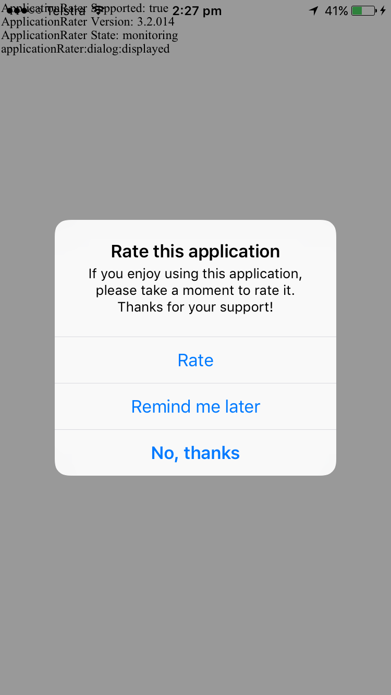
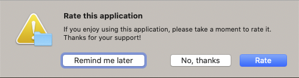

import Tabs from '@theme/Tabs'
import TabItem from '@theme/TabItem'


With this extension you can ask users of your application to return to the application stores and rate your application. 

You must be careful to set the limits in this extension to be appropriate to your users, not to
annoy them with repeated requests for ratings as this will often end up in a poor rating. The default
operation waits 5 days to prompt the user.


There are several different conditions applicable to the prompt display:

- days from initial launch
- number of launches
- number of significant user events


If you have set multiple conditions then the first condition to be met will cause the rate dialog to be displayed, unless you have altered the `requireAllConditions` option. When `requireAllConditions` is `true` then all of the conditions that you have set are required to have been met in order for the rate dialog to be presented.


>
> Note:
>
> This extension stores the current launch count, events and settings in a file in the application directory
> except on iOS/tvOS/macOS where the application user defaults is used to store this data. 
>


The most basic usage will use the default settings to count the number of days since first launch
and display the rate dialog after the max days is reached (default of 5 days). 

The code to achieve this is quite simple, just add the following lines at some point during your application
launch. We suggest somewhere after your is initialised and displayed. The important bit is to determine your
application ID and correctly set that in the `setApplicationId()` call (see the [Application ID](application-id) 
section).


<Tabs groupId="framework" defaultValue="air" values={[
    {label: 'AIR', value: 'air'},
    {label: 'Unity', value: 'unity'},
  ]}>
  <TabItem value="air" >

```actionscript 
ApplicationRater.service.setApplicationId( 
	"XXXXXXXXX", ApplicationRater.IMPLEMENTATION_IOS );
ApplicationRater.service.applicationLaunched();
```

  </TabItem>
  <TabItem value="unity" >

```csharp 
ApplicationRater.Instance.SetApplicationId(
	"XXXXXXXXX", ApplicationRater.IMPLEMENTATION_IOS);
ApplicationRater.Instance.ApplicationLaunched();
```

  </TabItem>
</Tabs>


The `applicationLaunched()` function should be called when your application launches, after your application has initialised. It will increment the launch count and if `autoPrompt` is set will cause the rate dialog to be displayed if the conditions are met.


## Auto Prompt 

By default the extension will automatically prompt the user when the conditions have been met, after a call to `applicationLaunched`.

If you wish to disable this, you do so by setting `autoPrompt` to be `false`:


<Tabs groupId="framework" defaultValue="air" values={[
    {label: 'AIR', value: 'air'},
    {label: 'Unity', value: 'unity'},
  ]}>
  <TabItem value="air" >

```actionscript 
ApplicationRater.service.autoPrompt = false;
```

  </TabItem>
  <TabItem value="unity" >

```csharp 
ApplicationRater.Instance.autoPrompt = false;
```

  </TabItem>
</Tabs>


When disabled you are responsible for displaying the dialog as in the section below.


## Displaying the Rate Dialog

If you have `autoPrompt` set then the dialog will be displayed when the `applicationLaunched()`, or `userDidSignificantEvent()` function is 
called and the conditions have been met.

Alternatively if you wish to control when to display the dialog you can set `autoPrompt` to be false and instead query the `hasMetConditions()` function, calling `showRateDialog()` if appropriate. Eg:


<Tabs groupId="framework" defaultValue="air" values={[
    {label: 'AIR', value: 'air'},
    {label: 'Unity', value: 'unity'},
  ]}>
  <TabItem value="air" >

```actionscript 
if (ApplicationRater.service.hasMetConditions())
{
	ApplicationRater.service.showRateDialog();
} 
```

  </TabItem>
  <TabItem value="unity" >

```csharp 
if (ApplicationRater.Instance.HasMetConditions())
{
	ApplicationRater.Instance.ShowRateDialog();
} 
```

  </TabItem>
</Tabs>


### iOS



### macOS 




## Conditions and Options

We suggest all these conditions and options should be set before calling `applicationLaunched()`, especially if you are using auto prompting.


### Application Launches

To set the number of application launches that will trigger the dialog you use the `setLaunchesUntilPrompt()` function.

For example:


<Tabs groupId="framework" defaultValue="air" values={[
    {label: 'AIR', value: 'air'},
    {label: 'Unity', value: 'unity'},
  ]}>
  <TabItem value="air" >

```actionscript 
ApplicationRater.service.setLaunchesUntilPrompt( 10 );
```

  </TabItem>
  <TabItem value="unity" >

```csharp 
ApplicationRater.Instance.SetLaunchesUntilPrompt( 10 );
```

  </TabItem>
</Tabs>


Each time `applicationLaunched` is called, the internal count will be incremented and compared against this value. 

If you wish to disable the application launch condition, simply set the value to `-1`.


### Days Until Prompt

You can set the number of days from the initial launch that will trigger the dialog by using the `setDaysUntilPrompt()` 
function.

For example, to set it to be 2 weeks after initial launch:


<Tabs groupId="framework" defaultValue="air" values={[
    {label: 'AIR', value: 'air'},
    {label: 'Unity', value: 'unity'},
  ]}>
  <TabItem value="air" >

```actionscript 
ApplicationRater.service.setDaysUntilPrompt( 14 );
```

  </TabItem>
  <TabItem value="unity" >

```csharp 
ApplicationRater.Instance.SetDaysUntilPrompt( 14 );
```

  </TabItem>
</Tabs>


If you wish to disable the number of days condition and rely on the other conditions (eg, application launches 
or significant user events) you should set this value to `-1`:


<Tabs groupId="framework" defaultValue="air" values={[
    {label: 'AIR', value: 'air'},
    {label: 'Unity', value: 'unity'},
  ]}>
  <TabItem value="air" >

```actionscript 
ApplicationRater.service.setDaysUntilPrompt( -1 );
```

  </TabItem>
  <TabItem value="unity" >

```csharp 
ApplicationRater.Instance.SetDaysUntilPrompt( -1 );
```

  </TabItem>
</Tabs>


The default value is `5`.


### User Significant Events

You can also enable the condition of significant user events. These could be events such as games completed or photos taken, and depends entirely on your application.

You can change the value of the number of events until prompt by using the `setSignificantEventsUntilPrompt()` function. By default these are disabled which you can acheive by setting the value to `-1`.

For example, to set the condition that after 5 events the dialog should be displayed:


<Tabs groupId="framework" defaultValue="air" values={[
    {label: 'AIR', value: 'air'},
    {label: 'Unity', value: 'unity'},
  ]}>
  <TabItem value="air" >

```actionscript 
ApplicationRater.service.setSignificantEventsUntilPrompt( 5 );
```

  </TabItem>
  <TabItem value="unity" >

```csharp 
ApplicationRater.Instance.SetSignificantEventsUntilPrompt( 5 );
```

  </TabItem>
</Tabs>


When you wish to log a significant event, simply call:


<Tabs groupId="framework" defaultValue="air" values={[
    {label: 'AIR', value: 'air'},
    {label: 'Unity', value: 'unity'},
  ]}>
  <TabItem value="air" >

```actionscript 
ApplicationRater.service.userDidSignificantEvent();
```

  </TabItem>
  <TabItem value="unity" >

```csharp 
ApplicationRater.Instance.UserDidSignificantEvent();
```

  </TabItem>
</Tabs>


### Require All Conditions

By default, if you have set multiple conditions then the first condition to be met will cause the rate dialog to be displayed, unless you have altered the `requireAllConditions` option. 

When `requireAllConditions` is `true` then all of the conditions that you have set are required to have been met in order for the rate dialog to be presented.


For example, if you call `setDaysUntilPrompt( 5 )`, setting the days until prompt to be `5` and  `setLaunchesUntilPrompt( 5 )`, setting the launches until prompt to be `5` as well then if `requireAllConditions` is:

- `false` (default): The prompt will appear if: 
  - the application is launched 5 times, even within the first 5 days;
  - 5 days passes and the app has only been launched < 5 times;

- `true`: The prompt will only appear:
  - after 5 days **and** after 5 launches of the app.


### Reminder Period

If a user presses the "Remind me later" button then the interval until the user is presented with
the rate dialog again is controlled by the `setTimeBeforeReminding` function. This accepts a number 
of days and is from the date that the user pressed the "Remind me later" button.

For example, to remind a user one week later, set this value to 7:


<Tabs groupId="framework" defaultValue="air" values={[
    {label: 'AIR', value: 'air'},
    {label: 'Unity', value: 'unity'},
  ]}>
  <TabItem value="air" >

```actionscript 
ApplicationRater.service.setTimeBeforeReminding( 7 );
```

  </TabItem>
  <TabItem value="unity" >

```csharp 
ApplicationRater.Instance.SetTimeBeforeReminding( 7 );
```

  </TabItem>
</Tabs>


