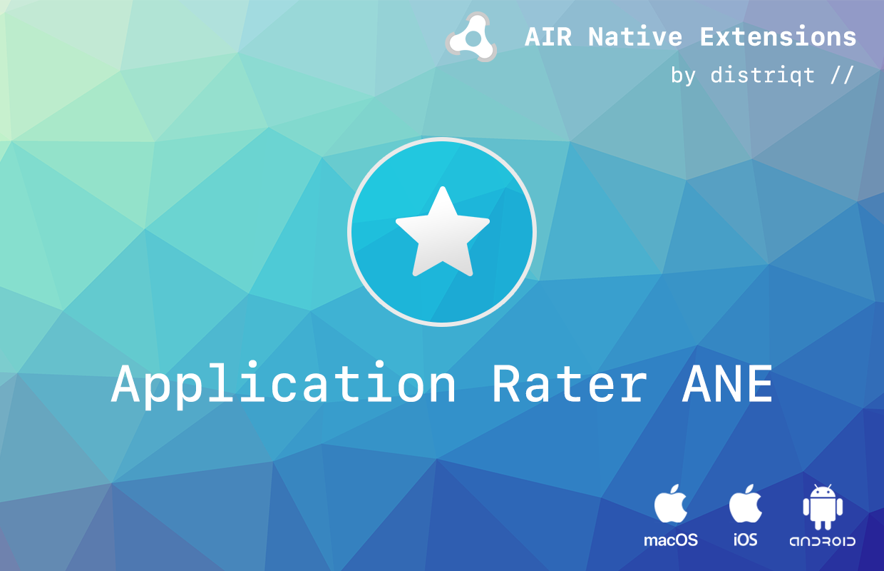

# Application Rater

The [Application Rater](https://airnativeextensions.com/extension/com.distriqt.ApplicationRater) extension allows you to ask the user for feedback on your application by displaying a native dialog and asking them to rate your application in the appropriate application store. When the user agrees to rate your application they are taken to your applications page in the store.

It also allows you to control this process yourself and use the extension to correctly redirect to the appropriate store review page.

Additionally you can use the modern in-app review controllers allowing simple in-app ratings and reviews so your user never has to leave your application.


The simple API allows you to quickly integrate application rating in your AIR application in just a few lines of code. Identical code base can be used across all platforms allowing you to concentrate on your application and not device specifics.

We provide complete guides to get you up and running with application ratings and reviews quickly and easily.


As with all our extensions you get access to a year of support and updates as we are continually improving and updating the extensions for OS updates and feature requests.


### Features

- Native interface to ask a user to rate your application;
- Range of conditions to automatically display the dialog;
- Reminder code to ask the user to rate at a later point if the user clicked the "remind me later" option;
- Customisable labels and conditions;
- Direct link to appropriate stores review page;
- Supports different Android stores including Amazon and Google Play;
- In App Reviews using:
  - Google Play In-App Review, and;
  - Apple StoreKit Review Controller; 


## Documentation

The [documentation site](https://docs.airnativeextensions.com/docs/applicationrater/) forms the best source of detailed documentation for the extension along with the [asdocs](https://docs.airnativeextensions.com/asdocs/applicationrater/). 


```actionscript
ApplicationRater.service.setApplicationId( "air.com.distriqt.test", ApplicationRater.IMPLEMENTATION_ANDROID );
ApplicationRater.service.setApplicationId( "552872162", ApplicationRater.IMPLEMENTATION_IOS );
ApplicationRater.service.setApplicationId( "552872162", ApplicationRater.IMPLEMENTATION_MACOS );
ApplicationRater.service.applicationLaunched();
```

More information here: 

[com.distriqt.ApplicationRater](https://airnativeextensions.com/extension/com.distriqt.ApplicationRater)


## License

You can purchase a license for using this extension:

[airnativeextensions.com](https://airnativeextensions.com/)


