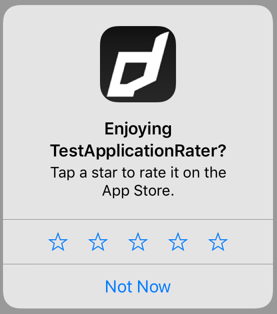
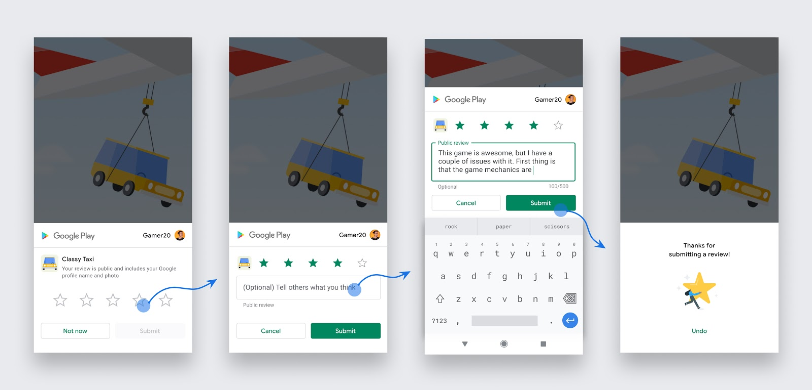

## Review Controller 

The review controller allows you to gather user reviews inside your application without redirecting them to the store. This process generally does not give you feedback about whether a user wrote a review however it does give you the ability to simplify a review request, presenting the review screens directly in your application.


Apple introduced the "Store Review Controller" in iOS 10.3. 




Google has made available the "In-App Review Activity" as part of the Play Core library running on Android v5.0 (API level 21) and higher that have the Google Play Store installed.




### Availability

To check if this functionality is supported on the current device you can call `isSupported` as below:

```actionscript
if (ApplicationRater.service.review.isSupported)
{
	// InApp Review is supported
}
```

Currently this is supported on iOS 10.3+ and on Android 5.0+ (API 21+) through Google Play. 


### Requesting Review

To start the review process you call the `requestReview()` function. This function attempts to ask 
the user to rate or review your app, if appropriate.

```actionscript
if (ApplicationRater.service.review.isSupported)
{
	ApplicationRater.service.review.requestReview();
}
```

Although you should call this method when it makes sense in the user experience flow of your app, the actual display of a rating/review request view is governed by App Store / Google Play policy and quotas and this logic is outside the control of the extension.

Because this method may or may not present any UI, it's not appropriate to call it in response to a button tap or other user action. 


#### When to request

Follow these guidelines to help you decide when to request in-app reviews from users:

- Trigger the in-app review flow after a user has experienced enough of your app or game to provide useful feedback.
- Do not prompt the user excessively for a review. This approach helps minimize user frustration and limit API usage.
- Your app should not ask the user any questions before or while presenting the rating button or card, including questions about their opinion (such as “Do you like the app?”) or predictive questions (such as “Would you rate this app 5 stars”).


#### Quotas

Limits are placed on when the UI will be displayed. This logic is dependent on the stores and outside the control of the developer.

iOS: *The system automatically limits the display of the prompt to three occurrences per app within a 365-day period*.

Android: *Google Play enforces a quota on how often a user can be shown the review dialog*.


### Testing 

#### iOS

With iOS while your app is still in development mode, a rating/review request view is always displayed so that you can test the user interface and experience. **However, this method has no effect when you call it in an app that you distribute using Testflight.**


#### Android

Follow the steps in the guide below for instructions on testing:

- [Android Google Play](https://developer.android.com/guide/playcore/in-app-review/test)


