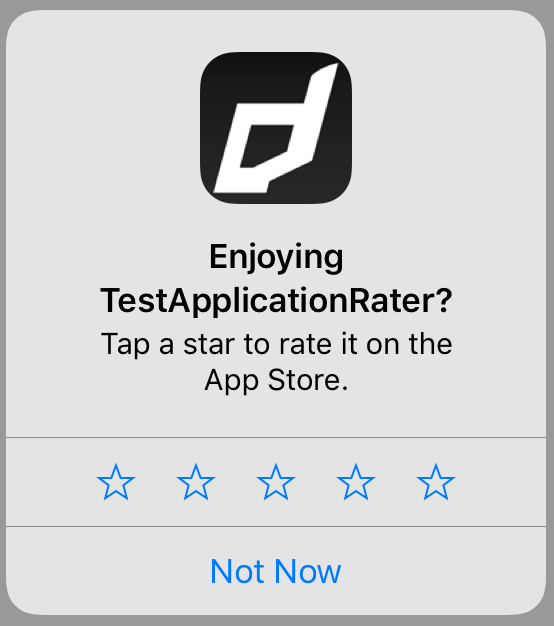
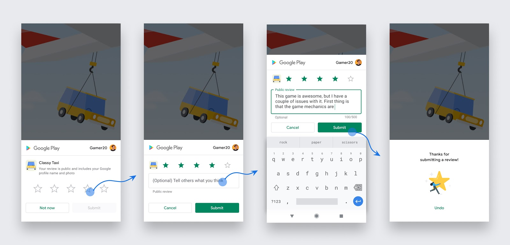
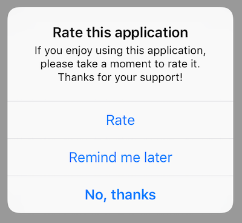
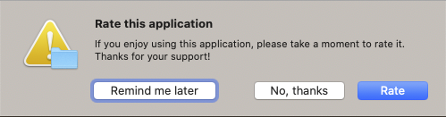

# Application Rater


<!--newpage-->


# Contents

- [Overview](#overview)
- [Features](#features)
- [Add the Plugin](#add-the-plugin)
    - [Asset Store](#asset-store)
    - [Manual Installation](#manual-installation)
    - [Import the Plugin](#import-the-plugin)
	- [Resolve Android Dependencies](#resolve-android-dependencies)
- [Usage](#usage)
	- [Review Controller](#review-controller)
	- [Application ID](#application-id)   
	- [Application Rate Dialog](#application-rate-dialog)  
	- [States](#states)  
	- [Requesting Review](#requesting-review)
	- [Handling Stores](#handling-stores)
- [Support](#support)


<!--newpage-->


# Overview

The [Application Rater](https://airnativeextensions.com/extension/com.distriqt.ApplicationRater) extension allows you to ask the user for feedback on your application by displaying a native dialog and asking them to rate your application in the appropriate application store. When the user agrees to rate your application they are taken to your applications page in the store.

It also allows you to control this process yourself and use the extension to correctly redirect to the appropriate store review page.

Additionally you can use the modern in-app review controllers allowing simple in-app ratings and reviews so your user never has to leave your application.

The simple API allows you to quickly integrate application rating in your AIR application in just a few lines of code. Identical code base can be used across all platforms allowing you to concentrate on your application and not device specifics.

We provide complete guides to get you up and running with application ratings and reviews quickly and easily.


<!--newpage-->


# Features

- In App Reviews using:
  - Google Play In-App Review, and;
  - Apple StoreKit Review Controller; 
- Direct link to appropriate stores review page;
- Native interface to ask a user to rate your application;
- Range of conditions to automatically display the dialog;
- Reminder code to ask the user to rate at a later point if the user clicked the "remind me later" option;
- Customisable labels and conditions;
- Supports different Android stores including Amazon and Google Play;


# Add the Plugin

First step is always to add the plugin to your development environment. 


## Asset Store

Open the Asset Store in your browser and add the Application Rater plugin to your assets.

Open the Package Manager (Window > Package Manager) in the Unity Editor and select the "My Assets" section. Select the Application Rater plugin, and click Import in the bottom right.


## Manual Installation

In unity you import the package by selecting `Assets / Import Package / Custom Package ...` and then browsing to the unity plugin package file: `com.distriqt.ApplicationRater.unitypackage`.


You can manually download the extension from our repository:

- https://github.com/distriqt/ANE-ApplicationRater


## Import the Plugin


This will present the import dialog and display all the files for the plugin, make sure all the files are selected.

The plugin will be added to your project and you can now use the plugins functionality in your application.


## Resolve Android Dependencies

This plugin depends on some common Android libraries, particularly the Google Play Core Library, which enables in-app reviews.

You can get these dependencies using one of the following methods.


### Unity Jar Resolver

This is the suggested method.

Use the *Unity Jar Resolver* plugin to download and manage the Android dependencies. 


##### Importing

> If you already use the *Unity Jar Resolver* in your project you can skip this step.

- Download the latest version of the [*Unity Jar Resolver*](https://github.com/googlesamples/unity-jar-resolver/releases)
- Import the plugin by selecting `Assets / Import Package / Custom Package ...` and locate the plugin you downloaded. The plugin will be in the zip named: `external-dependency-manager-latest.unitypackage` 
- In the *Import Unity Package* window, click Import


##### Resolving

By default, the resolver should run automatically and will add the dependencies required by this plugin. 

If you have need to resolve the dependencies manually then you will need to:

- Open the menu under: `Assets / External Dependency Manager / Android Resolver`
- Select `Resolve` or `Force Resolve`


More information on the *Unity Jar Resolver* can be found [here](https://github.com/googlesamples/unity-jar-resolver)


### Custom Gradle Template

Unity's in-built gradle build support and exporting to android studio does not support per plugin gradle script. Therefore, this plugin cannot add the dependencies by itself.

The `mainTemplate.gradle` is generated when you enable the **Custom Gradle Template** property on the Player window.

The `build.gradle` exists in generated Gradle project when you enable the **Export Project** property on the Player window and Build the project.

Update the `dependencies` section in your `mainTemplate.gradle` or `build.gradle` as below:

```
dependencies {
    compile fileTree(dir: 'libs', include: ['*.jar'])
    
	implementation 'com.google.android.play:core:1.9.1'
}
```


### Proguard 

If you are using a custom proguard configuration you may need to add the following line to ensure the interface class for the plugin is accessible to unity at runtime.

```
-keep class com.distriqt.extension.applicationrater.ApplicationRaterUnityPlugin {*;}
```


<!--newpage-->


# Usage


## Checking for Support

You can use the `isSupported` flag to determine if this extension is supported on the current platform and device.

This allows you to react to whether the functionality is available on the device and provide an alternative solution if not.


```csharp
if (ApplicationRater.isSupported)
{
	// Functionality here
}
```


<!--newpage-->


# Review Controller 

The review controller allows you to gather user reviews inside your application without redirecting them to the store. This process generally does not give you feedback about whether a user wrote a review however it does give you the ability to simplify a review request, presenting the review screens directly in your application.


### Apple

Apple introduced the "Store Review Controller" in iOS 10.3. 



and in macOS 10.14:


### Google

Google has made available the "In-App Review Activity" as part of the Play Core library running on Android v5.0 (API level 21) and higher that have the Google Play Store installed.




### Availability

To check if this functionality is supported on the current device you can call `isSupported` as below:

```csharp
if (ApplicationRater.Instance.Review.isSupported)
{
	// InApp Review is supported
}
```

Currently this is supported on iOS 10.3+, macOS 10.14+ and on Android 5.0+ (API 21+) through Google Play. 

>
> Note: this simply checks the operating system version and some basic requirements. It will not definitely report that your application was installed through an application store. If your application has multiple distribution avenues, make sure you use a method to check whether the application was installed via a store as well.
>


### Requesting Review

To start the review process you call the `RequestReview()` function. This function attempts to ask 
the user to rate or review your app, if appropriate.

```csharp
if (ApplicationRater.Instance.Review.isSupported)
{
	ApplicationRater.Instance.Review.RequestReview();
}
```

Although you should call this method when it makes sense in the user experience flow of your app, the actual display of a rating/review request view is governed by App Store / Google Play policy and quotas and this logic is outside the control of the extension.

**Because this method may or may not present any UI, it's not appropriate to call it in response to a button tap or other user action.** 


#### When to request

Follow these guidelines to help you decide when to request in-app reviews from users:

- Trigger the in-app review flow after a user has experienced enough of your app or game to provide useful feedback.
- Do not prompt the user excessively for a review. This approach helps minimize user frustration and limit API usage.
- Your app should not ask the user any questions before or while presenting the rating button or card, including questions about their opinion (such as “Do you like the app?”) or predictive questions (such as “Would you rate this app 5 stars”).


#### Quotas

Limits are placed on when the UI will be displayed. This logic is dependent on the stores and outside the control of the developer.

iOS: *The system automatically limits the display of the prompt to three occurrences per app within a 365-day period*.

Android: *Google Play enforces a quota on how often a user can be shown the review dialog*.


### Testing 

#### Apple

With iOS and macOS while your app is still in development mode, a rating/review request view is always displayed so that you can test the user interface and experience. **However, this method has no effect when you call it in an app that you distribute using Testflight.**


#### Google

Follow the steps in the guide below for instructions on testing:

- [Android Google Play](https://developer.android.com/guide/playcore/in-app-review/test)


<!--newpage-->


# Application ID

The application ID is the most important thing to set in the extension, an invalid value will take you to the wrong application, or fail altogether. This ID is unfortunately different on the different operating systems, it is generally related to an identifier in the particular stores. 


## Android

Under Android the value is the Java package name of your application.


## iOS / tvOS / macOS

Under Apple the value is a little more complicated. It's the value of the Apple ID in your iTunes Connect application page. For example, the distriqt test application `com.distriqt.test` has an iOS Apple ID of `552872162`. 

> It may be different for your macOS and iOS applications.

It can also be found in the iTunes App Store link URL which will be of the form 
`https://itunes.apple.com/us/app/[APP_NAME]/id[APP_ID]`


## Automatic Setup 

The extension can also automatically retrieve the appropriate application id's information for you. This is done using either information about the application package or querying the applicable store for information.

This will most likely not work for a test application, where you may not yet have a valid application store entry for your application.

To retrieve the id's automatically simply call the `RetrieveApplicationId()` function.

```csharp
ApplicationRater.Instance.RetrieveApplicationId();
```

This will dispatch an event when the id is determined:

- Retrieved: If the application id was retrieved correctly
	- `OnApplicationIDRetrieved` event
- Error: If the application could not be identified
	- `OnApplicationIDError` event

An error could result if the application is not yet in the app store or if the current application id does not match the one in the store.


For example:

```csharp
ApplicationRater.Instance.OnApplicationIDRetrieved 
	+= OnApplicationIDRetrieved;
ApplicationRater.Instance.OnApplicationIDError 
	+= OnApplicationIDError;

ApplicationRater.Instance.RetrieveApplicationId();


void OnApplicationIDRetrieved(ApplicationIDEvent e)
{
	Debug.Log(e.applicationId);
}

void OnApplicationIDError(ApplicationIDEvent e)
{
	Debug.Log("error: [" + e.errorCode + "] " + e.error);
}
```


## Manual Setup

Manually setting the application id can be useful if you want to ensure the rating process is working during testing or other situations where you don't want to rely on the automatic retrieval. 

You can call the `SetApplicationId()` function multiple times with the platform string (and store if required) specifying the platform for the `applicationId` so you won't have to determine the OS to set the correct ID. 

If you don't specify the platform then it is assumed you have determined to correct ID and it will overwrite any previous value.

You should pass the above id's to the extension as early as possible, preferably just after you initialise the extension as below:

```csharp
ApplicationRater.Instance.SetApplicationId(
	"com.package.application", ApplicationRater.IMPLEMENTATION_ANDROID);
ApplicationRater.Instance.SetApplicationId(
	"XXXXXXXXX", ApplicationRater.IMPLEMENTATION_IOS);
ApplicationRater.Instance.SetApplicationId(
	"YYYYYYYYY", ApplicationRater.IMPLEMENTATION_MACOS);
```


## Using Automatic and Manual 

You can combine both these methods to provide a fallback in the cases where the automatic method fails especially for testing.

Doing the following will set the fallback application id's first and then attempt to correct them using the automatic method.


```csharp
// Set the default / fallback
ApplicationRater.Instance.SetApplicationId(
	"com.package.application", ApplicationRater.IMPLEMENTATION_ANDROID);
ApplicationRater.Instance.SetApplicationId(
	"XXXXXXXXX", ApplicationRater.IMPLEMENTATION_IOS);
ApplicationRater.Instance.SetApplicationId(
	"YYYYYYYYY", ApplicationRater.IMPLEMENTATION_MACOS);

// Attempt automatic retrieval
ApplicationRater.Instance.RetrieveApplicationId();
```


<!--newpage-->


# Application Rate Dialog

With this extension you can ask users of your application to return to the application stores and rate your application. 

You must be careful to set the limits in this extension to be appropriate to your users, not to annoy them with repeated requests for ratings as this will often end up in a poor rating. The default operation waits 5 days to prompt the user.


There are several different conditions applicable to the prompt display:

- days from initial launch
- number of launches
- number of significant user events


If you have set multiple conditions then the first condition to be met will cause the rate dialog to be displayed, unless you have altered the `requireAllConditions` option. When `requireAllConditions` is `true` then all of the conditions that you have set are required to have been met in order for the rate dialog to be presented.


>
> Note:
>
> This extension stores the current launch count, events and settings in a file in the application directory
> except on iOS/tvOS/macOS where the native user defaults is used to store this data. 
>


The most basic usage will use the default settings to count the number of days since first launch and display the rate dialog after the max days is reached (default of 5 days). 

The code to achieve this is quite simple, just add the following lines at some point during your application launch. We suggest somewhere after your is initialised and displayed. The important bit is to determine your application ID and correctly set that in the `setApplicationId()` call (see the [Application ID](#application-id) section).

```csharp
ApplicationRater.Instance.SetApplicationId(
	"XXXXXXXXX", ApplicationRater.IMPLEMENTATION_IOS);
ApplicationRater.Instance.ApplicationLaunched();
```

The `ApplicationLaunched()` function should be called when your application launches, after your application has initialised. It will increment the launch count and if `autoPrompt` is set will cause the rate dialog to be displayed if the conditions are met.


## Auto Prompt 

By default the extension will automatically prompt the user when the conditions have been met, after a call to `ApplicationLaunched()`.

If you wish to disable this, you do so by setting `autoPrompt` to be `false`:

```csharp
ApplicationRater.Instance.autoPrompt = false;
```

When disabled you are responsible for displaying the dialog as in the section below.


## Displaying the Rate Dialog

If you have `autoPrompt` set then the dialog will be displayed when the `ApplicationLaunched()`, or `UserDidSignificantEvent()` function is 
called and the conditions have been met.

Alternatively if you wish to control when to display the dialog you can set `autoPrompt` to be false and 
instead query the `HasMetConditions()` function, calling `ShowRateDialog()` if appropriate. Eg:

```csharp
if (ApplicationRater.Instance.HasMetConditions())
{
	ApplicationRater.Instance.ShowRateDialog();
} 
```

Or you can just call `ShowRateDialog()` whenever you want to display the dialog.


### iOS



### macOS 




## Conditions and Options

We suggest all these conditions and options should be set before calling `ApplicationLaunched()`, especially if you are using auto prompting.


### Application Launches

To set the number of application launches that will trigger the dialog you use the `SetLaunchesUntilPrompt()` function.

For example:

```csharp
ApplicationRater.Instance.SetLaunchesUntilPrompt( 10 );
```

Each time `ApplicationLaunched()` is called, the internal count will be incremented and compared against this value. 

If you wish to disable the application launch condition, simply set the value to `-1`.


### Days Until Prompt

You can set the number of days from the initial launch that will trigger the dialog by using the `SetDaysUntilPrompt()` function.

For example, to set it to be 2 weeks after initial launch:

```csharp
ApplicationRater.Instance.SetDaysUntilPrompt( 14 );
```

If you wish to disable the number of days condition and rely on the other conditions (eg, application launches or significant user events) you should set this value to `-1`:

```csharp
ApplicationRater.Instance.SetDaysUntilPrompt( -1 );
```

The default value is `5`.


### User Significant Events

You can also enable the condition of significant user events. These could be events such as games completed or photos taken, and depends entirely on your application.

You can change the value of the number of events until prompt by using the `SetSignificantEventsUntilPrompt()` function. By default these are disabled which you can acheive by setting the value to `-1`.

For example, to set the condition that after 5 events the dialog should be displayed:

```csharp
ApplicationRater.Instance.SetSignificantEventsUntilPrompt( 5 );
```

When you wish to log a significant event, simply call:

```csharp
ApplicationRater.Instance.UserDidSignificantEvent();
```


### Require All Conditions

By default, if you have set multiple conditions then the first condition to be met will cause the rate dialog to be displayed, unless you have altered the `requireAllConditions` option. 

When `requireAllConditions` is `true` then all of the conditions that you have set are required to have been met in order for the rate dialog to be presented.


For example, if you call `SetDaysUntilPrompt( 5 )`, setting the days until prompt to be `5` and  `SetLaunchesUntilPrompt( 5 )`, setting the launches until prompt to be `5` as well then if `requireAllConditions` is:

- `false` (default): The prompt will appear if: 
  - the application is launched 5 times, even within the first 5 days;
  - 5 days passes and the app has only been launched < 5 times;

- `true`: The prompt will only appear:
  - after 5 days **and** after 5 launches of the app.


### Reminder Period

If a user presses the "Remind me later" button then the interval until the user is presented with
the rate dialog again is controlled by the `SetTimeBeforeReminding()` function. This accepts a number 
of days and is from the date that the user pressed the "Remind me later" button.

For example, to remind a user one week later, set this value to 7:

```csharp
ApplicationRater.Instance.SetTimeBeforeReminding( 7 );
```


<!--newpage-->


## States

There are several states that the service can be in:

- `ApplicationRater.STATE_MONITORING` : monitoring the system for conditions to display the rate dialog
- `ApplicationRater.STATE_LATER` : the user clicked on the "remind me later" button and the system will wait until the conditions have been met
- `ApplicationRater.STATE_DECLINED` : the user declined to rate the application by clicking on the "decline" button
- `ApplicationRater.STATE_RATED` : the user has clicked on the "rate" button. Nothing more will be done and this will be taken as the completed state
- `ApplicationRater.STATE_PROMPT` : has prompted the user to rate the application, ie that the rate dialog has been displayed. This state is transitional and only while the dialog is being shown to the user.


You can access the current state by calling, `state` :

```csharp
string state = ApplicationRater.Instance.state;
```


The particular states control how the `HasMetConditions()` function processes the conditions and 
triggers the dialog.

- In the `STATE_DECLINED` and `STATE_RATED` states, `HasMetConditions()` will always return `false`;
- In the `STATE_MONITORING` state, `HasMetConditions()` will return based on the current set conditions;
- In the `STATE_LATER` state the `HasMetConditions()` function will return after the set reminder period has passed.


<!--newpage-->


## Requesting Review 

If you don't wish to use the rate dialog you can use this extension to simply open the appropriate store page for your user to review your application. 

You should still set the application id by one of the methods described in the [Application ID](#application-id) section.

Once you have set the application id you can call `Rate()` to direct the user to the appropriate place for them to rate and review your application.


```csharp
ApplicationRater.Instance.Rate();
```


<!--newpage-->


## Handling Stores

You can retrieve the store that the application was installed through by using the `GetInstallerStore()` function.
This function will attempt to determine which store the application was installed through and return one of the following values:

- `STORE_GOOGLEPLAY`: The application was installed from the Google Play Store;
- `STORE_AMAZON`: The application was installed from the Amazon Store;
- `STORE_HUAWEI_APPGALLERY`: The application was installed from the Huawei App Gallery;
- `STORE_APPSTORE`: The application was installed from the Apple AppStore. This is the default for all iOS / macOS devices and will be returned on iOS / macOS whether the application was installed through the AppStore or not;
- `STORE_UNKNOWN`: Returned if the store could not be determined. This will happen when your application wasn't installed through a store eg when testing on Android.


Example:

```csharp
string store = ApplicationRater.Instance.GetInstallerStore();
```


You can then use this value to set the appropriate application id if you use different application id's in different stores.

For example, say we have `com.distriqt.test` in the Google Play Store and `com.distriqt.amazon` in the Amazon store:

```csharp
string store = ApplicationRater.Instance.GetInstallerStore();
switch (store)
{
    case ApplicationRater.STORE_AMAZON:
        ApplicationRater.Instance.SetApplicationId( "com.distriqt.amazon", ApplicationRater.IMPLEMENTATION_ANDROID );
        break;
    
    default:
    case ApplicationRater.STORE_GOOGLEPLAY:
        ApplicationRater.Instance.SetApplicationId( "com.distriqt.test", ApplicationRater.IMPLEMENTATION_ANDROID );
        break;
    
}
```


<!--newpage-->


# Support

If you need further support integrating or using this extension please feel free to contact us.

- Email: unityplugins@distriqt.com

We have been supporting developers for over 10 years and always happy to help.


<br/>
<br/>
<br/>
<br/>


- [https://distriqt.com](https://distriqt.com)
- [more native extensions](http://universalextensions.com)
