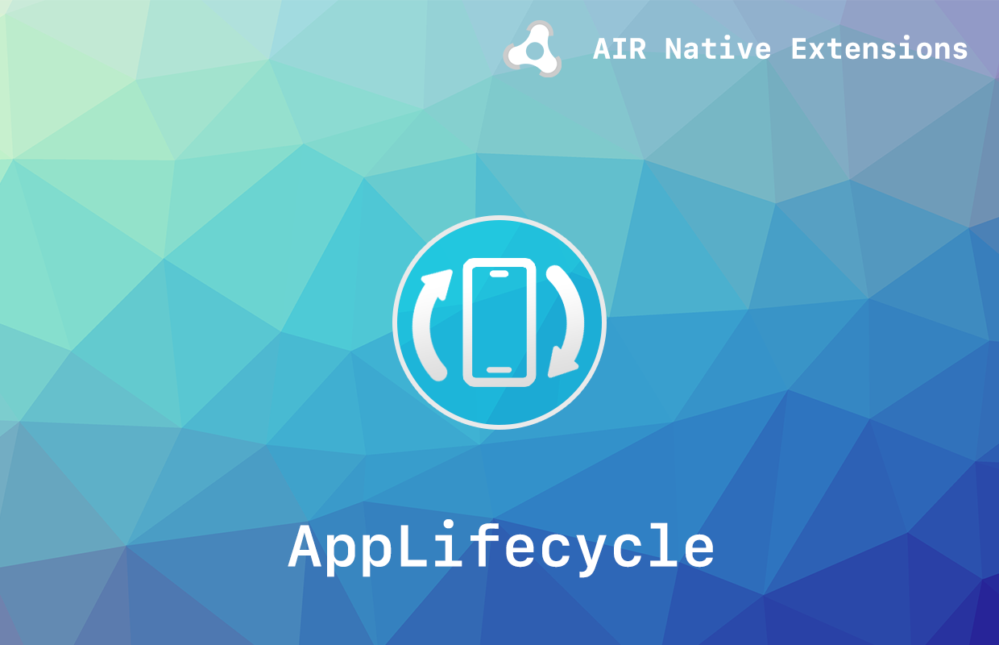
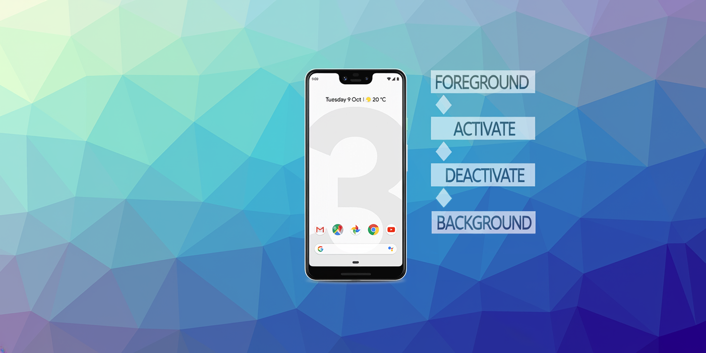

# AppLifecycle

The [AppLifecycle](https://airnativeextensions.com/extension/com.distriqt.AppLifecycle) extension 
gives you the ability to monitor the lifecycle of your application and determine when the application 
has been moved from the foreground to the background and vice versa.

We provide complete guides to get you up and running with sharing quickly and easily.

### Features

- Lifecycle events - better events to determine the ACTIVATE and DEACTIVATE state of your application 
- Single API interface - your code works across iOS and Android with no modifications
- Sample project code and ASDocs reference

As with all our extensions you get access to a year of support and updates as we are 
continually improving and updating the extensions for OS updates and feature requests.


## Documentation

The [documentation site](https://docs.airnativeextensions.com/docs/applifecycle) forms the best source of detailed documentation for the extension along with the [asdocs](https://docs.airnativeextensions.com/asdocs/applifecycle). 

Quick Example: 

```actionscript title="AIR"
AppLifecycle.service.addEventListener( AppLifecycleEvent.FOREGROUND, onForeground );
AppLifecycle.service.addEventListener( AppLifecycleEvent.BACKGROUND, onBackground );
```

More information here: 

[com.distriqt.AppLifecycle](https://airnativeextensions.com/extension/com.distriqt.AppLifecycle)


## License

You can purchase a license for using this extension:

- [airnativeextensions.com](https://airnativeextensions.com/)





