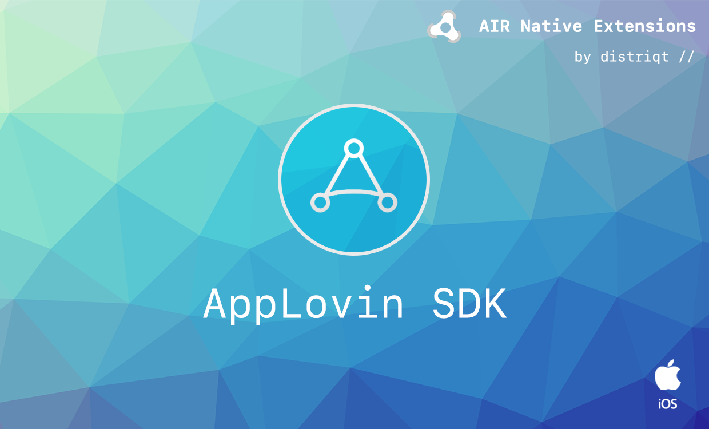

# AppLovinSDK

The [AppLovinSDK](https://airnativeextensions.com/extension/com.distriqt.AppLovinSDK) extension 
gives you access to the AppLovin SDK in your AIR application.


- Dashboard: https://dash.applovin.com/
- SDK Reference: https://dash.applovin.com/docs/integration#iosIntegration
- MAX SDK Reference: https://dash.applovin.com/documentation/mediation/ios/getting-started


### Features:

- Access to the [AppLovin MAX](https://www.applovin.com/max/) SDK:
    - Banners
    - Interstitials
    - Rewarded Video

- Single API interface - your code works across supported platforms with no modifications
- Sample project code and ASDocs reference


## Documentation

The [documentation site](https://docs.airnativeextensions.com/docs/applovinsdk/) forms the best source of detailed documentation for the extension along with the [asdocs](https://docs.airnativeextensions.com/asdocs/applovinsdk/). 


Quick Example: 

```actionscript
var interstitial:MaxInterstitialAd = AppLovinSDK.instance.interstitials.createMaxInterstitialAd();
interstitial.setAdUnitId( "interstitial_adUnitId" );
interstitial.addEventListener( InterstitialAdEvent.LOADED, loadedHandler );
interstitial.load();

function loadedHandler( event:InterstitialAdEvent ):void
{
	interstitial.show();
}
```


## Native Extensions

The highest quality and widest range of Native Extensions for Adobe AIR

With many native extensions available, we are the largest provider of native extensions for AIR developers. 
Our mobile solutions allow developers to fast-forward development and focus on building great games and apps.

[https://airnativeextensions.com](https://airnativeextensions.com)


