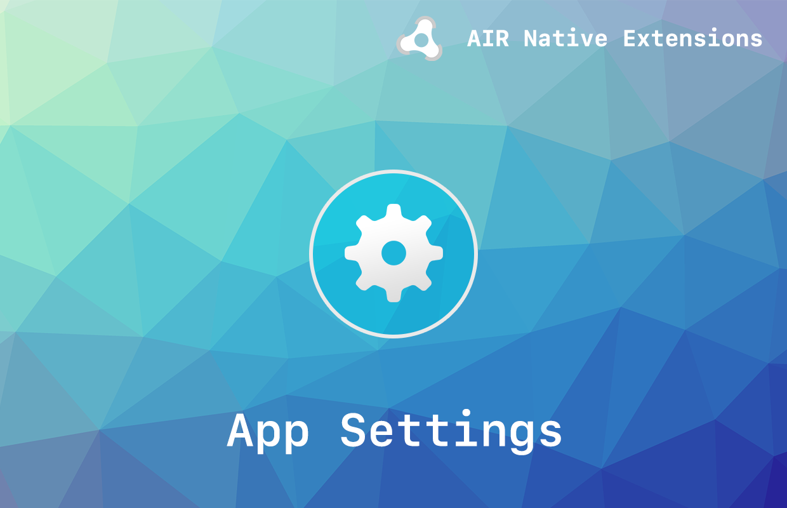

# AppSettings

The [AppSettings](https://airnativeextensions.com/extension/com.distriqt.AppSettings) extension gives you an easy way to store and display user preferences/settings to your users. 

We provide complete guides to get you up and running with sharing quickly and easily.


### Features

- Save defaults (simple data values) using:
  - SharedPreferences on Android;
  - UserDefaults on iOS/tvOS/macOS;
  - and SharedObject on unsupported platforms
- Single API interface - your code works across iOS and Android with no modifications
- Sample project code and ASDocs reference

As with all our extensions you get access to a year of support and updates as we are 
continually improving and updating the extensions for OS updates and feature requests.


## Documentation

The [documentation site](https://docs.airnativeextensions.com/docs/appsettings) forms the best source of detailed documentation for the extension along with the [asdocs](https://docs.airnativeextensions.com/asdocs/appsettings). 

Quick Example: 

```actionscript title="AIR"
var value:String = AppSettings.service.defaults.getString( "IABTCF_TCString" );
```

More information here: 

[com.distriqt.AppSettings](https://airnativeextensions.com/extension/com.distriqt.AppSettings)


## License

You can purchase a license for using this extension:

- [airnativeextensions.com](https://airnativeextensions.com/)


