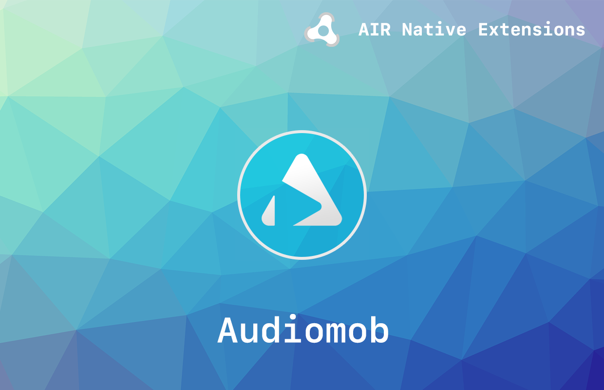

# Audiomob

The [Audiomob](https://airnativeextensions.com/extension/com.distriqt.Audiomob) extension allows developers to integrate audio ads into their AIR applications seamlessly. Audio ads let you earn incremental revenue on top of your existing monetization strategy, without disrupting the user’s gaming experience.

This SDK contains everything you need to add audio advertisements to your game. 

We provide complete guides to get you up and running with sharing quickly and easily.


### Features

- Ordering the ad from the ad server
- Downloading and playing the audio
- Managing tracking events
- Volume detection and unmute prompt
- Single API interface - your code works across supported platforms with no modifications
- Sample project code and ASDocs reference


## Documentation

The [documentation site](https://docs.airnativeextensions.com/docs/audiomob) forms the best source of detailed documentation for the extension along with the [asdocs](https://docs.airnativeextensions.com/asdocs/audiomob). 

Quick Example: 

```actionscript title="AIR"
```


