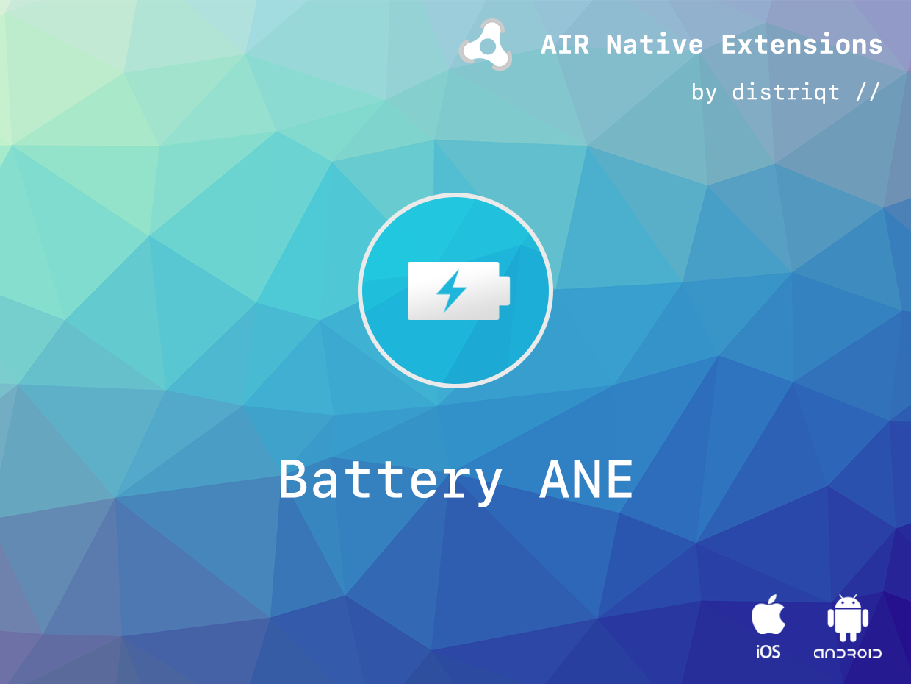
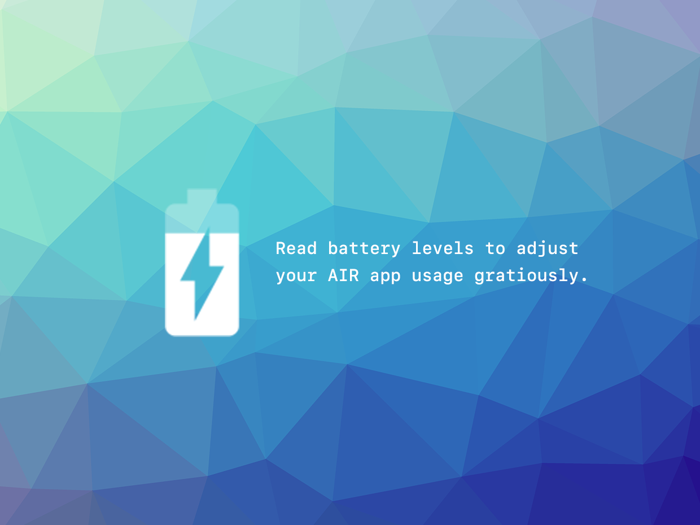

# Battery

The [Battery](https://airnativeextensions.com/extension/com.distriqt.Battery) extension gives 
you access to a device's battery status.

The simple API allows you to quickly retrieve the battery information including charging 
status and battery level.

### Features:

- Provides access to device battery state (i.e. charging, full, not charging);
- Provides access to the device battery level;
- Works across iOS, Android, macOS and Windows with the same code

This Wiki forms the best source of detailed documentation for the extension along 
with the [asdocs](https://docs.airnativeextensions.com/asdocs/battery). 

