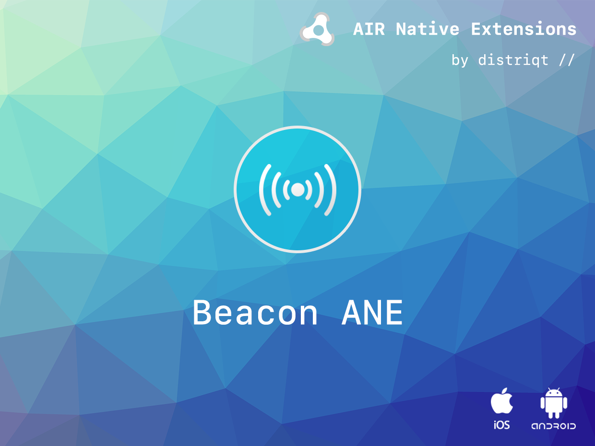

# Beacon

The [Beacon](https://airnativeextensions.com/extension/com.distriqt.Beacon) extension
allows a developer to gain access to iBeacon's. This allows you to range and read the
details of iBeacons on both Android and iOS.

Identical code base can be used across all platforms without any platfrom specific code,
allowing you to develop once and deploy everywhere! It comes with detailed AS docs, and
a complete example application.

We provide a complete getting started guide to walk you through the processes involved
in monitoring and detecting beacons. This helps you get up and running with iBeacons quickly.

As with all our extensions you get access to a year of support and updates as we are
continually improving and updating the extensions for OS updates and feature requests.

### Features:

- Provides access to the Apple iBeacon protocol on both iOS and Android;
- Allows you to monitor a region with entry and exit events;
- Ranging reporting distances to beacons in a region;
- Works across iOS and Android with the same code;
- Sample project code and ASDocs reference

The [documentation site](https://docs.airnativeextensions.com/docs/beacon) forms the best source of detailed documentation for the extension along
with the [asdocs](https://docs.airnativeextensions.com/asdocs/beacon).

