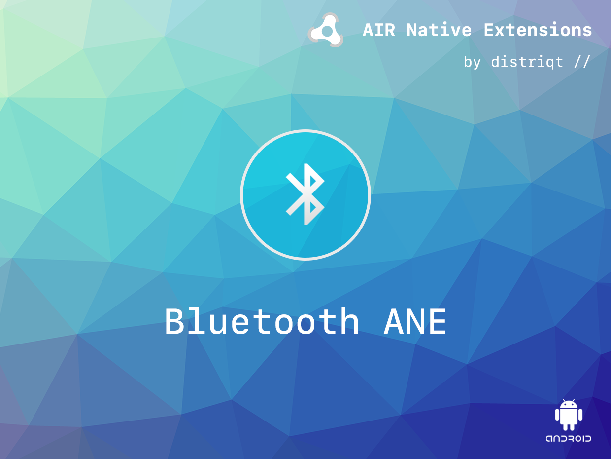
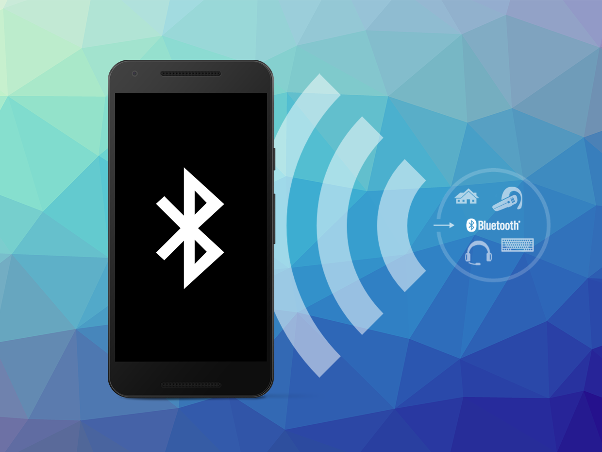

# Bluetooth

The [Bluetooth](https://airnativeextensions.com/extension/com.distriqt.Bluetooth) extension 
allows a developer to gain access to communicate using the Bluetooth interface on the device.

It uses Bluetooth 3.0 and is available on Android only. This is due to the restrictions of 
the iOS SDK that do not allow communications to Bluetooth 3.0 devices unless supported through 
the limited External Accessory Framework.

Using the Bluetooth APIs, an application can perform the following:

- Scan for other Bluetooth devices
- Query the local Bluetooth adapter for paired Bluetooth devices
- Establish RFCOMM channels
- Connect to other devices through service discovery
- Transfer data to and from other devices
- Manage multiple connections

We provide a complete getting started guide to walk you through the processes involved 
in using Bluetooth.

As with all our extensions you get access to a year of support and updates as we are 
continually improving and updating the extensions for OS updates and feature requests.

### Features:

- Provides access the Bluetooth interface power on and off;
- Ability to scan for available devices;
- Make the device discoverable by listening for connections;
- Initiate a connection to another Bluetooth device;
- Transmit any data you require as a ByteArray;
- Sample project code and ASDocs reference

### Support

This extension is supported on the following platforms: 

- Android

## Documentation

The Wiki forms the best source of detailed documentation for the extension along 
with the [asdocs](https://docs.airnativeextensions.com/asdocs/bluetooth). 

More information here: 

[com.distriqt.Bluetooth](https://airnativeextensions.com/extension/com.distriqt.Bluetooth)

## License

You can purchase a license for using this extension:

[airnativeextensions.com](https://airnativeextensions.com/)

distriqt retains all copyright.

