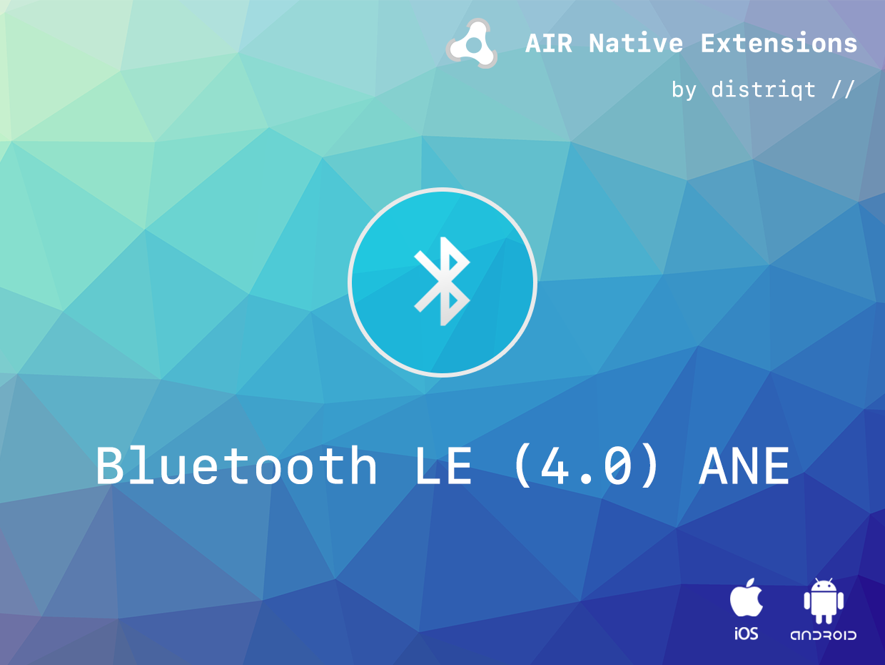
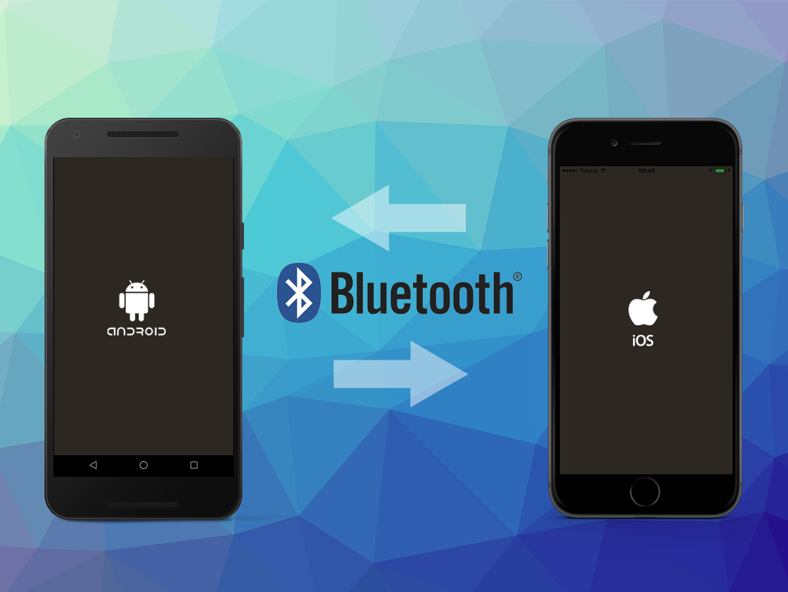

# BluetoothLE

The [BluetoothLE](https://airnativeextensions.com/extension/com.distriqt.BluetoothLE) extension 
enables the use of Bluetooth Low Energy (LE) or Bluetooth 4.0 on your mobile device.

Identical code base can be used across all platforms without any platfrom specific code, 
allowing you to develop once and deploy everywhere! It comes with detailed AS docs, and a 
complete example application. It uses CoreBluetooth on iOS and the built in Android support 
to provide the most in-depth and complete Bluetooth API possible.

We provide a complete getting started guide to walk you through the Central and Peripheral 
modes of BLE. This helps you get up and running with Bluetooth quickly.

Using this ANE you can communicate simply and easily between iOS and Android devices using 
a single AS3 code base. Key to this functionality is the ability to act as not only a Central 
(client) and read/write values from/to devices but also as a Peripheral (server), creating 
your own values for clients to read and write.

You can use the API to act as a Central to scan for Peripheral advertised services. You can then

- Read the RSSI value to estimate distance to the device
- subscribe to a characteristic to get updates when the value changes
- read the value of a characteristic
- write the value of a charateristic

You can use the API to act as a Peripheral to create your own custom Services and Characteristics, 
allowing you to publish and advertise your own custom data services. 
Other Central devices can the find your device and you can:

- listen and respond to Central subscribers sending value updates
- respond to read requests sending the value of a characteristic
- respond to write requests updating the value of a characteristic

You can also use the API to act as both a Central and a Peripheral to enable 2 way communication
between devices.

As with all our extensions you get access to a year of support and updates as we are continually 
improving and updating the extensions for OS updates and feature requests.

### Features:

- Central Mode - Act as a Central device to scan for Peripherals;
- Peripheral Mode - Act as a Peripheral to advertise available data;
- Two way communication using both a Central and Peripheral modes;
- Single API interface - your code works across iOS and Android with no modifications;
- Sample project code and ASDocs reference

## Documentation

The [documentation site](https://docs.airnativeextensions.com/docs/bluetoothle) forms the best source of detailed documentation for the extension along with the [asdocs](https://docs.airnativeextensions.com/asdocs/bluetoothle/). 

More information here: 

[com.distriqt.Bluetooth](https://airnativeextensions.com/extension/com.distriqt.BluetoothLE)

## License

You can purchase a license for using this extension:

[airnativeextensions.com](https://airnativeextensions.com/)

distriqt retains all copyright.

