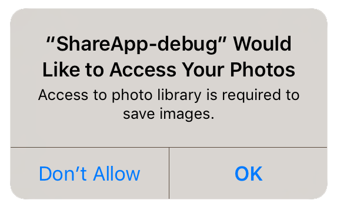

After initialising the extension you should check whether the user has given your application 
authorisation to user Bluetooth LE. You can check the value of hasAuthorisation() which will 
return true if the device is authorised and false otherwise. However the better method is to 
use the authorisationStatus() to determine the status, this will allow you to determine if 
your application has authorisation, has been denied or is not yet determined (i.e. the user 
has not yet been asked to grant authorisation).

On iOS you will only be able to display the authorisation request dialog once! Hence it is 
very important that you inform your users why they should grant authorisation before requesting 
authorisation. To request authorisation you call requestAuthorisation(). This function will 
trigger the native dialog asking the user for authorisation.

On Android these permissions are listed through the manifest additions. On older versions of 
Android these permissions are accepted when the user installs the application. More modern 
versions (Marshmallow 6 [v23]+) require that you request the permissions at runtime similar 
to iOS. You will still need to list them in your manifest and then follow the same code below 
as for iOS, except that on Android you will be able to ask multiple times. You should respect 
the SHOULD_EXPLAIN status by displaying additional information to your user about why you 
require this functionality.


```actionscript
BluetoothLE.service.addEventListener( AuthorisationEvent.CHANGED, authorisationChangedHandler );

switch (BluetoothLE.service.authorisationStatus())
{
	case AuthorisationStatus.AUTHORISED:
		// The user has granted access to Bluetooth LE
		break;
	
	case AuthorisationStatus.NOT_DETERMINED:
	case AuthorisationStatus.SHOULD_EXPLAIN:
		// The user has not yet been asked or 
		// has denied once and you should explain
		BluetoothLE.service.requestAuthorisation();
		break;
	
	case AuthorisationStatus.DENIED:
	case AuthorisationStatus.RESTRICTED:
	case AuthorisationStatus.UNKNOWN:
		// The user has denied access or has restricted access to Bluetooth LE
		break;
}


function authorisationChangedHandler( event:AuthorisationEvent ):void
{
	// Authorisation status has now changed
}
```


## Usage Description

You can customise the usage description messages as you see fit to suit your application. These messages are displayed in the main body area of the iOS authorisation dialog with the title and buttons being standard (and not customisable).

The image below is an example of the authorisation dialog. The content *"Access to photo library is required to save images."* is the usage description message you can set.



You set these values through adding the usage description keys to your info additions or simply by setting up your configuration options in your `apm` project. 


