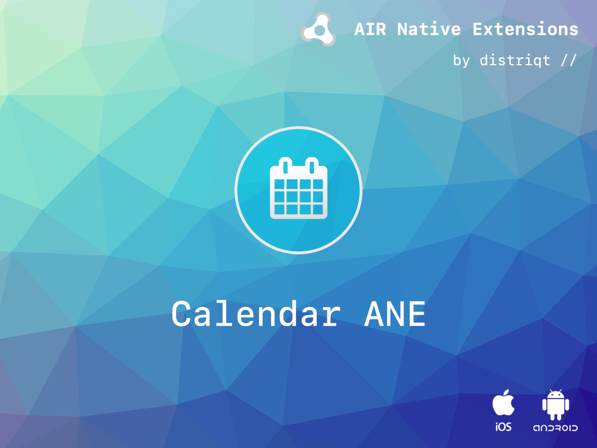
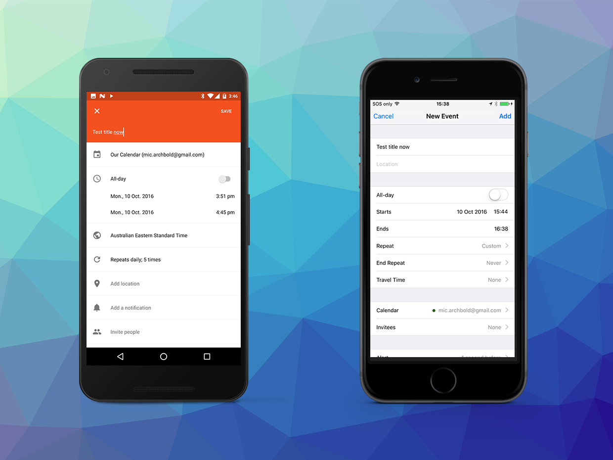

# Calendar

This extension gives you the ability to access the user's calendar. You can retrieve details on the events, 
add new events (using the native UI or directly) and delete existing events. 
Included in this functionality is all the ability to request the correct permissions.

The simple API allows you to quickly integrate calendar access in your AIR application in just a few lines of code. 
Identical code base can be used across all platforms allowing you to concentrate on your application and not device specifics.

We provide complete guides to get you up and running with asset selection quickly and easily.

### Features

- Provides access to add events to the user's iOS Calendar;
- Provides ability to retrieve calendars on Android in addition to events;
- Schedule alerts to events;
- Retrieve the users events within date ranges;
- Add and delete events;
- Request the appropriate runtime permissions on Android and iOS;
- Sample project code and ASDocs reference


As with all our extensions you get access to a year of support and updates as we are 
continually improving and updating the extensions for OS updates and feature requests.


## Documentation

The [wiki](https://github.com/distriqt/ANE-Calendar/wiki) forms the best source of detailed documentation for the extension along with the
 [ASDocs](https://docs.airnativeextensions.com/asdocs/calendar/). 


Quick Example: 

```actionscript
var e:EventObject = new EventObject();
e.title = "Test title now";
e.startDate = new Date() ;
e.endDate = new Date();
e.startDate.minutes = e.startDate.minutes + 6;
e.endDate.hours = e.endDate.hours+1;

Calendar.service.addEventWithUI( e );
```

More information here: 

[com.distriqt.Calendar](https://airnativeextensions.com/extension/com.distriqt.Calendar)


## License

You can purchase a license for using this extension:

[airnativeextensions.com](https://airnativeextensions.com/)

distriqt retains all copyright.



