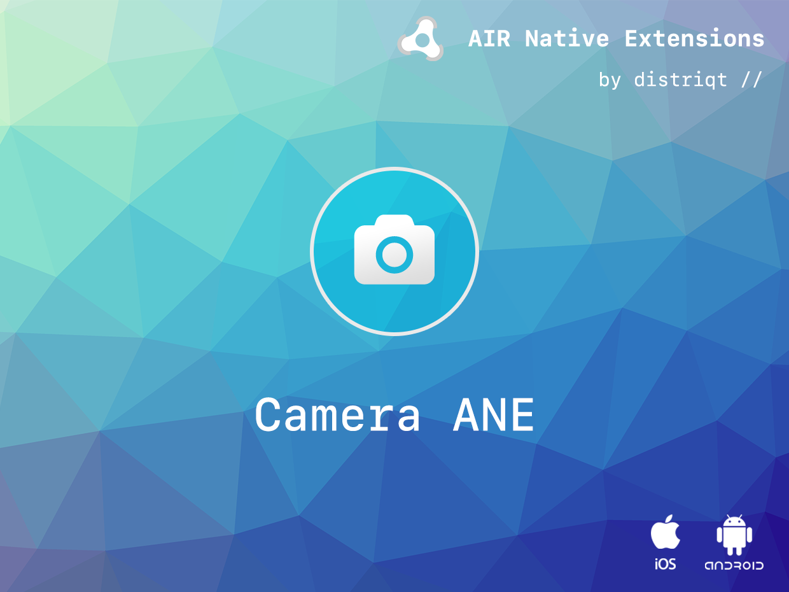
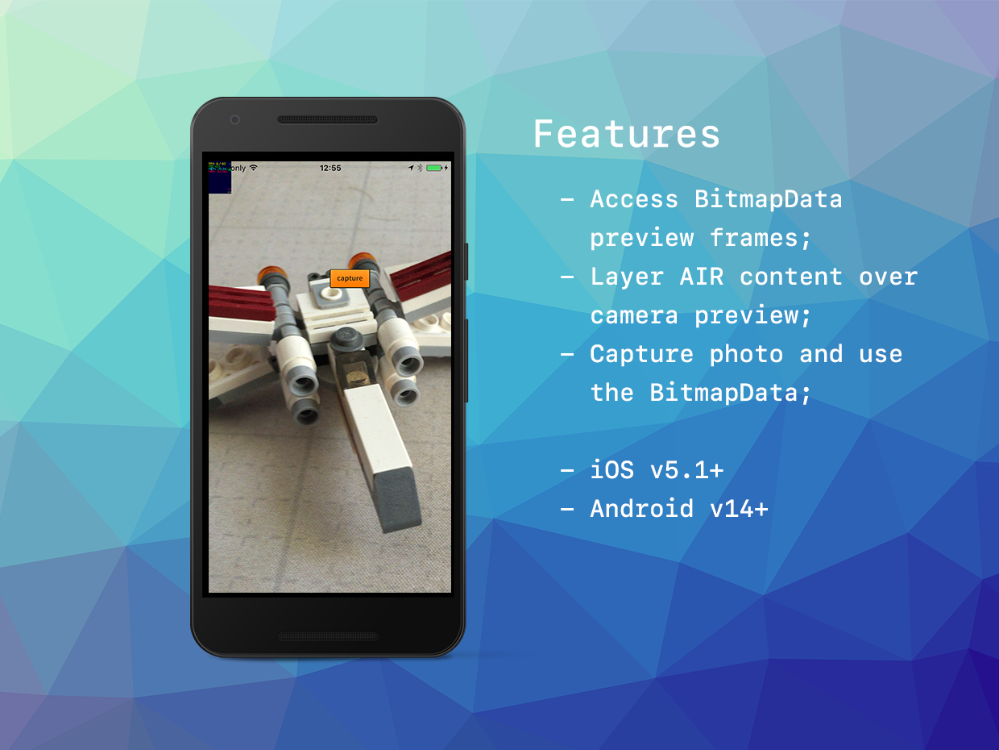

# Camera

The [Camera](https://airnativeextensions.com/extension/com.distriqt.Camera) extension provides access to advanced features of the camera not available through the AIR SDK.

This includes access to the flash modes, exposure, white balance, and focus point control.

Additionally this extension allows you to take a photo using the camera while simultaneously saving it to the camera roll and accessing it in your AIR application as `BitmapData`.

Please note this is not a replacement for the `flash.media.CameraUI` class but gives you the ability to build your own.

If you are looking for a Camera UI replacement see the [CameraUI](https://airnativeextensions.com/extension/com.distriqt.CameraUI) extension.

Identical code base can be used across all supported platforms allowing you to concentrate on your application and not device specifics.

### Features

- Allows control of the camera's functionality on iOS and Android including: flash, exposure, white balance, focus, focus point and others;
- Raw access to the camera preview frames;
- Capture an image and access BitmapData;
- Compatible with most Android devices and iOS 5+ devices which include a flash;
- Sample project code and ASDocs reference

## Documentation

The [documentation site](https://docs.airnativeextensions.com/docs/camera) forms the best source of detailed documentation for the extension along with the [asdocs](https://docs.airnativeextensions.com/asdocs/camera).

More information here:

[com.distriqt.Camera](https://airnativeextensions.com/extension/com.distriqt.Camera)

## License

You can purchase a license for using this extension:

[airnativeextensions.com](https://airnativeextensions.com/)

distriqt retains all copyright.

