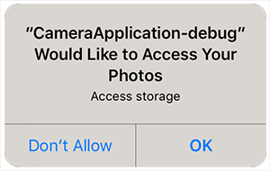

When you are going to be accessing the camera you must check that your application has been allowed access. 
To this end the extension provides several helpers to check and request access to the camera. 
Normal permission rules apply here.

On Android these permissions are listed through the manifest additions. 
On older versions of Android these permissions are accepted when the user installs the application. 
More modern versions (Marshmallow 6 [v23]+) require that you request the permissions similar to iOS. 
You will still need to list them in your manifest and then follow the same code below as for iOS, except that on Android you will be able to ask multiple times. 
You should respect the `SHOULD_EXPLAIN` status by displaying additional information to your user about why you require this functionality.

On iOS the user must be asked at runtime, which you only get one chance to ask, after which you must direct the user to manually change the permissions in the settings.

The following code will work across both platforms:


```actionscript
Camera.instance.addEventListener( AuthorisationEvent.CHANGED, authorisationStatus_changedHandler );

switch (Camera.instance.authorisationStatus())
{
	case AuthorisationStatus.SHOULD_EXPLAIN:
	case AuthorisationStatus.NOT_DETERMINED:
		// REQUEST ACCESS: This will display the permission dialog
		Camera.instance.requestAuthorisation( AuthorisationType.CAMERA );
		return;
	
	case AuthorisationStatus.DENIED:
	case AuthorisationStatus.UNKNOWN:
	case AuthorisationStatus.RESTRICTED:
		// ACCESS DENIED: You should inform your user appropriately
		return;
		
	case AuthorisationStatus.AUTHORISED:
		// AUTHORISED: Camera will be available
		break;						
}

function authorisationStatus_changedHandler( event:AuthorisationEvent ):void
{
	trace( "authorisationStatus_changedHandler: "+event.status );
}
```


### Authorisation Types

There are several types of authorisation that you will require for this extension and as they 
may not be required by all applications they have been separated so you can request them individually 
as appropriate for your application:

- `AuthorisationType.CAMERA`: Access to the camera device
- `AuthorisationType.PHOTOS`: Access to the camera roll to save images (only required if you set `saveToCameraRoll` to `true` in a capture request)

You will need to run through the above process for each of the permissions your application requires!


## Usage Description

You can customise the usage description messages as you see fit to suit your application. These messages are displayed in the main body area of the iOS authorisation dialog with the title and buttons being standard (and not customisable).

The image below is an example of the authorisation dialog. The content *"Require Camera"* is the usage description message you can set.


You set these values through adding the usage description keys to your info additions or simply by setting up your configuration options in your `apm` project. 


The most important string is the camera usage description which is controlled via the `NSCameraUsageDescription` key or the matching `apm` config parameter.

If you are saving images to the camera roll the following dialog will be displayed the first time you attempt to save a captured image to the camera roll:



There are 2 keys required here that control the text in this dialog, `NSPhotoLibraryUsageDescription` and `NSPhotoLibraryAddUsageDescription` (and equivalent `apm` config parameters). The second key was added in iOS 11.2. You should add both keys to your info additions and they can be set to the same content if you wish.


## Device Settings

If your user has denied access to the camera in some situations you can prompt them to enable them
and then redirect them to your application device settings, which will allow your user to change 
the setting.

This is especially important on iOS where you only get one attempt to ask your user for permission.

To redirect your user simply call the `openDeviceSettings()` function. 
You can use the `canOpenDeviceSettings` flag to check if the current device supports this functionality.

```actionscript
if (Camera.instance.canOpenDeviceSettings)
{
	Camera.instance.openDeviceSettings();
}
```
