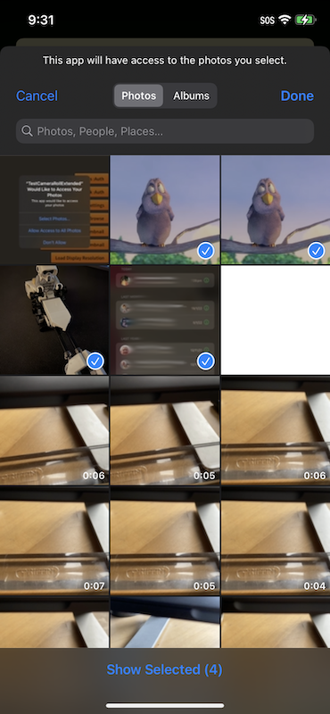

To ask the user to select an asset (or multiple assets) you will need to call the `browseForAsset()` function. 
This will present the user interface and allow the user to select an asset from their device. In the following events you will get information about the selected items as `Asset` objects which you can use to load the asset as you require. 

You can limit what the user is presented with and allowed to select by changing the options in the `CameraRollExtendedBrowseOptions`.

The extension will dispatch one of two events to determine the result of the browse,

- `CameraRollExtendedEvent.CANCEL`: Indicates the user cancelled the browsing operation and no assets where selected
- `CameraRollExtendedEvent.SELECT`: Indicates the user selected an asset(s) and the details of the assets will be attached to the event

The following example shows selection of up to 5 images:

```actionscript
CameraRollExtended.service.addEventListener( CameraRollExtendedEvent.CANCEL, cancelHandler );
CameraRollExtended.service.addEventListener( CameraRollExtendedEvent.SELECT, selectHandler );

var options:CameraRollExtendedBrowseOptions = new CameraRollExtendedBrowseOptions();

options.maximumCount = 5;
options.type = Asset.IMAGE;

CameraRollExtended.service.browseForAsset( options );


function cancelHandler( event:CameraRollExtendedEvent ):void
{
	trace( "camera roll cancelled" );
}

function selectHandler( event:CameraRollExtendedEvent ):void
{
	trace( "camera roll select" );
	for each (var asset:Asset in event.assets)
	{
		trace( asset.toString() );
	}
}
```


## iOS

From iOS 14, Apple provides a very functional native picker (`PHPickerViewController`) which will now be used when available. 

Previous versions of iOS will use a custom UI asset picker. 

The functionality in the native implementation is slightly different in that the "auto close on count reached" feature will only work when only one asset is being selected and cannot be disabled in this case. 


### Limited Authorisation

When presenting the photo picker unfortunately iOS does not apply this limitation to the assets the user can select. So your **user may select assets that you don't have access to**.

In order to identify this situation you can access a `limited` property on the `SELECT` event that informs you that the user selected some assets that your application cannot access. 

```as3
CameraRollExtended.service.addEventListener( CameraRollExtendedEvent.SELECT, selectHandler );

function selectHandler( event:CameraRollExtendedEvent ):void
{
	if (event.limited)
	{
		// User selected assets that cannot be accessed
	}
}
```

You then can inform your user of the situation and if allow them to change their limitation by changing the selection of the limited assets or by changing the permissions.

To present a dialog to change the selection of limited assets you can call `requestAuthorisation()`. When the authorisation status is "limited" this method will display the selection dialog:



You will receive an authorisation changed event on completion and can use that to proceed to browse for an asset again. 


Alternatively you may ask the user to change the permission level through the [device settings](request-authorisation.md#device-settings).


## Android

With Android there are a two distinct implementations, a custom UI built to provide similar functionality as on iOS, and the native implementation.

The native implementation has the advantage of being closely integrated with the system allowing a user to select an image from a range of media. However this varies betweens versions of Android and does not support most of the browse options.

The custom implementation is a little more limited in that it can only select from media that the application can access through the system content provider. However this implementation allows you to control the number of images and other options more easily.

To switch between these methods you set the `useNativePicker` option on the `CameraRollExtendedBrowseOptions` instance:

```actionscript
var options:CameraRollExtendedBrowseOptions = new CameraRollExtendedBrowseOptions();

options.useNativePicker = true;

CameraRollExtended.service.browseForAsset( options );
```

We highly recommend using the native picker however feel free to try the custom implementation and see if it suits your needs.