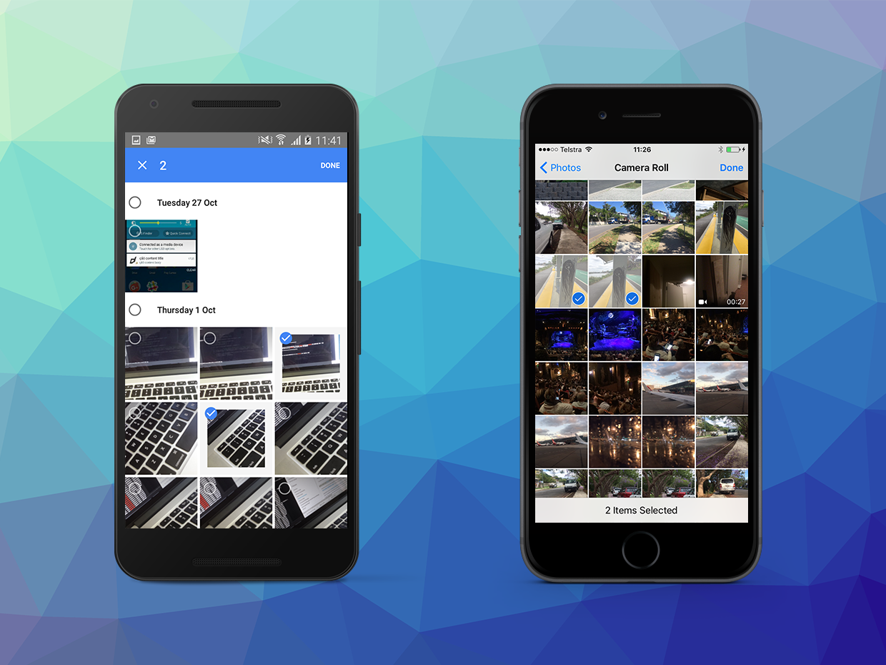

# Camera Roll Extended 

The [CameraRollExtended](http://airnativeextensions.com/extension/com.distriqt.CameraRollExtended) extension 
provides functionality to select and load assets from a user device. 
It extends the functionality of the AIR built in CameraRoll.

The simple API allows you to quickly integrate image and video selection in your AIR application in just a few lines of code. 
Identical code base can be used across all platforms allowing you to concentrate on your application and not device specifics. 
You can select multiple assets, including images and videos and access them either as BitmapData or through File access.

We provide complete guides to get you up and running with asset selection quickly and easily.

### Latest Features:

- Uses the latest Photos framework on iOS;
- Pick using user applications (such as Photos) on Android; or
- Pick using a custom grid view on Android;
- Read assets using File access for raw data on both platforms

As with all our extensions you get access to a year of support and updates as we are continually 
improving and updating the extensions for OS updates and feature requests.

This Wiki forms the best source of detailed documentation for the extension along with the [asdocs](https://docs.airnativeextensions.com/asdocs/camerarollextended). 

