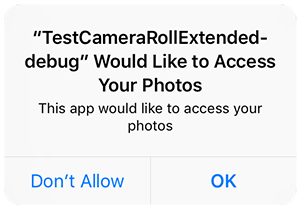

When you are going to be accessing the user's media you must check that your application has been allowed access. 
To this end the extension provides several helpers to check and request access to the camera roll. 
Normal permission rules apply here.

On Android these permissions are listed through the manifest additions. 
On older versions of Android these permissions are accepted when the user installs the application. 
More modern versions (Marshmallow 6 [v23]+) require that you request the permissions similar to iOS. 
You will still need to list them in your manifest and then follow the same code below as for iOS, 
except that on Android you will be able to ask multiple times. 
You should respect the `SHOULD_EXPLAIN` status by displaying additional information to your user 
about why you require this functionality.

On iOS the user must be asked at runtime, which you only get one chance to ask,
after which you must direct the user to manually change the permissions in the settings.

The following code will work across both platforms:

```actionscript
CameraRollExtended.service.addEventListener( AuthorisationEvent.CHANGED, authorisationChangedHandler );
switch (CameraRollExtended.service.authorisationStatus())
{
	case AuthorisationStatus.SHOULD_EXPLAIN:
	case AuthorisationStatus.NOT_DETERMINED:
		// REQUEST AUTHORISATION: This will display the permission dialog
		CameraRollExtended.service.requestAuthorisation();
		return;
	
	case AuthorisationStatus.DENIED:
	case AuthorisationStatus.UNKNOWN:
	case AuthorisationStatus.RESTRICTED:
		// ACCESS DENIED: You should inform your user appropriately
		return;
		
	case AuthorisationStatus.AUTHORISED:
		// AUTHORISED: Media access is available
		break;						
}


function authorisationChangedHandler( event:AuthorisationEvent ):void
{
	switch (event.status)
	{
		case AuthorisationStatus.SHOULD_EXPLAIN:
			// Should display a reason you need this feature
			break;
			
		case AuthorisationStatus.AUTHORISED:
			// AUTHORISED: Media access is available
			break;
			
		case AuthorisationStatus.RESTRICTED:
		case AuthorisationStatus.DENIED:
			// ACCESS DENIED: You should inform your user appropriately
			break;
	}
}
```


## Usage Description

You can customise the usage description messages as you see fit to suit your application. These messages are displayed in the main body area of the iOS authorisation dialog with the title and buttons being standard (and not customisable).

The image below is an example of the authorisation dialog. The content *"Access to photo library is required to save images."* is the usage description message you can set.



You set these values through adding the usage description keys to your info additions or simply by setting up your configuration options in your `apm` project. 

The text is controlled via the `NSPhotoLibraryUsageDescription` and `NSPhotoLibraryAddUsageDescription` keys or their equivalent `apm` config parameters. 


## Device Settings

If your user has denied permission you can direct them to the device application settings to change them, particularly in the iOS case where you cannot force the request dialog to appear again.


To do this you use the `openDeviceSettings()` function.

```actionscript
if (CameraRollExtended.service.canOpenDeviceSettings)
{
	CameraRollExtended.service.openDeviceSettings();
}
```


The `canOpenDeviceSettings` property allows you to ensure the device and platform supports opening the settings and inform your user appropriately.
