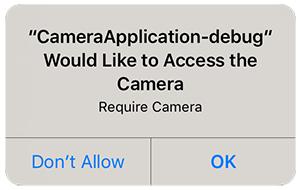
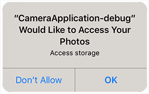

First step is always to add the extension to your development environment. 
To do this use the tutorial located [here](/docs/tutorials/getting-started).


## Dependencies

Many of our extensions use some common libraries, for example, the Android Support libraries.

We have to separate these libraries into separate extensions in order to avoid multiple versions of the libraries being included in your application and causing packaging conflicts. This means that you need to include some additional extensions in your application along with the main extension file.

You will add these extensions as you do with any other extension, and you need to ensure it is packaged with your application.


### Core 

The Core ANE is required by this ANE. You must include and package this extension in your application.

The Core ANE doesn't provide any functionality in itself but provides support libraries and frameworks used by our extensions.
It also includes some centralised code for some common actions that can cause issues if they are implemented in each individual extension.

You can access this extension here: [https://github.com/distriqt/ANE-Core](https://github.com/distriqt/ANE-Core).


### Android Support

The Android Support libraries encompass the Android Support, Android X and common Google libraries. 

These libraries are specific to Android. There are no issues including these on all platforms, they are just **required** for Android.

This extension requires the following extensions:

- [androidx.core.ane](https://github.com/distriqt/ANE-AndroidSupport/raw/master/lib/androidx.core.ane)

You can access these extensions here: [https://github.com/distriqt/ANE-AndroidSupport](https://github.com/distriqt/ANE-AndroidSupport).


>
> **Note**: if you have been using the older `com.distriqt.androidsupport.*` (Android Support) extensions you should remove these extensions and replace it with the `androidx` extensions listed above. This is the new version of the android support libraries and moving forward all our extensions will require AndroidX.
>


>
> **Note:** The Google Play Services and Android Support ANEs are only **required** on Android devices. 
> There are no issues packaging these extensions with all platforms as there are default implementations available which will allow your code to package without errors however if you are only building an iOS application feel free to remove the Google Play Services and Android Support ANEs from your application.
>


## Extension IDs

The following should be added to your `extensions` node in your application descriptor to identify all the required ANEs in your application:

```xml
<extensions>
    <extensionID>com.distriqt.CameraUI</extensionID>
    <extensionID>com.distriqt.Core</extensionID>
    <extensionID>androidx.core</extensionID>
</extensions>
```


## Android 

### Manifest Additions

You should add the following manifest additions. 

**Make sure you only have one `<application>` node in your manifest additions combining them if you have multiple.**

The following shows the complete manifest additions node. You must replace `YOUR_APPLICATION_PACKAGE` with your 
AIR application's Java package name, something like `air.com.distriqt.test`.
Generally this is your AIR application id prefixed by `air.` unless you have specified no air flair in your build options.


```xml
<manifest android:installLocation="auto">
	<uses-permission android:name="android.permission.INTERNET"/>
	<uses-permission android:name="android.permission.WRITE_EXTERNAL_STORAGE" />
	<uses-permission android:name="android.permission.READ_EXTERNAL_STORAGE" />
	
	<!-- optional if your application REQUIRES the camera -->
	<uses-feature android:name="android.hardware.camera" android:required="true" />
	
	<application android:hardwareAccelerated="true">
		
		<provider
			android:name="com.distriqt.extension.cameraui.content.FileProvider"
			android:authorities="YOUR_APPLICATION_PACKAGE.camerauifileprovider"
			android:grantUriPermissions="true"
			android:exported="false">
			<meta-data 
				android:name="android.support.FILE_PROVIDER_PATHS" 
				android:resource="@xml/distriqt_cameraui_paths" />
		</provider>
		
		<activity 	android:name="com.distriqt.extension.cameraui.permissions.AuthorisationActivity" 
					android:theme="@android:style/Theme.Translucent.NoTitleBar" />

	</application>
</manifest>
```


## iOS 

### Info Additions

The following additions are for the `InfoAdditions` node of the iPhone section in your application descriptor:

```xml
<iPhone>
	<InfoAdditions><![CDATA[

		HERE

	]]></InfoAdditions>
</iPhone>
```


If you are using **iOS 10** you now need to add some strings to display messages to the user 
when certain permissions are requested. 

The most important string is the camera usage description which will get displayed during
the request authorisation process (later). 



The key that controls the text in this dialog is:

```xml
	<key>NSCameraUsageDescription</key>
	<string>Require camera usage description</string>

```

To be able to record audio along with your video you will need to add the microphone
usage description: 

```xml
	<key>NSMicrophoneUsageDescription</key>
	<string>Require record audio description</string>
```


If you are saving images to the camera roll the following dialog will be displayed the
first time you attempt to save a captured image to the camera roll:



There are 2 keys required here that control the text in this dialog:

```xml
	<key>NSPhotoLibraryUsageDescription</key>
	<string>Access to photo library is required to save images.</string>
	<key>NSPhotoLibraryAddUsageDescription</key>
	<string>Access to photo library is required to save images.</string>
```

The second key was added in iOS 11.2. You should add both keys to your info additions.


## Checking for Support

You can use the `isSupported` flag to determine if this extension is supported on the current platform and device.

This allows you to react to whether the functionality is available on the device and provide an alternative solution if not.


```actionscript
if (CameraUI.isSupported)
{
	// Functionality here
}
```

