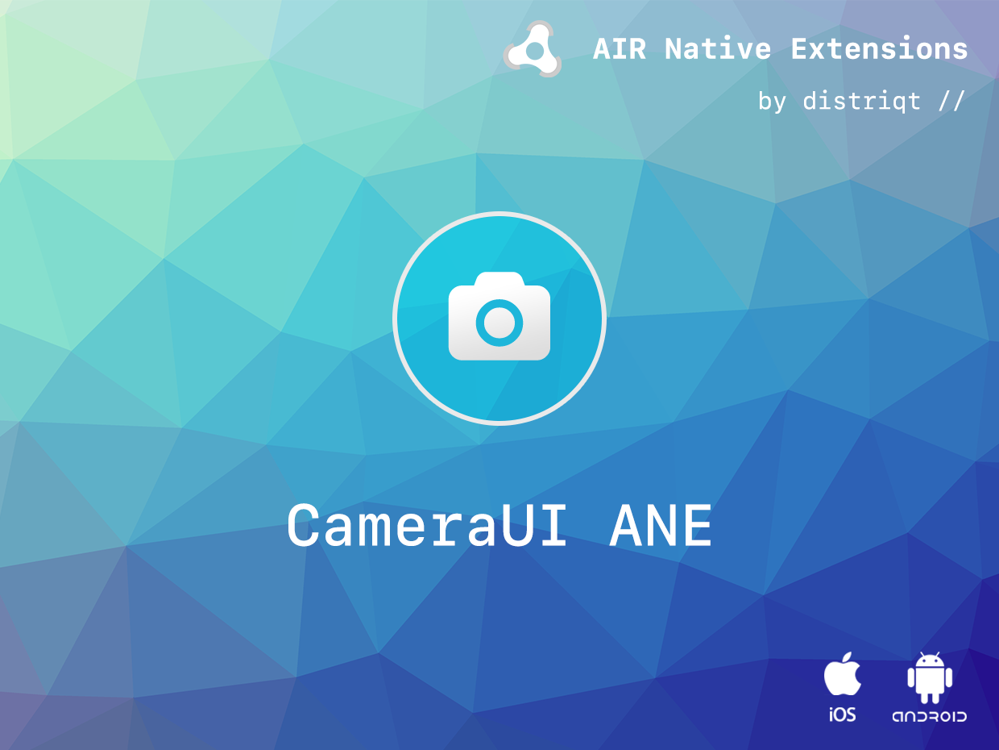
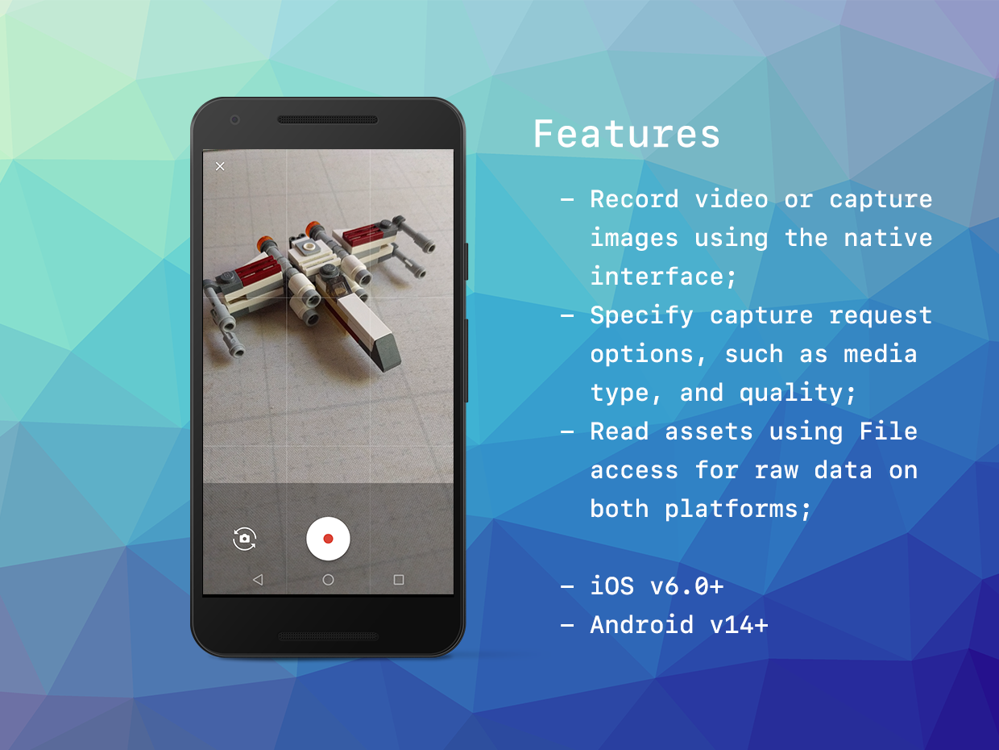

# Camera UI

The CameraUI extension provides a native user interface for capturing images and videos using the device camera.
It extends the functionality of the AIR built in CameraUI providing better control and stability.

The simple API allows you to quickly integrate image and video capture in your AIR application in just a few lines of code.
Identical code base can be used across all platforms allowing you to concentrate on your application and not device specifics.

We provide complete guides to get you up and running with image capture quickly and easily.

### Features

- Record video or capture images using the native interface;
- Specify capture request options, such as media type, and quality;
- Read assets using File access for raw data on both platforms;
- Native Camera UI interface for capturing images and videos;
- Single API interface - your code works across supported platforms with no modifications;
- Sample project code and ASDocs reference

As with all our extensions you get access to a year of support and updates as we are continually improving and updating the extensions for OS updates and feature requests.


## Documentation

The [documentation site](https://docs.airnativeextensions.com/docs/cameraui/) forms the best source of detailed documentation for the extension along with the [asdocs](https://docs.airnativeextensions.com/cameraui/docs). 

Quick Example: 

```actionscript
CameraUI.service.launch( MediaType.VIDEO );
```

More information here:

https://airnativeextensions.com/extension/com.distriqt.CameraUI


## License

You can purchase a license for using this extension:

https://airnativeextensions.com

distriqt retains all copyright.



