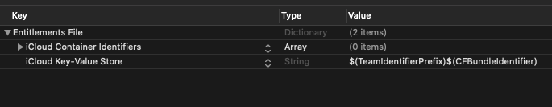

First step is always to add the plugin to your development environment. 


## Asset Store

Open the Asset Store in your browser and add the plugin to your assets.

Open the Package Manager (Window > Package Manager) in the Unity Editor and select the "My Assets" section. Select the plugin, and click Import in the bottom right.


## Manual Installation

In unity you import the package by selecting `Assets / Import Package / Custom Package ...` and then browsing to the unity plugin package file: `com.distriqt.CloudStorage.unitypackage`.


You can manually download the extension from our repository:

- https://github.com/distriqt/ANE-CloudStorage


## Import the Plugin


This will present the import dialog and display all the files for the plugin, make sure all the files are selected.

The plugin will be added to your project and you can now use the plugins functionality in your application.


## iOS / tvOS 

The `Capabilities` editor script should automatically enable iCloud key-value store for your Xcode project, which should add the appropriate value for the `com.apple.developer.ubiquity-kvstore-identifier` key in your entitlements.

We suggest you ensure the value is correct and that cloud kit has been enabled in the capabilities section of your Xcode project.




## Checking for Support

You can use the `isSupported` flag to determine if this extension is supported on the current platform and device.

This allows you to react to whether the functionality is available on the device and provide an alternative solution if not.


```csharp
if (CloudStorage.isSupported)
{
	// Functionality here
}
```