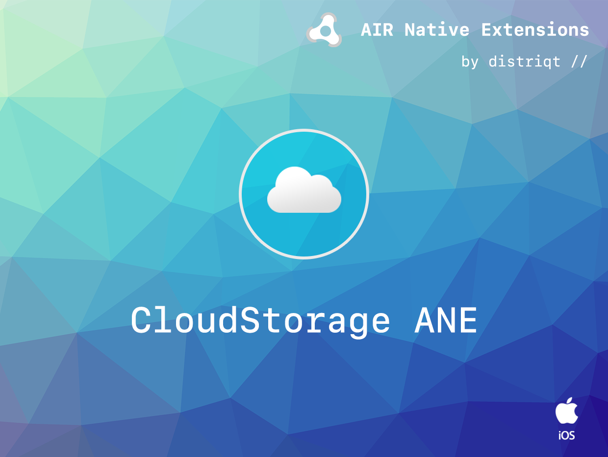

# Cloud Storage

The [Cloud Storage](https://airnativeextensions.com/extension/com.distriqt.CloudStorage) extension 
provides the ability to save data to cloud storage services, such as iCloud.

The simple API allows you to quickly integrate saving data to the cloud using the native cloud 
services on a user's device. The key-value storage allows you to store discrete values in the 
cloud for app preferences, app configuration, or app state. Key-value storage is similar to the 
local user defaults database; but values that you place in key-value storage are available to 
every instance of your app on all of a user’s various devices. If one instance of your app 
changes a value, the other instances see that change and can use it to update their 
configuration.

Document Storage makes your application's documents available on all of a user's devices. 
It implements something very similar to a file system that is automatically syncrhonised
between devices. You'll be able to write your user's application to a file similar to a 
normal file and get notifications of changes when updates are received from the cloud.

We provide complete guides to get you up and running with cloud storage quickly and easily.

It supports both Unity and Adobe AIR frameworks on iOS, tvOS and macOS, allowing you to use the same functionality on all frameworks.

### Features

- Save key/value pairs to iCloud on iOS, tvOS and macOS;
- Document store 

As with all our extensions you get access to a year of support and updates as we are continually 
improving and updating the extensions for OS updates and feature requests.

## Documentation

Latest documentation can be found in the [documentation site](https://docs.airnativeextensions.com/docs/cloudstorage)

More information here: 

[com.distriqt.CloudStorage](https://airnativeextensions.com/extension/com.distriqt.CloudStorage)

## License

You can purchase a license for using this extension:

- [airnativeextensions.com](https://airnativeextensions.com/)
- [Unity Asset Store](https://assetstore.unity.com/publishers/46451)

distriqt retains all copyright.

