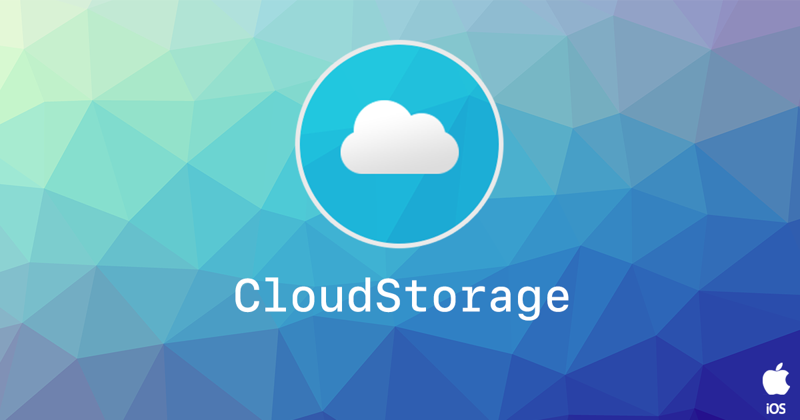

<!--newpage-->


# Contents

- [Overview](#overview)
- [Features](#features)
- [Add the Plugin](#add-the-plugin)
    - [Asset Store](#asset-store)
    - [Manual Installation](#manual-installation)
    - [Import the Plugin](#import-the-plugin)
- [Usage](#usage)
    - [Checking for Support](#checking-for-support)   
    - [Key-Value Storage](#key-value-storage)   
        - [Set Values](#set-values)   
        - [Get Values](#get-values)   
        - [Events](#events)   
        - [Example](#example)   
- [Support](#support)


<!--newpage-->

# Overview

The [Cloud Storage](https://universalextensions.com/extension/com.distriqt.CloudStorage) plugin provides the ability to save data to cloud storage services, such as iCloud.

The simple API allows you to quickly integrate saving data to the cloud using the native cloud services on a user's device. The key-value storage allows you to store discrete values in the cloud for app preferences, app configuration, or app state. Key-value storage is similar to the local user defaults database; but values that you place in key-value storage are available to every instance of your app on all of a user’s various devices. If one instance of your app changes a value, the other instances see that change and can use it to update their configuration.

We provide complete guides to get you up and running with cloud storage quickly and easily.

It supports both Unity and Adobe AIR frameworks on **iOS**, **tvOS** and **macOS**, allowing you to use the same functionality on all frameworks and platforms.


<!--newpage-->

# Features

Save key/value pairs to iCloud on: 

- iOS;
- tvOS; and, 
- macOS

As with all our extensions you get access to a year of support and updates as we are continually improving and updating the extensions for OS updates and feature requests.


# Add the Plugin

First step is always to add the plugin to your development environment. 


## Asset Store

Open the Asset Store in your browser and add the CloudStorage plugin to your assets.

Open the Package Manager (Window > Package Manager) in the Unity Editor and select the "My Assets" section. Select the CloudStorage plugin, and click Import in the bottom right.


## Manual Installation

In unity you import the package by selecting `Assets / Import Package / Custom Package ...` and then browsing to the unity plugin package file: `com.distriqt.CloudStorage.unitypackage`.


You can manually download the extension from our repository:

- https://github.com/distriqt/ANE-CloudStorage


## Import the Plugin


This will present the import dialog and display all the files for the plugin, make sure all the files are selected.

The plugin will be added to your project and you can now use the plugins functionality in your application.


## iOS / tvOS 

The `Capabilities` editor script should automatically enable iCloud key-value store for your Xcode project, which should add the appropriate value for the `com.apple.developer.ubiquity-kvstore-identifier` key in your entitlements.

We suggest you ensure the value is correct and that cloud kit has been enabled in the capabilities section of your Xcode project.


<!--newpage-->


# Usage


## Checking for Support

You can use the `isSupported` flag to determine if this extension is supported on the current platform and device.

This allows you to react to whether the functionality is available on the device and provide an alternative solution if not.


```csharp
if (CloudStorage.isSupported)
{
	// Functionality here
}
```


## Key-Value Storage

The key-value storage system can be broken down into several main concepts:

- setting a value;
- getting a value;
- listen for changes;

This represents the majority functionality you will need to implement to be able to successfully store values in the cloud. 


### Set Values

Firstly to set a value, you call `SetString`, which takes a `key` and a `value` as parameters. 

```csharp
CloudStorage.Instance.SetString("userId", "some_value");
```

or to set an integer value:

```csharp
CloudStorage.Instance.SetInt("userId", 5);
```


### Get Values

You can then retrieve the value using `GetString` providing the same `key` as 
a parameter which will then return the value set previously.

For example: 

```csharp 
var userId = CloudStorage.Instance.GetString("userId");
```


### Remove Value

To remove a value that you have previously set you can use the `Remove` function:


```csharp
CloudStorage.Instance.Remove("userId");
```


### Events

The extension will dispatch events when the values are changed (on another device) and when 
other system events occur:

- Changed: Indicates a value has changed and the event will contain an array of keys that changed
	- `OnChanged` event
- Over Quota: Your app's key-value store has exceeded its space quota on the server
	- `OnOverQuota` event
- Account Changed: The user's account was changed
	- `OnAccountChanged` event
- Initial Sync: The initial data synchronisation from the server was received
	- `OnInitialSync` event


<!--newpage-->

### Example

The following example shows the core concepts, setting then retrieving a value and listening 
to the `OnChanged` event.


```csharp
CloudStorage.Instance.OnChanged += Instance_OnChanged;
CloudStorage.Instance.Synchronise();

// Set a value
CloudStorage.Instance.SetString( "KEY_FOR_VALUE", "some_value" );

// Retrieve the value
string value = CloudStorage.Instance.GetString( "KEY_FOR_VALUE" )


private void Instance_OnChanged(KeyValueStoreEvent e)
{
	Debug.Log("OnChanged");
	// e.changedKeys contains an array of changed keys
	foreach (string key in e.changedKeys)
	{
		Debug.Log("OnChanged: " + key);
	}
}
```


<!--newpage-->


# Support

If you need further support integrating or using this extension please feel free to contact us.

- Email: unityplugins@distriqt.com

We have been supporting developers for over 10 years and always happy to help.


<br/>
<br/>
<br/>
<br/>


- [https://distriqt.com](https://distriqt.com)
- [more native extensions](http://universalextensions.com)
