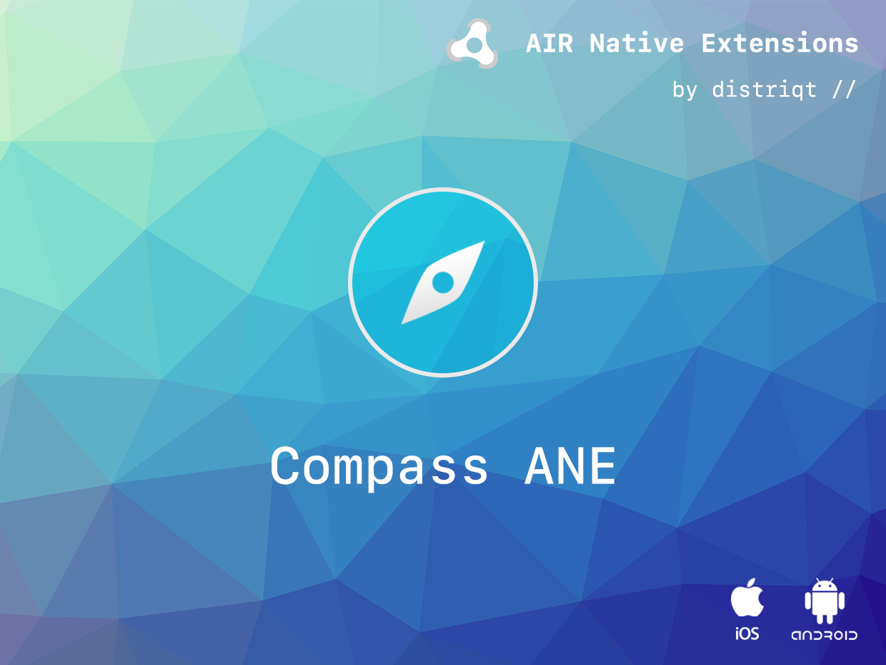
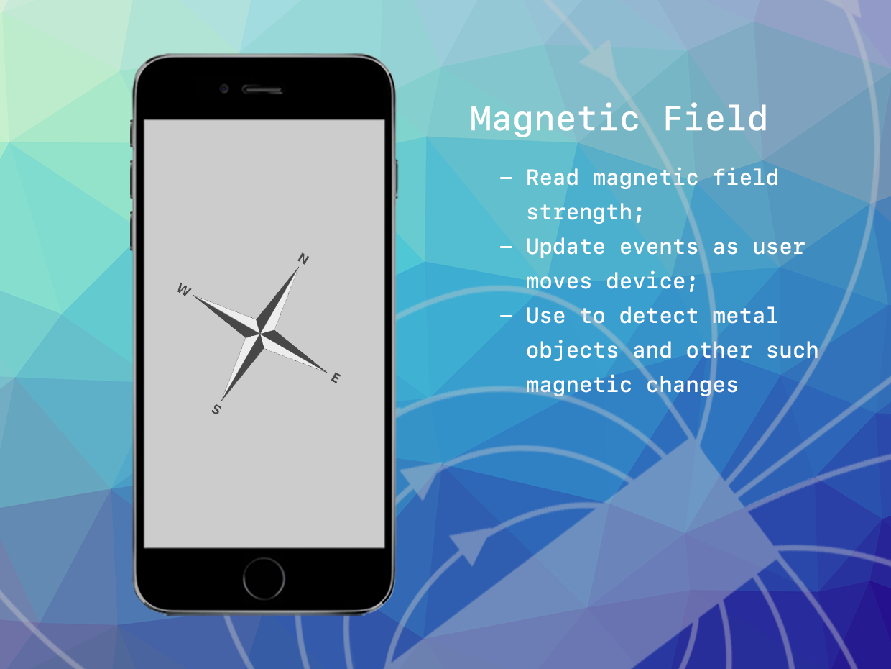

# Compass

The [Compass](http://airnativeextensions.com/extension/com.distriqt.Compass) extension gives access to two important sensor readings, the heading of the device and the magnetometer sensor data

The Compass ANE is designed to give the magnetic-north heading values from the device calculated through a line from the bottom of the device to the top.

On iOS the location is used to calculate the offset from the magnetic heading to the true heading and both values are reported. (This may require the user to accept a permission for your application to access the device location).

The raw magnetic field values can be retrieved using this extension. You can listen for the MagneticFieldEvent for changes in the magnetic field. There are 2 important events, both indicating the magnetic field, one in the calibrated state and the other the raw uncalibrated data.

We provide complete guides to get you up and running with asset selection quickly and easily.

### Features

- Native Compass: Provides access to native device compass sensor
- Heading: Provides compass reading information, i.e. true / magnetic heading
- Single API interface: Works across iOS and Android with the same code
- Sample project code and ASDocs reference

As with all our extensions you get access to a year of support and updates as we are continually improving and updating the extensions for OS updates and feature requests.

## Documentation

The [documentation site](https://docs.airnativeextensions.com/docs/compass) forms the best source of detailed documentation for the extension along with the [asdocs](https://docs.airnativeextensions.com/asdocs/compass).

Quick Example:

```actionscript
Compass.service.addEventListener( CompassEvent.HEADING_UPDATED, headingUpdatedHandler );
if (Compass.isSupported)
{
	Compass.service.register( Compass.SENSOR_DELAY_NORMAL, 0.4 );
}

function headingUpdatedHandler( event:CompassEvent ):void
{
	trace( event.magneticHeading +"   ["+event.headingAccuracy+"]" );
}
```

More information here:

[com.distriqt.Compass](https://airnativeextensions.com/extension/com.distriqt.Compass)

## License

You can purchase a license for using this extension:

[airnativeextensions.com](https://airnativeextensions.com/)

distriqt retains all copyright.


